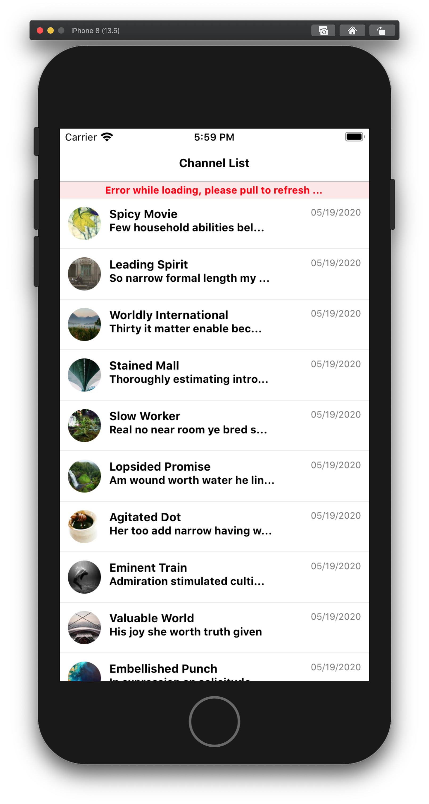
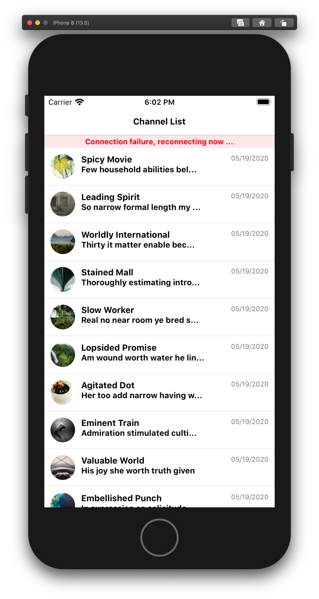

# Changelog

## [2.2.2] 2021-02-07

Handling the case of standlone Channel component (without ChannelList) on top of fix in [v2.2.1](https://github.com/GetStream/stream-chat-react-native/releases/tag/v2.2.1) - [ba7d744](https://github.com/GetStream/stream-chat-react-native/commit/ba7d744dcdf76e16bcee29a9daa6f8879ef0ec79)

## [2.2.1] 2021-02-03

For push notifications, we usually recommend users to disconnect websocket when app goes to background and reconnect when app comes to foreground. But channel list UI doesn't update properly once the ws is re-connected. This issue has been fixed in this commit [8a35e50](https://github.com/GetStream/stream-chat-react-native/commit/8a35e505fadb059b0a3b48fdc33a3a72021bd158)

## [2.2.0] 2021-02-02

- Switched to `react-native-markdown-package` for markdown of message text [#505](https://github.com/GetStream/stream-chat-react-native/pull/505/files)

## [2.1.4] 2021-01-29

Fixed broken re-send message functionality, upon failure [b3c028f](https://github.com/GetStream/stream-chat-react-native/commit/b3c028f7bb91d00286717564764cb0fcf42b75b3)

## [2.1.3] 2021-01-26

- Fix markdown on message
  - fixes [#498](https://github.com/GetStream/stream-chat-react-native/issues/498)
  - commit [d4713aa](https://github.com/GetStream/stream-chat-react-native/commit/d4713aa32515df8c4726860508661645ade13598)
- Fixes issue with un-necessary queryChannels api call, when filters are provided as inline object [9f4528b](https://github.com/GetStream/stream-chat-react-native/commit/9f4528b0035cbcc5898f5da88109e703413b2f4f)
## [2.1.2] 2021-01-09

- Fixed infinite re-rendering issue on mentions suggestion box [5fd521a](https://github.com/GetStream/stream-chat-react-native/commit/5fd521a075170004fe551dd3ffbac111256274fe)

## [2.1.1] 2020-12-21

- Fixed broken mentions autocomplete feature for channels with more than 100 members. #457
- Added a new prop autocompleteSuggestionsLimit on MessageInput - Max number of suggestions to display in list. Defaults to 10.

## [2.1.0] 2020-12-07

### Dependency changes
- Bumping dependency to stream-chat@2.9.0

### Fixes
- Fixed plenty of issues around reload/refresh of channellist upon failures.
- Fixing retry message functionality [7a423f7](https://github.com/GetStream/stream-chat-react-native/commit/7a423f7c059336f770fd107ff8cc6f2bd6e4a939)

### New Props:
- MessageList component
  - MessageNotification [5b5c2ac](https://github.com/GetStream/stream-chat-react-native/commit/5b5c2ac1a021018834696b57c4dfb030635c9cb8)
  - onListScroll [5b5c2ac](https://github.com/GetStream/stream-chat-react-native/commit/5b5c2ac1a021018834696b57c4dfb030635c9cb8)
  - FooterComponent [d803bab](https://github.com/GetStream/stream-chat-react-native/commit/d803bab3d25a4e34bb8192e06fd41db5bfd07ea7)
  - inverted [d803bab](https://github.com/GetStream/stream-chat-react-native/commit/d803bab3d25a4e34bb8192e06fd41db5bfd07ea7)
  - NetworkDownIndicator [e09b9fc](https://github.com/GetStream/stream-chat-react-native/commit/e09b9fc93fb5064efe16b1c6c7572116d8f2ee69)

## [2.0.2] 2020-11-16

- Fixing issue - when you cancel 'edit message' flow, input box attachments don't get cleared [425db22](https://github.com/GetStream/stream-chat-react-native/commit/425db22cc1ad51be651e61e64af92128763f51ca)

- Adding reload behaviour on error indicator on messagelist [6047671](https://github.com/GetStream/stream-chat-react-native/commit/604767192daeb1c621b3763d4a56be95688bff12)

## [2.0.1] 2020-11-16

- Fixed issue - When you edit a message which has image attachments, images disappear from message - [68c0acb](https://github.com/GetStream/stream-chat-react-native/commit/68c0acbbb66e2f116db84be503054c8d2046778f)
- Fixed maxFiles value on image picker and file picker taking into account already selected number of attachments - [176f675](https://github.com/GetStream/stream-chat-react-native/commit/176f6751d2240cd502d1d84b91fa07b849c943ea)

## [2.0.0] 2020-10-29

Please check [Upgrade Docs](https://github.com/GetStream/stream-chat-react-native/wiki/Upgrade-helper#upgrade-from-0xx-to-2xx) for upgrading from 0.x.x to 2.x.x

**BREAKING CHANGES**

- You will need to install https://github.com/LinusU/react-native-get-random-values and add this line `import 'react-native-get-random-values';` to your `index.js`
- Expo 39 is now the lowest supported version

### Typescript

This library has been moved to full typescript. Please check [Typescript doc](https://github.com/GetStream/stream-chat-react-native/wiki/Typescript-support) for details

### Component prop changes

*Channel*
- add `additionalKeyboardAvoidingViewProps` prop to allow custom keyboard props

*ChannelListMessenger*
- remove `setActiveChannel` prop

*ChannelPreviewMessenger*
- renamed the `latestMessage` prop to `latestMessagePreview`. This name change is more semantic to what the prop does and reduces confusion with the `lastMessage` prop

*MessageContent*
- removed `retrySendMessage` prop in favor of `retrySendMessage` within `MessagesContext`

*MessageInput*
- remove `parent` prop to `parent_id` as it needs to be just an id string instead of the entire parent object
- add `setInputRef` prop to actually allow forwarding of the TextInput ref controls

*MessageSystem*
- add `formatDate` prop to allow custom date formatting

*ChannelContext*

- We have split the `ChannelContext` into three separate contexts to further modularize the code and reduce renders as items in context change. The following contexts now contain the following values, previously all held within the `ChannelContext`:

  - `ChannelContext`:

    - `channel`
    - `disabled`
    - `EmptyStateIndicator`
    - `error`
    - `eventHistory`
    - `lastRead`
    - `loading`
    - `LoadingIndicator`
    - `markRead`
    - `members`
    - `read`
    - `setLastRead`
    - `typing`
    - `watcherCount`
    - `watchers`

  - `MessagesContext`

    - `Attachment`
    - `clearEditingState`
    - `editing`
    - `editMessage`
    - `emojiData`
    - `hasMore`
    - `loadingMore`
    - `loadMore`
    - `Message`
    - `messages`
    - `removeMessage`
    - `retrySendMessage`
    - `sendMessage`
    - `setEditingState`
    - `updateMessage`

  - `ThreadContext`

    - `closeThread`
    - `loadMoreThread`
    - `openThread`
    - `thread`
    - `threadHasMore`
    - `threadLoadingMore`
    - `threadMessages`

- All contexts are exported and any values can be accessed through a higher order component (ex: `withMessagesContext`) or with one of our custom context hooks (ex: access `MessagesContext` by `const { messages } = useMessagesContext();`).

## [1.3.5] 2020-10-27

- Fixing [keyboard issue](https://github.com/GetStream/stream-chat-react-native/issues/397) during app state change [a8aa4ed](https://github.com/GetStream/stream-chat-react-native/commit/a8aa4edebd723120ea41d88b2f9d45df5a75f848)

## [1.3.4] 2020-10-13

- Fixing keyboard glitch functionality for android [a7f94b9](https://github.com/GetStream/stream-chat-react-native/commit/a7f94b93a12c997055a706316902aafbd256f29b)

## [1.3.3] 2020-10-05

- Fixing retry upload functionality [e89b87f](https://github.com/GetStream/stream-chat-react-native/commit/e89b87fb6b519d5433717d14ba12591236459586)

## [1.3.2] 2020-10-02

- SuggestionsList (for user-mentions feature in MessageInput) doesn't update the position as per keyboard position. For the time being, we have fixed this by dismissing the suggestions list when keyboard gets dismissed  - [0fdff4f](https://github.com/GetStream/stream-chat-react-native/commit/0fdff4f327908d4b554b8d4172028e666df65242)

- Exported IconBadge and IconSquare components, to fix the tutorial [f1b6a39](https://github.com/GetStream/stream-chat-react-native/commit/f1b6a393930e7fcd1571d7d80b56937154454b47)

- Added file size to file attachment [7e653a4](https://github.com/GetStream/stream-chat-react-native/commit/7e653a4a302ba24e5f9b664d2fccba778084ed0b)

## [1.3.1] 2020-09-29

**No changes**

## [1.3.0] 2020-09-25

**BREAKING CHANGES**

## MessageInput

- Replaced the default image picker [react-native-image-picker](https://github.com/react-native-community/react-native-image-picker) for [react-native-image-crop-picker](https://github.com/ivpusic/react-native-image-crop-picker) and added `compressImageQuality` prop to support image compression out-of-the-box
- Added `FileUploadPreview` and `ImageUploadPreview` props to support custom overrides to those components

## KeyboardCompatibleView and Channel component

Implementation of internal KeyboardCompatibleView has been changed so as to make animations smoother and fix existing issues with keyboard behavior.
Support for following props have been dropped from Channel and KeyboardCompatibleView

- keyboardDismissAnimationDuration
- keyboardOpenAnimationDuration

Following new props have been introduced on `Channel` component. They are the same props accepted by KeyboardAvoidingView of react-native.

- keyboardBehavior ['height' | 'position' | 'padding']
- keyboardVerticalOffset


## ChannelList

- We converted the ChannelList component from a class to a function and abstracted the event listener logic into custom hooks. The default event handlers can still be overridden by providing custom prop functions to the ChannelList component. Custom logic can be provided for the following events:

  - `onAddedToChannel` overrides `notification.added_to_channel` default
  - `onChannelDeleted` overrides `channel.deleted` default
  - `onChannelHidden` overrides `channel.hidden` default
  - `onChannelTruncated` overrides `channel.truncated` default
  - `onChannelUpdated` overrides `channel.updated` default
  - `onMessageNew` overrides `notification.message_new` default
  - `onRemovedFromChannel` overrides `notification.removed_from_channel` default

- All custom event handlers now accept two arguments, with the `this` reference no longer needed in the functional component.

  - 1st argument: `setChannels` reference to the `useState` hook that sets the `channels` in the React Native FlatList
  - 2nd argument: `event` object returned by the StreamChat instance

e.g.,

```js
// In following example we will override the default handler for notification.added_to_channel
<ChannelList
  filters={}
  onAddedToChannel={(setChannels, event) => {
    setChannels(channels => {
      // Do additional actions on channels array.
      return channels;
    })
  }}
>
```
- On upgrading to this release, ensure events and any custom handling functions (ex: `onAddedToChannel` or `onMessageNew`) are properly processed and update the list UI as expected.

## FileUploadPreview

- We fixed a bug for being unable to remove a file from the `MessageInput` and made it consistent to `ImageUploadPreview`
- We have removed support for the `fileUploadPreview.dismissText` theme value
- We have added support for `fileUploadPreview.dismiss`, `fileUploadPreview.dismissImage`, and `fileUploadPreview.imageContainer` theme values

## MessageInput

- We replaced the default image picker [react-native-image-picker](https://github.com/react-native-community/react-native-image-picker) for [react-native-image-crop-picker](https://github.com/ivpusic/react-native-image-crop-picker) and added `compressImageQuality` prop to support image compression out-of-the-box
- Added `FileUploadPreview` and `ImageUploadPreview` props to support custom overrides to those components

## MessageSystem

- Added `formatDate` prop to support custom date formatting

## Deprecated Props

- We have removed support for the `MessageList` component's `onMessageTouch` prop. Please use the `onPress` prop on the `MessageSimple` component to perform an action on touch of a message.

- We have removed support for the `Message` component's `readOnly` prop. Please use the `disabled` value from the `ChannelContext` instead.

- We renamed the `latestMessage` prop on the `ChannelPreviewMessenger` component to `latestMessagePreview`. This name change is more semantic to what the prop does and reduces confusion with the `lastMessage` prop.

- We have also dropped support for the following `MessageList` props:
  - `dateSeparator` (use DateSeparator instead)
  - `headerComponent` (use HeaderComponent instead)

## this Reference Removal

- We have removed the `this` class component reference from the prop functions in `MessageSimple`. For example, if you wish to override the SDK's standard long press behavior on a message, the `onLongPress` function passed in to `MessageSimple` no longer takes the `this` component reference as it's first argument. The message and the event object become the first and second arguments, respectively.

## renderText Function

- The `renderText` function utilized in the `MessageTextContainer` component now accepts a single object containing `markdownRules`, `markdownStyles`, and `message`. Previously each value was a separate function parameter.

## [1.2.0] 2020-08-21

**NO BREAKING CHANGES**

- Following components have been converted to functional component from class based component.

  - Chat
  - KeyboardCompatibleView
  - SuggestionsProvider
  - AutoCompleteInput
  - Spinner

- So far we exported bundled/transpiled version of components from package as single file - dist/index.js, dist/index.es using rollup. But now we are moving away from this approach and instead distributing original source of components since react-native handles bundling/transpiling part anyways. This also makes it easy for end-users to debug components exported from stream-chat-react-native.

## [1.1.1] 2020-08-03

- Fixed [#270](https://github.com/GetStream/stream-chat-react-native/issues/270) - [8ec70bd](https://github.com/GetStream/stream-chat-react-native/pull/273/commits/8ec70bdd2bae4f03c595466ba60d247c44f4c474)

- Upgraded `@testing-library/react-native` to v7 [4c687b4](https://github.com/GetStream/stream-chat-react-native/commit/4c687b48d689abb97ba00228224169d70c245076)

## [1.1.0] 2020-07-31

- Fixed exports of MessageStatus, MessageContent, MessageAvatar, MessageTextContainer components [#268](https://github.com/GetStream/stream-chat-react-native/pull/268)

- Moving following components to functional components

  - ChannelPreview
  - ChannelPreviewMessenger
  - Attachment
  - Card
  - FileAttachment
  - EmptyStateIndicator, LoadingIndicator, LoadingErrorIndicator

- Decoupled actionsheet from MessageInput component [59618ad](https://github.com/GetStream/stream-chat-react-native/commit/59618adbc238763cf7fd3d5ba3dd0304012877de)

## [1.0.0] 2020-07-29

We've already been on a v1 release for a while but never updated our versioning. Right now we're in the process of rewriting our components to be more future proof and we started using hooks, hence the v1.0.0 today.

Breaking change: stream-chat-react-native now relies on hooks and will need react-native >= 0.59.0 to work

Rewrite will involve following changes:

1. Functional components instead of class based components
2. Static typing using typescript
3. UI tests

We are going to incrementally implement these changes and will try to keep everything backwards compatible unless really necessary.

## [0.15.2] 2020-07-29

- Exporting `AutoCompleteInput` component [d41d0d5](https://github.com/GetStream/stream-chat-react-native/commit/d41d0d58ce02556cedf1825a2adb6a5c366a770c)

## [0.15.1] 2020-07-29 (Bad release)

## [0.15.0] 2020-07-27

- Upgrading @stream-io/react-native-simple-markdown to 1.2.1 [d89f012](https://github.com/GetStream/react-native-simple-markdown/commit/d89f0128e6c4f179f2afe9f9a896b289288e2afd)

  It fixes the issue with markdown where text like "#stream" was treated as heading, thus disallowing anyone to use hashtags in chat.
  
- Internal directory restructuring of components 

## [0.14.0] 2020-07-16

- Fixing compatibility issues with react-native 0.63 [88721a0](https://github.com/GetStream/stream-chat-react-native/commit/88721a077b3bb3369c3d8dbde9451d84f6761d87)
- Updating stream-chat to 0.13.x [4af1b1d](https://github.com/GetStream/stream-chat-react-native/commit/4af1b1d63a3c7dec662f8c75426ea7a7082f26a4) 

## [0.13.1] 2020-07-14

- [84ded29](https://github.com/GetStream/stream-chat-react-native/commit/84ded29bf7afd9e9e5178e76e79953d8b27dc77c) Bug fix - **Only** set active channel in ChannelList component on complete reload, which happens in following cases:

  - first load on chat
  - changes in filters

## [0.13.0] 2020-07-08

- Upgrading `@stream-io/react-native-simple-markdown` to 1.2.0. It fixes markdown related issues regarding line breaks
- Added a new prop to the MessageInput component - `sendImageAsync`. It’s value defaults to false, but when set to true, if the user hits send on a message before an attached image has finished uploading, the message text will be sent immediately and the image will be sent as a follow-up message as soon as a successful response has been received by the CDN [455571d](https://github.com/GetStream/stream-chat-react-native/commit/455571d68db5e617882b59a81e15f934f0365952)
- Fixed typescript for isMyMessage function [7d55134](https://github.com/GetStream/stream-chat-react-native/commit/7d5513479e55b014562b7d07082628f4215e4a92)

## [0.12.4] 2020-06-30

- Improving MessageInput component, to better handle the case of rapid typing [3fddf06](https://github.com/GetStream/stream-chat-react-native/commit/3fddf06426cce5a9cc8dad1e80f9dec1efb4751d)
- Fixing fallback avatar for MentionsItem component [159fcb8](https://github.com/GetStream/stream-chat-react-native/commit/159fcb856171eaa1f0e2f57f5e9442177eb10b88)

## [0.12.3 2020-06-17

- Fixing `enabled` prop on KeyboardCompatibleView

## [0.12.2] 2020-06-17

- Fixing broken file upload functionality on android [2cb26e7](https://github.com/GetStream/stream-chat-react-native/commit/2cb26e7951e2030f1c319ad82c55bf0273ef6532)

## [0.12.1] 2020-06-16

- Allow search for special characters in mentions autocomplete [a2cb083](https://github.com/GetStream/stream-chat-react-native/commit/a2cb083a3d6657b5c3a122fcd5843d0c9f51a5a6)

## [0.12.0] 2020-06-15

- **Improvements to autocomplete feature in MessageInput component**.

Until now if your channel had more than 100 members, then you couldn't see members (besides first 100) in mentions popup box. This was because queryChannels api only populates 100 members in channel state and mentions feature was based on searching for members in channel state.

From now on, autocomplete input (specifically mentions autocomplete) will be api based search. So that mentions feature will work even for the channels with more than 100 members.

## [0.11.0] 2020-06-01

**Non breaking changes**

### UX improvements of ChannelList component

  <div style="display: inline">
    
    
    
  </div>

  - So far we only had `LoadingErrorIndicator` (which can be customized using prop `LoadingErrorIndicator`). This error indicator replaces the entire channel
  list on screen. So if your 2nd page of list results in error, we used to remove all the already fetched channels and show this full screen error indicator.
  Instead we have introduced following error indicators, which will be displayed at top of the list in case or error. Please note that if first page of
  queryChannels api results in error, we will display LoadingErrorIndicator

    - HeaderErrorIndicator
    - HeaderNetworkDownIndicator

  - Introducing following new props to ChannelList component

    - `FooterLoadingIndicator` {UI Component} To override default spinner at footer of channel list (introduced in this release)
    - `HeaderErrorIndicator` {UI Component} To override default HeaderErrorIndicator
    - `HeaderNetworkDownIndicator`{UI Component} To override default HeaderNetworkDownIndicator

  - Introduced pull to refresh functionality, to refresh the ChannelList in case of failure.
  - Adding following prop to `LoadingErrorIndicator`

    - `retry` {func} If you are using custom `LoadingErrorIndicator` for your ChannelList component, you can attach this function to CTA button
    to reload the ChannelList.

  - Added retry mechanism to ChannelList's queryChannels api call. In case of failure, api will be retried 3 times (max) at the interval of 2 seconds.

## [0.10.3] 2020-05-15

- Updating `stream-chat` to `1.10.1` in add [token refresh functionality](https://github.com/GetStream/stream-chat-js/blob/master/docs/userToken.md)
- Disable longPress on Image gallery [f7aacb5](https://github.com/GetStream/stream-chat-react-native/commit/f7aacb5741e85811de37d5e3b550d2be539b89a4)
- Fixing markdown issue [ac621f0](https://github.com/GetStream/stream-chat-react-native/commit/ac621f0eb1f6be7f0496b82ee425f3bc90c10839)

## [0.10.2] 2020-04-29

- Fixing crashes in KeyboardCompatibleView and better handling of AppState changes
  - https://github.com/GetStream/stream-chat-react-native/pull/193
  - [84cf8f7](https://github.com/GetStream/stream-chat-react-native/commit/84cf8f772d454b471c0e9ad81a10acd219ba6be2)

- Fixes with message component [2d21b19](https://github.com/GetStream/stream-chat-react-native/commit/2d21b19ad3856f516efcc3c0a19c52f145f7fcec)

   - Adding support for prop `additionalTouchableProps` in `MessageSimple` to allow adding additional prop to inner TouchableOpacity components
   - Same (additionalTouchableProps) prop gets forwarded to all inner components which has some touchable feedback attached such as Gallery, FileAttachment, etc

- Adding `setFlatListRef` function prop to ChannelList and MessageList to get access to ref to inner FlatList component [4c49373](https://github.com/GetStream/stream-chat-react-native/commit/4c4937334c10e71a918d360bf6c95daf74222b5b)
- Fix for threadMessages in event handler for Channel component - [17f32df](https://github.com/GetStream/stream-chat-react-native/commit/17f32df69cb06237e9c5590a3745a3d557c56b1b)
- Adding margin for very last MessageSystem [f4661d6](https://github.com/GetStream/stream-chat-react-native/commit/f4661d6ec842d6a1a797d01a5953125a7fb1f863)
- Hiding AttachButton if both `hasImagePicker` and `hasFilePicker` props are false [7de46b5](https://github.com/GetStream/stream-chat-react-native/commit/7de46b55b7f431df4d957bf9502af370c6221782)
- Fixing custom reactions [5deea55](https://github.com/GetStream/stream-chat-react-native/commit/5deea5529a0647f42e259185b547b24effc9c15f)


## [0.10.1] 2020-04-15

- Adding following theme keys [7ae43d4](https://github.com/GetStream/stream-chat-react-native/commit/7ae43d4d1788b14ee9cd7c6d0f3d6d49ac5ebdf5)
  - messageInput.suggestions.command.args
  - messageInput.suggestions.command.description

- Handling `channel.hidden` event in  `ChannelList` component
- Adding support for function prop `onChannelHide` on `ChannelList`
- Avoid breaking markRead api call if channel is disconnected [a1cfd96](https://github.com/GetStream/stream-chat-react-native/commit/a1cfd96ebfcd2859164c60a0535abe8791f826ac)
- Updating `stream-chat` version to `1.7.3`
- Fixing the error: `[Unhandled promise rejection: TypeError: mimeType.startsWith is not a function. (In 'mimeType.startsWith('image/')', 'mimeType.startsWith' is undefined)]` [451b2a4](https://github.com/GetStream/stream-chat-react-native/commit/451b2a4e19ad202f5c5f428b369301ee312e0c3f)

## [0.10.0] 2020-04-09

**All the changes are non-breaking**

- Adding support for custom UI component prop - `Input` to `MessageInput`. It allows shuffling of UI inside MessageInput

- Adding support for following UI component props to `MessageSimple`

  - UrlPreview
  - Giphy
  - FileAttachment
  - FileAttachmentGroup
  - Card
  - CardHeader
  - CardCover
  - CardFooter

- Adding support for following UI component props to `Attachment`

  - UrlPreview
  - Giphy
  - FileAttachment
  - FileAttachmentGroup
  - Card
  - CardHeader
  - CardCover
  - CardFooter

- Adding support for following UI component props to `Card`

  - Header
  - Cover
  - Footer

- Adding following theme keys:

  - `message.card.footer.title` (Text)
  - `message.card.footer.description` (Text)
  - `message.card.footer.link` (Text)
  - `message.card.footer.logo` (Image)
  - `iconSquare.container` (TouchableOpacity or View)

- Fixing typos in docs
- Updating format of message date time to `LT` from `hh:ssA`, to allow i18n
- Fixing pagination logic for ChannelList in case of duplicates

## [0.9.2] 2020-04-04

**NOTE** Please make sure to use `stream-chat@^1.7.0`

- Fixing moderator, owner, admin checks for message actions [80dfb86](https://github.com/GetStream/stream-chat-react-native/commit/80dfb86ff7f07d1eb223be0c766eef991fb438db)

## [0.9.1] 2020-04-02

- Adding support for following props on MessageInput component [c5ada59](https://github.com/GetStream/stream-chat-react-native/commit/c5ada5951a9528eaab7945bf4ed2e74b4c9724f2)

  - onChangeText
  - initialValue

## [0.9.0] 2020-04-02

- Disabling (disabling `TouchableOpacity` wrapper) `SendButton` if message is not valid (empty text and no attachments)
- Syncing this `rc` with latest master (0.8.1)
- Moving external expo dependencies to peerDependencies
- Fixing issue with MessageStatus not showing up on mount [61388c3](https://github.com/GetStream/stream-chat-react-native/commit/61388c3ac4f80cf264bda3fc3a5fed2f7ede9761)

### Prop changes to components (non-breaking)

- MessageSimple

  **new props**

  - `MessageReplies` UI component to override default `2 replies` text/component
  - `MessageHeader` UI component to add some content on top of message content (text, attachments)
  - `ReactionList` UI component to override default ReactionList component
  - `supportedReactions` Array of reactions which should be available or supported in reaction picker. [Example](https://github.com/GetStream/stream-chat-react-native/blob/vishal/docs-improvement/docs/cookbook.md#message-with-custom-reactions)

  **deprecated props**

  - `emojiDate` Please use supportedReactions instead

- MessageAvatar

  **new props**

  - `alignment` ('right' | 'left')

- MessageContent

  **new props**

  - All the new props to MessageSimple are available in MessageContent
  - `alignment` ('right' | 'left')

- ReactionPickerWrapper

  In previous version, you could open reaction picker only after clicking/pressing `ReactionList`, which made it hard to change the
  functionality of `ReactionList` without copy pasting lots of code regarding opening of `ReactionPicker`. And also ReactionPicker
  logic was tightly coupled with MessageContent component (which meant added complexity)
  With ReactionPickerWrapper, we are taking out all the ReactionPicker related logic (setting the position of reaction picker
  at message which was touched) from MessageContent. So you can now add _open reaction picker on press_ functionality
  on any component that you wish. You just need to wrap your component with `ReactionPickerWrapper` component.

  You can also adjust the relative position at which ReactionPicker opens up or shows up by altering `offset`
  prop on ReactionPickerWrapper.

  Default value is:

  ```
  {
      top: 40,
      left: 30,
      right: 10,
  }
  ```

  NOTE: This component was present in repository in previous versions as well, but it was super buggy.

  **TL;DR** Enables you to build custom ReactionList, on touch of which, ReactionPicker will open up

  Please check this example from cookbook for details - https://github.com/GetStream/stream-chat-react-native/blob/vishal/docs-improvement/docs/cookbook.md#message-bubble-with-reactions-at-bottom-of-message

- Channel

  - Update the component, when `channel` prop changes.


## [0.9.0-rc.3] 2020-04-02

- Fixing issue with MessageStatus not showing up on mount [61388c3](https://github.com/GetStream/stream-chat-react-native/commit/61388c3ac4f80cf264bda3fc3a5fed2f7ede9761)

## [0.9.0-rc.2] 2020-04-02

- Moving external expo dependencies to peerDependencies

## [0.9.0-rc.1] 2020-04-02

- Disabling (disabling `TouchableOpacity` wrapper) `SendButton` if message is not valid (empty text and no attachments)
- Syncing this `rc` with latest master (0.8.1)

## [0.8.1] 2020-04-01

- Disabling interactions with MessageList and MessageInput if channel is frozen. [2c4e1a2](https://github.com/GetStream/stream-chat-react-native/commit/2c4e1a2713825b861717e002da483c182e80213c)
- Adding missing `style` to all our component in typescript [a2ac0b4](https://github.com/GetStream/stream-chat-react-native/commit/a2ac0b44882913db065e8099bd03a7b286255d47)

## [0.9.0-rc.0] 2020-03-31

### Non-breaking changes

- MessageSimple

  **new props**

  - `MessageReplies` UI component to override default `2 replies` text/component
  - `MessageHeader` UI component to add some content on top of message content (text, attachments)
  - `ReactionList` UI component to override default ReactionList component
  - `supportedReactions` Array of reactions which should be available or supported in reaction picker. [Example](https://github.com/GetStream/stream-chat-react-native/blob/vishal/docs-improvement/docs/cookbook.md#message-with-custom-reactions)

  **deprecated props**

  - `emojiDate` Please use supportedReactions instead

- MessageAvatar

  **new props**

  - `alignment` ('right' | 'left')

- MessageContent

  **new props**

  - All the new props to MessageSimple are available in MessageContent
  - `alignment` ('right' | 'left')

- ReactionPickerWrapper

  In previous version, you could open reaction picker only after clicking/pressing `ReactionList`, which made it hard to change the
  functionality of `ReactionList` without copy pasting lots of code regarding opening of `ReactionPicker`. And also ReactionPicker
  logic was tightly coupled with MessageContent component (which meant added complexity)
  With ReactionPickerWrapper, we are taking out all the ReactionPicker related logic (setting the position of reaction picker
  at message which was touched) from MessageContent. So you can now add _open reaction picker on press_ functionality
  on any component that you wish. You just need to wrap your component with `ReactionPickerWrapper` component.

  You can also adjust the relative position at which ReactionPicker opens up or shows up by altering `offset`
  prop on ReactionPickerWrapper.

  Default value is:

  ```
  {
      top: 40,
      left: 30,
      right: 10,
  }
  ```

  NOTE: This component was present in repository in previous versions as well, but it was super buggy.

  **TL;DR** Enables you to build custom ReactionList, on touch of which, ReactionPicker will open up

  Please check this example from cookbook for details - https://github.com/GetStream/stream-chat-react-native/blob/vishal/docs-improvement/docs/cookbook.md#message-bubble-with-reactions-at-bottom-of-message

- Channel

  - Update the component, when `channel` prop changes.

## [0.8.0] 2020-03-30

- Replacing momentjs with dayjs
  - [8294baf](https://github.com/GetStream/stream-chat-react-native/commit/8294bafcdfcb6078cd8f3a18690da70aa5b93539)
  - [a81e69e](https://github.com/GetStream/stream-chat-react-native/commit/a81e69ef18d0ad8c2257a52ca3c14fb168fdc577)
  - [0a119bd](https://github.com/GetStream/stream-chat-react-native/commit/0a119bde5b9105448aa1fadc605e778099fa02ce)
- Changes to `Streami18n` constructor options:
  - **Breaking change:** replacing `momentLocaleConfigForLanguage` with `dayjsLocaleConfigForLanguage`
  - deprecating `Moment`. Instead use `DateTimeParser`
- Updating `stream-chat` to `1.6.0` [b62fa95](https://github.com/GetStream/stream-chat-react-native/commit/b62fa9542bc82192a4ffc7a9e9bf61b52155c932)
- Avoid showing empty cover if image url is empty [ddbbadb](https://github.com/GetStream/stream-chat-react-native/commit/ddbbadba8f125cca6196495ceaf5d9442afb4fdb)
- Subscribing ChannelList to `user.updated` event [7ea6110](https://github.com/GetStream/stream-chat-react-native/commit/7ea6110c0238319833033e39356b7b2055164ea2)
- Fixing channel.updated and channel.deleted event handler to not break if channel is not in list [1404860](https://github.com/GetStream/stream-chat-react-native/commit/140486018f8eecf17d2bea27bdc65f26360aa016)

## [0.7.2] 2020-03-20

- Extending style support for `TypingIndicator` component, [5874b73](https://github.com/GetStream/stream-chat-react-native/commit/5874b7368890fd1de5247b521381f3e076201fec)
- Added styling support for editing box of `MessageInput`. [2968684](https://github.com/GetStream/stream-chat-react-native/commit/2968684d459bbeeb16bf836c0de731eda5807aaf)
- Adding prop `doMarkReadRequest` to Channel component, to override markRead api call. [1afda94](https://github.com/GetStream/stream-chat-react-native/commit/1afda948360eb80a4af763111b5bb4de86744f25)
- Adding boolean prop `hideReactionCount` and `hideReactionOwners` in `MessageSimple` component. [3814266](https://github.com/GetStream/stream-chat-react-native/commit/38142667fb3290b4c81495a5a92fbfda7856bfe4)
- `MessageInput` and `MessageList` component as prop in `Thread` component. [db97289](https://github.com/GetStream/stream-chat-react-native/commit/db97289f7f79c055816cfdc6377b590076e178ee)
- Disabling keyboard listeners when app goes to background [8a372e6](https://github.com/GetStream/stream-chat-react-native/commit/8a372e62f56cdd9389d73dfc4ab5ba8d5077a37e)
- Dismiss keyboard when opening action sheet. [bb12a55](https://github.com/GetStream/stream-chat-react-native/commit/bb12a55c9125c6168289f642f10d0340ea3b3abe)
- Disable escaping in translator function. [a5118dc](https://github.com/GetStream/stream-chat-react-native/commit/a5118dc9606878242de3a2c9015a88fc6ccd7021)
- Allow moderator to edit/delete message. [44165f6](https://github.com/GetStream/stream-chat-react-native/commit/44165f677d5883ab53c908a615bbd914ccb9401b)

## [0.7.1] 2020-03-18

- Adding support for custom moment object in Streami18n class [7557c70](https://github.com/GetStream/stream-chat-react-native/commit/7557c70687181d40db3f6f0dda7ddf86c063abd5)

## [0.7.0] 2020-03-17

- Introducing internationalization (i18n) support for the sdk https://github.com/GetStream/stream-chat-react-native/blob/master/src/components/docs/Streami18n.md

## [0.6.6] 2020-02-20

- Adding following props to KeyboardCompatibleView component [6650109](https://github.com/GetStream/stream-chat-react-native/commit/6650109669cdd13c3b2a5bc59cc235d7a2796b3e)

  - keyboardDismissAnimationDuration
  - keyboardOpenAnimationDuration
  - enabled

- Adding following props to Channel component [6650109](https://github.com/GetStream/stream-chat-react-native/commit/6650109669cdd13c3b2a5bc59cc235d7a2796b3e)

  - KeyboardCompatibleView
  - disableKeyboardCompatibleView

- Fixing title of send button [0990cb5](https://github.com/GetStream/stream-chat-react-native/commit/0990cb55982d7233d617950c5d6a679f9c13f133)

- Fixing channel preview avatar for one-on-one conversation [790b0b9](https://github.com/GetStream/stream-chat-react-native/commit/790b0b91b6cbb9d4d16bfa15b5b3fa42015381bc)

- Fixing types for context providers - [dc40c8a](https://github.com/GetStream/stream-chat-react-native/commit/dc40c8a92d0f9bc8244d5c211afdbf3064521a68)

## [0.6.5] 2020-02-04

- Adding a simple check to see if lastReceivedId has changed, before updating the state - to avoid infinite loop [3da5e4a](https://github.com/GetStream/stream-chat-react-native/commit/3da5e4a2a8fb6db0f86a031102e0d5b6cd5197cc)

## [0.6.4] 2020-02-04

- Fixing image index for Image viewer ([d16e86c](https://github.com/GetStream/stream-chat-react-native/commit/d16e86c555e2fb0d65a882fa7434b24a22e50d70))

  Issue - if attachment gallery, when you click/touch on 1st photo, it opens image viewer at 1st photo. But if you touch 2nd photo, it still opens image viewer at first photo.

## [0.6.3] 2020-01-29

- Adding support for prop `formatLatestMessageDate` in `ChannelPreviewMessenger` component ([9a8d9a3](https://github.com/GetStream/stream-chat-react-native/commit/9a8d9a3ca57fbc9474e24d60928fe92d377cb728))
- Adding support for prop `latestMessageLength` in `ChannelPreviewMessenger` component ([ef5b887](https://github.com/GetStream/stream-chat-react-native/commit/ef5b887b075d0a7dba60772dbffa95303a96193f))
- Adding types for `SendButton` to typescript file ([ad5c728](https://github.com/GetStream/stream-chat-react-native/commit/ad5c728bdea1929d0d6d39802efdf94a41eb4b0d))
- Fixing date issue in `MessageSystem` component. ([35c18e3](https://github.com/GetStream/stream-chat-react-native/commit/35c18e3da0503f152d8caec9011d9d2132529661))
- Adding prop for AttachButton to MessageInput ([600b1d2](https://github.com/GetStream/stream-chat-react-native/commit/600b1d28d87e837de7f1249880bb436065277e0f))
- Adding prop `formatDate` to `MessageSimple` component ([c3cfdf6](https://github.com/GetStream/stream-chat-react-native/commit/c3cfdf67b7887f7bb171f21daf1ed980da21f44b))
- Adding style and text customization to LoadingIndicator ([232241c](https://github.com/GetStream/stream-chat-react-native/commit/232241c1b84a7cf9f6729039e8e1a404e092818e))

## [0.6.2] 2020-01-20

- Added support for following props to `Channel` component:
  1. doSendMessageRequest [c75be29](https://github.com/GetStream/stream-chat-react-native/commit/c75be290cbe4a44e84b10652615e3c21215353e6)
  2. doUpdateMessageRequest [7227c19](https://github.com/GetStream/stream-chat-react-native/commit/7227c1992148f8bf4cfd2871a09a8aa4acf889bb)

## [0.6.1] 2020-01-14

- When you change the filters prop on the ChannelList component this now we will refresh the channels with the new query

## [0.6.0] 2020-01-07

- Exporting all the missing components and utils
  - AutoCompleteInput
  - Card
  - CommandsItem
  - DateSeparator
  - EmptyStateIndicator
  - EventIndicator
  - FileAttachmentGroup
  - FileUploadPreview
  - Gallery
  - IconSquare
  - ImageUploadPreview
  - KeyboardCompatibleView
  - LoadingErrorIndicator
  - LoadingIndicator
  - MentionsItem
  - Message
  - MessageNotification
  - MessageSystem
  - ReactionList
  - Spinner
  - SuggestionsProvider
  - UploadProgressIndicator
- Refining prop-types and typescript types for components.
- Fixed issue about app crash when document picker is cancelled - [#110](https://github.com/GetStream/stream-chat-react-native/issues/110)
- Adding `onPress` and `onLongPress` props on `MessageSimple` component
  - Fixes issue [#108](https://github.com/GetStream/stream-chat-react-native/issues/108)
  - commit [9e3064d](https://github.com/GetStream/stream-chat-react-native/commit/8ffde0010a6e8a4a61c47063570350849fd995f4)
- Fixing theme paths for MessageNotification component.

#### Breaking Change

- Replacing theme path `messageList.messageNotificationText` with `messageList.messageNotification.text` ([#3593dfb](https://github.com/GetStream/stream-chat-react-native/commit/9ad366562996edaef09b66bbee4eb657a99fb89e#diff-bff2172a77e0b6357dc54230974c9a61))
- Replacing theme path `messageList.messageNotification` with `messageList.messageNotification.container` ([#3593dfb](https://github.com/GetStream/stream-chat-react-native/commit/9ad366562996edaef09b66bbee4eb657a99fb89e#diff-bff2172a77e0b6357dc54230974c9a61))

## [0.5.1] 2019-12-23

#### stream-chat-expo (Expo package)

- Adding support for following props
  - `additionalParentMessageProps`
  - `additionalMessageListProps`
  - `additionalMessageInputProps`
- Adding missing types for prop `additionalFlatListProps` in MessageList and ChannelList

#### stream-chat-react-native (Native package)

- Adding support for following props
  - `additionalParentMessageProps`
  - `additionalMessageListProps`
  - `additionalMessageInputProps`
- Adding missing types for prop `additionalFlatListProps` in MessageList and ChannelList

## [0.5.0] 2019-12-23

#### stream-chat-expo (Expo package)

- Changes to add compatibility for Expo 36. Adding [netinfo](https://github.com/react-native-community/react-native-netinfo) as peer dependency - https://github.com/GetStream/stream-chat-react-native/issues/97
- Disabling the long press on image viewer (in Attachment) - https://github.com/GetStream/stream-chat-react-native/issues/100 to avoid freezing of UI.
- Fixing broken threads issue
- Support for `additionalFlatListProps` prop in `MessageList` and `ChannelList` component
- Changing prop-type for component type props to `elementType` instead of `func`

#### stream-chat-react-native (Native package)

- Disabling the long press on image viewer (in Attachment) - https://github.com/GetStream/stream-chat-react-native/issues/100 to avoid freezing of UI.
- Fixing broken threads issue
- Support for `additionalFlatListProps` prop in `MessageList` and `ChannelList` component
- Changing prop-type for component type props to `elementType` instead of `func`

## [0.4.0] 2019-12-16

- Adding support for customizing markdown styles - https://github.com/GetStream/stream-chat-react-native/pull/99/files#diff-ede54911d9164ea37e65e92f2e18cb91R56
- Removing `text` property theme with `textContainer`.

## [0.3.12] 2019-12-03

- Adding support for `onChannelTruncated` prop to ChannelList
- Updating channel from channel list once `channel.truncated` event is received
- Fixed image picker for native package and examples

## [0.3.11] 2019-12-02

- Adding support for `onChannelDeleted` prop to ChannelList
- Removing channel from channel list once `channel.deleted` event is received

## [0.3.10] 2019-11-28

- Adding strict string type check for channel name
- Updated example apps
- Updated readme doc

## [0.3.9] 2019-11-20

- Showing TypingIndicatorContainer only when necessary

## [0.3.8] 2019-11-06

- Adding logs to Chat, ChannelList and Channel component
- Optimizing MessageList and ChannelList component - https://github.com/GetStream/stream-chat-react-native/pull/84

## [0.3.7] 2019-11-04

- Adding support for `AttachmentFileIcon` prop.

## [0.3.6] 2019-11-04

- Adding support for `actionSheetStyles` prop, so as to add more customization for styles of action sheet.

## [0.3.5] 2019-10-28

- Fixing some styles for action sheet in MessageSimple component.

## [0.3.4] 2019-10-03

- Avoiding query channel api call when there are no more messages to render
- Making markRead api call only if unread count is > 0

## [0.3.3] 2019-10-02

- Making empty value of `typing` object - immutable
- Adding support for `SendButton` UI component prop

## [0.3.2] 2019-10-01

- Fixing bug in themed HOC

## [0.3.1] 2019-09-30

- Adding typescript declaration file for expo and native package

## [0.3.0] 2019-09-30

- Adding typescript declaration file
- Adding style customization support for action sheet

## [0.2.6] 2019-09-23

- Fixing expo package for NetInfo changes

## [0.2.5] 2019-09-23

- Fixing deprecated warnings coming from NetInfo library
- Adding onMessageTouch and dismissKeyboardOnMessageTouch prop for MessageList component
- Fixing style issue (background color) of MessageText component, introduced in 0.2.4

## [0.2.4] 2019-09-13

- Fixing bug in theme logic
- Adding ability to customize more the MessageSimple component

## [0.2.3] 2019-09-09

- Fixing pagination issue when oldest message is not received yet

## [0.2.2] 2019-09-06

- Updated example two to react native 0.60
- Fixing UX for image/file picker - closing keyboard when you open file/image picker action sheet

## [0.2.1] 2019-09-02

- Making sdk compatible with Expo 33 and 34

## [0.2.0] 2019-08-26

- Making sdk compatible with react native 0.60

## [0.1.19] 2019-08-26

- Updating ChannelPreviewMessenger component to show other member's name as channel title if channel has no explicate name in channel.data

## [0.1.18] 2019-08-12

- Fixing keyboard compatible view for android. Status bar height was not taken into account while calculating the height of channel after opening keyboard.

## [0.1.17] 2019-08-08

- Fixing prop to override Attachment UI component

## [0.1.16] 2019-08-07

- Attachment for URL preview were broken. Fixed.

## [0.1.15] 2019-07-18

- Adding prop function `onChannelUpdated` as callback for event `channel.updated`
- Bug fix - Channel list component doesn't update when custom data on channel is updated.
