# Stream Chat React Native - 3.x

What follows are the most important aspects of Stream Chat React Native. It should cover enough to integrate the out of the box Stream Chat in an application and give the basic knowledge of the library so that you may utilize, modify, and extend the functionality as you see fit.

## Appendix

- [Installation](#installation)
  - [Installing dependencies for Expo](#installing-dependencies-for-expo)
- [Components](#components)
  - [`OverlayProvider`](#OverlayProvider)
  - [`Chat`](#Chat)
  - [`Channel`](#Channel)
  - [`MessageList`](#MessageList)
  - [`MessageInput`](#MessageInput)
- [Customization](#customization)
  - [Theme](#theme)
  - [Custom components](#custom-components)
- [Putting it all together](#Putting-it-all-together)
- [FAQ](#FAQ)
  - [How to customize message component](#How-to-customize-message-component)
  - [Message bubble with custom text styles & fonts](#Message-bubble-with-custom-text-styles-&-fonts)
  - [Message with custom reactions](#Message-with-custom-reactions)
  - [Instagram style double-tap reaction](#Instagram-style-double-tap-reaction)
  - [Slack style messages all on the left side](#Slack-style-messages-all-on-the-left-side)
  - [Message bubble with name of sender](#Message-bubble-with-name-of-sender)
  - [Swipe message left to delete and right to reply](#Swipe-message-left-to-delete-and-right-to-reply)
  - [Keyboard](#Keyboard)
  - [How to modify the underlying `FlatList` of `MessageList` or `ChannelList`](#How-to-modify-the-underlying-FlatList-of-MessageList-or-ChannelList)
  - [Image compression](#Image-compression)
  - [Override or intercept message actions (edit, delete, reaction, reply, etc.)](#Override-or-intercept-message-actions-(edit,-delete,-reaction,-reply,-etc.))
  - [How to change the layout of `MessageInput` component](#How-to-change-the-layout-of-MessageInput-component)
  - [Disable autocomplete feature on input (mentions and commands)](#Disable-autocomplete-feature-on-input-(mentions-and-commands))
  - [Push Notifications](#Push-Notifications)
    - [Setup](#Setup)
      - [iOS](#iOS)
      - [Android](#Android)
    - [Requirements](#Requirements)
    - [Caveats](#Caveats)

## Installation

Install the required packages in your React Native project:

`yarn add stream-chat-react-native`

Stream Chat has a number of peer dependencies that are required to take advantage of all of the out of the box features. It is suggested you follow the install instructions for each package to ensure it is properly setup. Most if not all of the required packages now support auto-linking so setup should be minimal.

- [`@react-native-community/blur`](https://github.com/Kureev/react-native-blur)
- [`@react-native-community/cameraroll`](https://github.com/react-native-cameraroll/react-native-cameraroll)
- [`@react-native-community/netinfo`](https://github.com/react-native-netinfo/react-native-netinfo)
- [`@stream-io/flat-list-mvcp`](https://github.com/GetStream/flat-list-mvcp)
- [`react-native-document-picker`](https://github.com/rnmods/react-native-document-picker)
- [`react-native-fs`](https://github.com/itinance/react-native-fs)
- [`react-native-gesture-handler`](https://github.com/software-mansion/react-native-gesture-handler)
- [`react-native-haptic-feedback`](https://github.com/junina-de/react-native-haptic-feedback)
- [`react-native-image-crop-picker`](https://github.com/ivpusic/react-native-image-crop-picker)
- [`react-native-image-resizer`](https://github.com/bamlab/react-native-image-resizer)
- [`react-native-reanimated`](https://github.com/software-mansion/react-native-reanimated)
- [`react-native-safe-area-context`](https://github.com/th3rdwave/react-native-safe-area-context)
- [`react-native-share`](https://github.com/react-native-share/react-native-share)
- [`react-native-svg`](https://github.com/react-native-svg/react-native-svg)

`yarn add @react-native-community/blur @react-native-community/cameraroll @react-native-community/netinfo @stream-io/flat-list-mvcp react-native-document-picker react-native-fs react-native-gesture-handler react-native-haptic-feedback react-native-haptic-feedback react-native-image-crop-picker react-native-image-resizer react-native-reanimated@2.0.0-rc.0 react-native-safe-area-context react-native-share react-native-svg`

For iOS on a Mac install the pods `npx pod-install ios`.

`react-native-gesture-handler` requires the package to be imported at the **top of the entry file** before anything else, this is usually your `App.js` or `index.js` file.

```tsx
import 'react-native-gesture-handler';
import { AppRegistry } from 'react-native';

import App from './App';
import { name as appName } from './app.json';

AppRegistry.registerComponent(appName, () => App);
```

`react-native-reanimated@2.0.0-rc.0` requires additional installation steps that should be followed to ensure it runs and builds properly. These steps can be found in the [`React Native Reanimated V2 documentation`](https://docs.swmansion.com/react-native-reanimated/docs/installation).

### Installing dependencies for Expo

Stream Chat React Native is set up for parity on Expo, expo requires a different set of dependencies, in your project directory run:

`expo install @react-native-community/netinfo expo-blur expo-document-picker expo-file-system expo-haptics expo-image-manipulator expo-image-picker expo-media-library expo-permissions expo-sharing react-native-gesture-handler react-native-reanimated react-native-safe-area-context react-native-svg`

## Components

Stream Chat components make extensive use of React Context to maintain state and provide an optimal user experience. To access these contexts your screens, components, or entire app must be wrapped in the Stream Chat Context components.

### OverlayProvider

The highest level of these components is the `OverlayProvider`. The `OverlayProvider` allows users to interact with messages on long press above the underlying views, use the full screen image viewer, and use the `AttachmentPicker` as a keyboard-esk view.

<table>
  <tr>
    <td align='center' width="33%">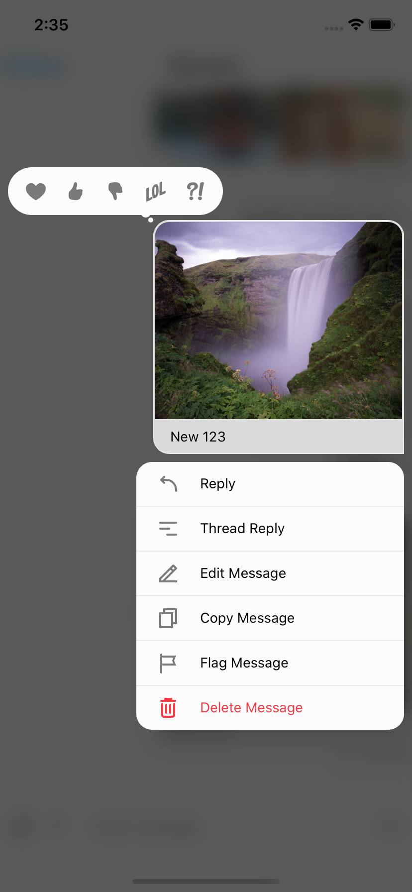</td>
    <td align='center' width="33%">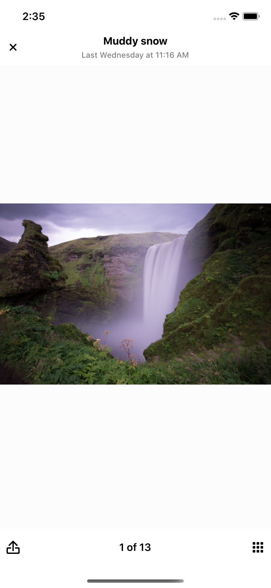</td>
    <td align='center' width="33%">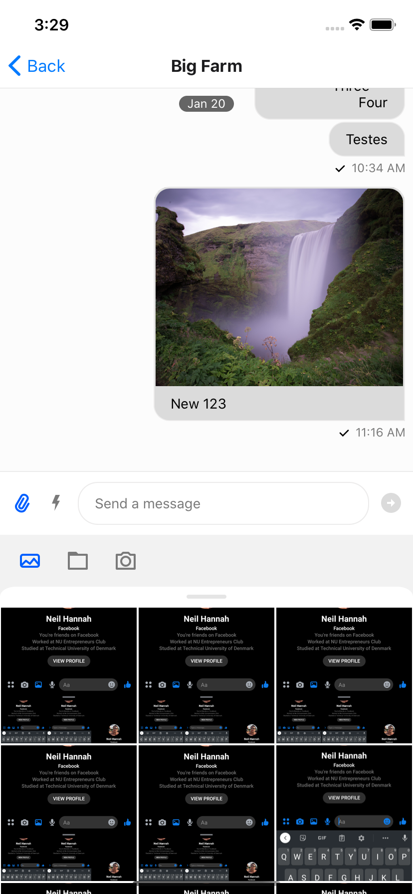</td>
  </tr>
  <tr></tr>
  <tr>
    <td align='center'>Message Interaction</td>
    <td align='center'>Image Viewer</td>
    <td align='center'>Attachment Picker</td>
  </tr>
</table>

Because these views must exist above all others `OverlayProvider` should wrap your navigation stack as well. Assuming [`React Navigation`](https://reactnavigation.org/) is being used, your highest level navigation stack should be wrapped in the provider:

```tsx
<NavigationContainer>
  <OverlayProvider>
    <Stack.Navigator>
      <Stack.Screen />
    </Stack.Navigator>
  </OverlayProvider>
</NavigationContainer>
```

`stream-chat-react-native` like [`stream-chat-js`](https://github.com/GetStream/stream-chat-js) is written in TypeScript with full support for custom object types via provided generics. These generics are given to components as designated in the [TypeScript language docs](https://www.typescriptlang.org/docs/handbook/release-notes/typescript-2-9.html#generic-type-arguments-in-jsx-elements) but can appear unusual if you have not used them before. The previous code snippet with all 7 possible generics given to the `OverlayProvider` would be written as:

```tsx
<NavigationContainer>
  <OverlayProvider<
    AttachmentType,
    ChannelType,
    CommandType,
    EventType,
    MessageType,
    ResponseType,
    UserType
  >>
    <Stack.Navigator>
      <Stack.Screen />
    </Stack.Navigator>
  </OverlayProvider>
</NavigationContainer>
```

**NOTE:** For simplicity in the code snippets not all generics that may be needed are shown. In many cases in practice the generics can be inferred from the provided props. But this is not true in all cases and you may need to provide the proper generics explicitly to ensure type safety and that the TypeScript compiler does not throw an error.

The `OverlayProvider` can be used with no props provided but there are a plethora of props for customizing the components in the overlay. Three core props that will you will likely want to use are `bottomInset`, `i18nInstance`, and `value`. `value` is a `Partial` of the `OverlayContextValue`. It provides the theme to the components in the overlay and thus if you are using a custom theme you can provide it to the overlay as `value={{ style: theme }}`. The `ThemeProvider` inherits from parent contexts and thus the theme will also be provided to the child components used later, such as `Chat` and `Channel`; therefore, this can be used as the main theming entry point. `i18nInstance` is the instance of Streami18n you have for translations. **`bottomInset`** is important as it is required to determine the height of the `AttachmentPicker` and the underlying shift to the `MessageList` when it is opened. In the example shown, the bottom safe area is and is not taken into account and the resulting UI difference is obvious. This can also be set via the `setBottomInset` function provided by the `useAttachmentPickerContext` hook.

```tsx
const streami18n = new Streami18n({ language: 'en' });
const { bottom } = useSafeAreaInsets();
const theme = useStreamChatTheme();

<OverlayProvider
  bottomInset={bottom}
  i18nInstance={streami18n}
  value={{ style: theme }}
>
```

Additionally a `topInset` must be set to ensure that when the picker is completely open it is opened to the desired height. This can be done via props, but can also be set via the `setTopInset` function provided by the `useAttachmentPickerContext` hook. The bottom sheet will not render without this height set, but it can be set to 0 to cover the entire screen, or the safe area top inset if desired. In the example it is being set using the `useHeaderHeight` hook from [React Navigation](https://reactnavigation.org/).

**IMPORTANT:** The current implementation of the scrolling bottom-sheet in which the image picker resides does not re-evaluate heights after the `topInset` is set. So only set this to one value.

```tsx
const headerHeight = useHeaderHeight();
const { setTopInset } = useAttachmentPickerContext();

useEffect(() => {
  setTopInset(headerHeight);
}, [headerHeight]);
```

<table>
  <tr>
    <td align='center' width="33%"></td>
    <td align='center' width="33%">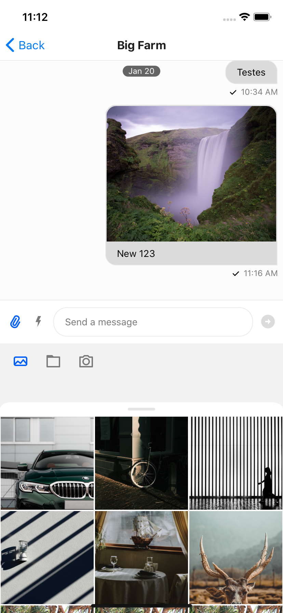</td>
    <td align='center' width="33%"></td>
  </tr>
  <tr></tr>
  <tr>
    <td align='center'>With bottomInset</td>
    <td align='center'>Without bottomInset</td>
    <td align='center'>With topInset</td>
  </tr>
</table>

The `OverlayProvider` contains five providers to which you can add customizations and retrieve data using the appropriate hooks: `TranslationProvider`, `OverlayContext.Prover`, `MessageOverlayProvider`, `AttachmentPickerProvider`, and `ImageGalleryProvider`

**NOTE:** As mentioned there are many modifications that can be performed to the UI. Custom styling via the theme gives you the ability to shape the look of the application as a whole and/or implement dark mode. But additionally the majority of the UI can be modified or replaced via [`Stream Chat settings`](https://getstream.io/chat/) or props. It is trivial to replace or modify most UI elements.

<table>
  <tr>
    <td align='center' width="33%">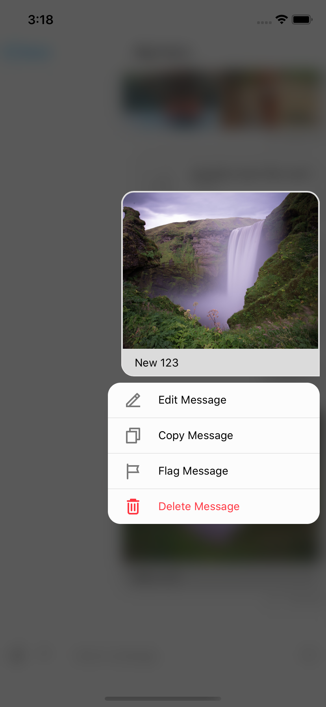</td>
    <td align='center' width="33%"></td>
    <td align='center' width="33%">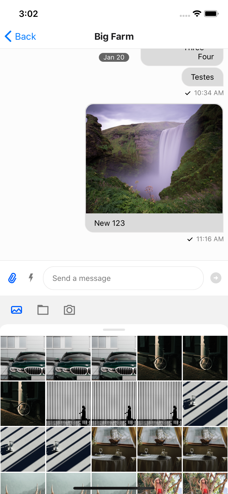</td>
  </tr>
  <tr></tr>
  <tr>
    <td align='center'>No Reactions or Replies</td>
    <td align='center'>Custom Header and Footer</td>
    <td align='center'>Custom Grid Layout</td>
  </tr>
</table>

### Chat

`Chat` is the next level down of context component from `OverlyProvider` that is required for `stream-chat-react-native` to function as designed. You can choose to wrap your entire application in `Chat` similar to what is required for the `OverlayProvider` or you can implement `Chat` at the screen level. `Chat` takes two important props, `client` and `i18nInstance`. The `client` should be an instance of StreamChat from [`stream-chat`](https://github.com/GetStream/stream-chat-js) configured for your app, and `i18nInstance` should be an instance of `Streami18n` from `stream-chat-react-native` configured for the desired language. `Chat` can also accept a `style` prop with the theme, this can be used to overwrite styles inherited from `OverlayProvider`. If you are using TypeScript you should add the appropriate generics to your instantiation of `StreamChat`. Follow the documentation for [`stream-chat`](https://github.com/GetStream/stream-chat-js) to ensure proper setup.

```tsx
import { StreamChat } from 'stream-chat';
import { Streami18n } from 'stream-chat-react-native';

const streami18n = new Streami18n({ language: 'en' });
const chatClient = StreamChat.getInstance<
  AttachmentType,
  ChannelType,
  CommandType,
  EventType,
  MessageType,
  ResponseType,
  UserType
>('key');

<Chat client={chatClient} i18nInstance={streami18n}>
```

### Channel

When creating a chat screen it is required that `Channel` wrap the `stream-chat-react-native` components being used. `Channel` provides multiple contexts to the enclosed components and allows for modification of many of the enclosed components via props that are then kept in context.

Three key props to `Channel` are `channel`, `keyboardVerticalOffset`, and `thread`. `channel` is a `StreamChat` channel. It can be created via `const channel = client.channel('type', 'id')` or is available as a callback on the `ChannelList` component via the prop `onSelect`. `keyboardVerticalOffset` is needed for adjusting the keyboard compatible view and should be the spacing above the `Channel` component, e.g. if you have a header it should be the header height. `thread` is a message object in the context of which a thread is occurring, i.e. the parent message of a thread. This can be set to any message, but is easily accessible on the `MessageList` component using the prop `onThreadSelect`. `Channel` also keeps an internal thread state which can be manipulated via `openThread` and `closeThread` using the `ThreadContext` if you would prefer not to use your own state for the thread.

```tsx
const channel = client.channel('type', 'id');
const headerHeight = useHeaderHeight();
const { thread } = useContext(AppContext);

<Channel
  channel={channel}
  keyboardVerticalOffset={headerHeight}
  thread={thread}
>
```

<table>
  <tr>
    <td align='center' width="33%">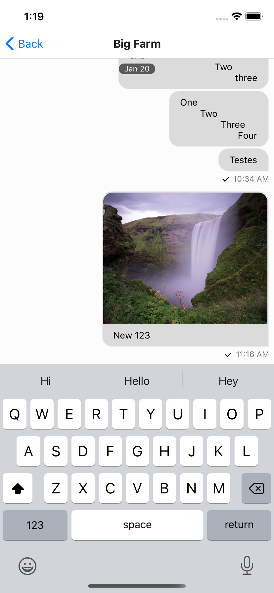</td>
    <td align='center' width="33%"></td>
    <td align='center' width="33%"></td>
  </tr>
  <tr></tr>
  <tr>
    <td align='center'>Missing keyboardVerticalOffset</td>
    <td align='center'>Missing channel</td>
    <td align='center'>Missing Thread</td>
  </tr>
</table>

`Channel` contains five providers to which you can add customizations and retrieve data using the appropriate hooks. They are `ChannelProvider`, `MessagesProvider`, `ThreadProvider`, `SuggestionsProvider`, and `MessageInputProvider`. These are all contained within a `KeyboardCompatibleView` then ensures the encompassed views respect the keyboard layout.

The type definition for `Channel` provide a full overview of the customizations available. A small sample of what is possible is can be seen in modifying `hasFilePicker`, `messageContentOrder`, and `supportedReactions`.

**NOTE:** When `messageContentOrder` is changed the default styling no longer matches the design as the bottom inner corner does not a have a radius. This can be altered using the `theme`, or more appropriately in this case to both `theme` and `myMessageTheme`. `myMessageTheme` will apply a theme to only the current users messages and thus allow for differing styles on sent and received messages.

<table>
  <tr>
    <td align='center' width="33%">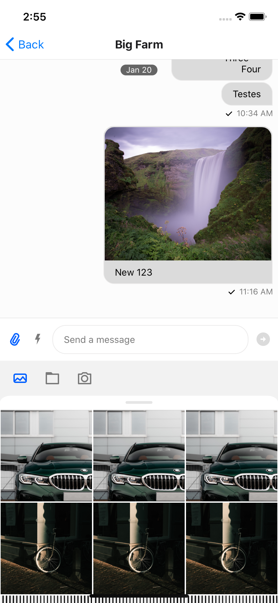</td>
    <td align='center' width="33%">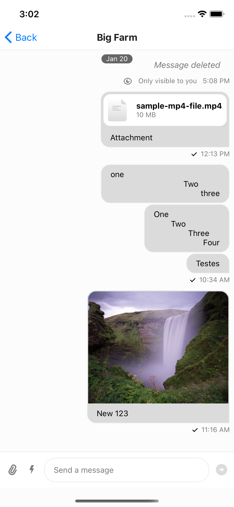</td>
    <td align='center' width="33%">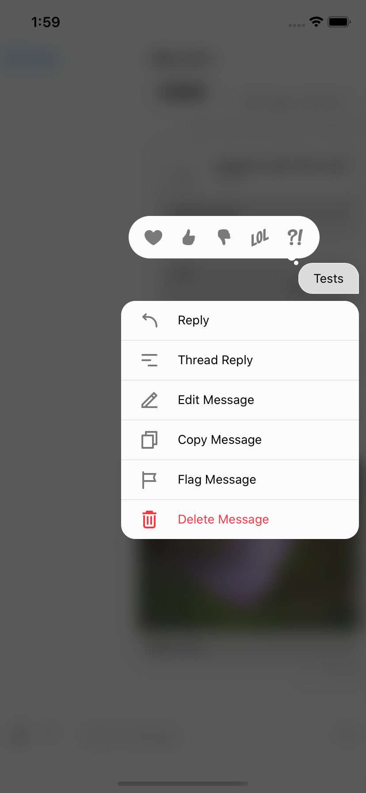</td>
  </tr>
  <tr></tr>
  <tr>
    <td align='center'>hasFilePicker={true} (default)</td>
    <td align='center'>messageContentOrder={['gallery', 'files', 'text', 'attachments']} (default)</td>
    <td align='center'>supportedReactions={reactionData} (default)</td>
  </tr>
  <tr></tr>
  <tr>
    <td align='center'>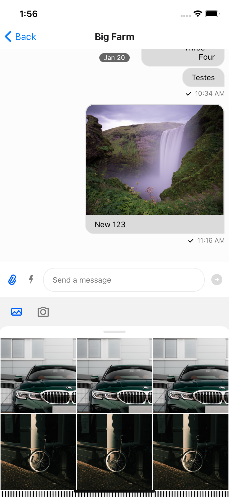</td>
    <td align='center'>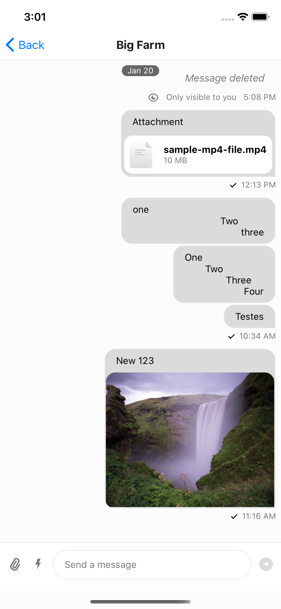</td>
    <td align='center'>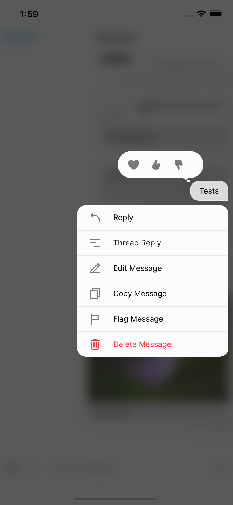</td>
  </tr>
  <tr></tr>
  <tr>
    <td align='center'>hasFilePicker={false}</td>
    <td align='center'>messageContentOrder={['text', 'gallery', 'files', 'attachments']}</td>
    <td align='center'>supportedReactions={reactionData.slice(0, 3)}</td>
  </tr>
</table>

### MessageList

`MessageList` is the next component that is necessary for rendering a chat interface. It does not require any props as it uses the surrounding contexts.

```tsx
<MessageList<
  AttachmentType,
  ChannelType,
  CommandType,
  EventType,
  MessageType,
  ResponseType,
  UserType
  >
/>
```

Similar to the other components props are available for modification of the UI. Although most modifications are provided via the `Channel` component some are provided through the `MessageList`, such as `additionalFlatListProps` to pass props directly to the flat list, `onListScroll` to access the scroll handler, and `setFlatListRef` to directly access the [FlatList ref](https://reactnative.dev/docs/flatlist).

If you choose to track thread state locally the thread when selected can be accessed via a callback provided to the prop `onThreadSelect`. In this case proper typing can be added via generics.

```tsx
<MessageList<
  AttachmentType,
  ChannelType,
  CommandType,
  EventType,
  MessageType,
  ResponseType,
  UserType
>
  onThreadSelect={(thread) => {
    setThread(thread);
    navigation.navigate('Thread');
  }}
/>
```

### MessageInput

The final component necessary to create a fully functioning Chat screen is `MessageInput`. Similar to `MessageList` this component can be used without any props as it utilizes the surrounding contexts for functionality. The majority of `MessageInput` customizations are set at the `Channel` level. But one prop that should be local is `threadList` which is a `boolean` indicating whether or not the current `MessageList` is a thread.

```tsx
<MessageInput />
```

**Note:** You can also utilize the `Thread` component which is already setup with both a `MessageList` and `MessageInput` component when creating a thread screen. A key prop on `Thread` is `onThreadDismount` as it can be used to set a locally tracked thread state to `null | undefined`.

## Putting it all together

It takes very few components to put together a fully functioning Chat screen in practice:

```tsx
<OverlayProvider
  bottomInset={bottom}
  i18nInstance={streami18n}
>
  <Chat client={chatClient} i18nInstance={streami18n}>
    <Channel
      channel={channel}
      keyboardVerticalOffset={headerHeight}
    >
      <View style={{ flex: 1 }}>
        <MessageList />
        <MessageInput />
      </View>
    </Channel>
  </Chat>
</OverlayProvider>
```

Once you have Chat up and running there are tons of customization possibilities and the TypeScript intellisense is a great asset in customizing the UI and functionality to your needs. Check out the [examples](./examples) for implementations of these components in apps you can build locally.

## Customization

This SDK provides quite rich UI components in terms of design and functionality. But sometimes you may want to replace the default components with something that better fits your application requirements. For this purpose, we have made it quite easy to either replace the existing components with custom components or add your own styling on existing components

### theme

The majority of components used in `stream-chat-react-native` can have custom styles applied to them via the theming system. You can add a theme object on `Chat` component as shown in following code snippet: To accurately create a theme we suggest utilizing our exported types to create your own theme. You can find the default theme object in [theme.ts](https://github.com/GetStream/stream-chat-react-native/blob/v2-designs/src/contexts/themeContext/utils/theme.ts) (check for the line `export type Theme`). We perform a deep merge on the styles so only styles designated in the custom theme overwrite the default styles. 

Where possible we have also used `displayName` to expose the the path to the style for components. 
e.g., lets say if you want to customize styles on file attachment

- Open the [in-app developer menu](https://reactnative.dev/docs/debugging#accessing-the-in-app-developer-menu)
- Turn on inspector by pressing "Show Inspector" button
- Select the attachment file on UI. You will the displayName of the component in inspector (as showin in screenshot below)

For displayName `FileAttachment{messageSimple{file}}` we are saying the component name is `FileAttachment` and the style keys are `messageSimple -> file`. There are often multiple keys on a designated display name corresponding to different sub-components styles. In this case `file` has five sub-component keys, that can modify the styling.

```typescript
file: {
  container: ViewStyle;
  details: ViewStyle;
  fileSize: TextStyle;
  icon: IconProps;
  title: TextStyle;
};
```

Modifying the theme for this component is done by adding custom styles at the desired keys.

```tsx
import type { DeepPartial, Theme } from 'stream-chat-react-native';

const theme: DeepPartial<Theme> = {
  messageSimple: {
    file: {
      container: {
        backgroundColor: 'red',
      },
      icon: {
        height: 16,
        width: 16,
      },
    },
  },
};

<Chat style={theme}>
</Chat>
```

<table>
  <tr>
    <td align='center' width="33%">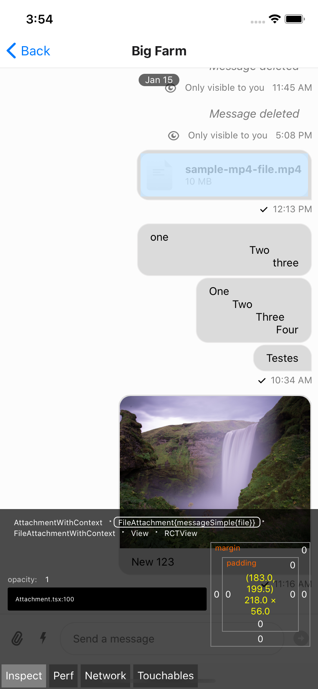</td>
    <td align='center' width="33%">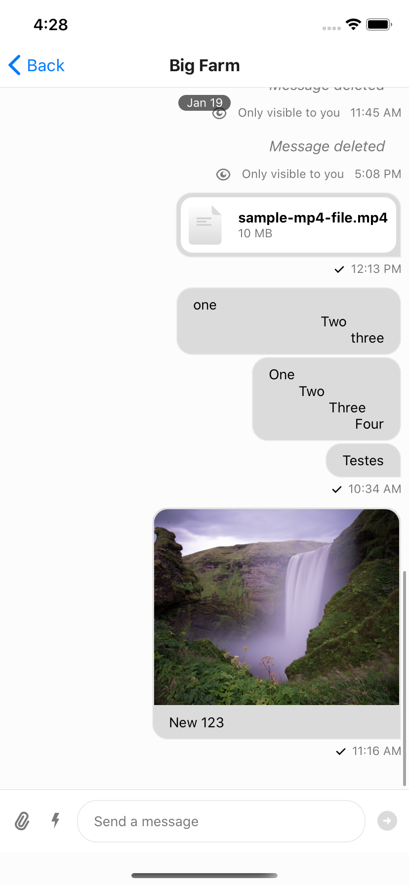</td>
    <td align='center' width="33%">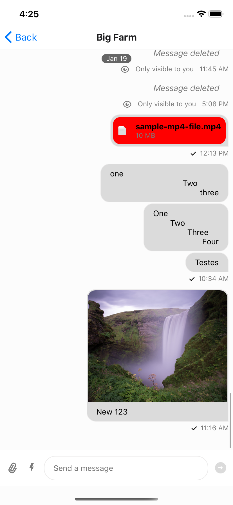</td>
  </tr>
  <tr></tr>
  <tr>
    <td align='center'>Display Name in Inspector</td>
    <td align='center'>Non-Themed Component</td>
    <td align='center'>Themed Component</td>
  </tr>
</table>

**NOTE:** Most of the styles are standard React Native styles, but some styles applying to SVGs, Markdown, or custom components are numbers, strings, or other specified types. The TypeScript documentation of `Theme` should help you in this regard. Message text is an instance of an exception as it is rendered using [`react-native-markdown-package`](https://github.com/andangrd/react-native-markdown-package) and the [`MarkdownStyle`](https://github.com/andangrd/react-native-markdown-package/blob/master/styles.js) is added to the theme at key `messageSimple -> content -> markdown`. Standard React Native styles is a departure from the `2.x` version of `stream-chat-react-native` in which [`styled-components`](https://styled-components.com/) was utilized for theming.

### Custom components

Please check the [visual guide](https://github.com/GetStream/stream-chat-react-native/blob/vishal/v2-designs-docs/VisualGuide.md) which makes it easy to know which components can be customized.

## FAQ

### How to customize message component

Channel component accepts following props, for which you can provide your own components:

- [Message](./src/components/Message/Message.tsx) - This is a higher order component, that wraps the UI component (MessageSimple) for message bubble. This component provides underlying UI component with all the handlers necessary. Mostly you shouldn't need to use customize this component, unless you want to write your own handlers for message actions, gesture etc. Using the [Message Component](./src/components/Message/Message.tsx) as an example can be helpful to understand what props and hooks provide different information to the component. It is also suggested you optimize the component for rendering using memoization as is the standard suggested practice for `FlatList` items.

```tsx
<OverlayProvider
  bottomInset={bottom}
  i18nInstance={streami18n}
>
  <Chat client={chatClient} i18nInstance={streami18n}>
    <Channel
      channel={channel}
      keyboardVerticalOffset={headerHeight}
      Message={CustomMessageComponent}
    >
      <View style={{ flex: 1 }}>
        <MessageList />
        <MessageInput />
      </View>
    </Channel>
  </Chat>
</OverlayProvider>
```

- [MessageSimple](./src/components/Message/MessageSimple.tsx) - This is the actual UI component for message bubble. You can still get access to all the handlers defined in [Message](./src/components/Message/Message.tsx) HOC via `useMessageContext`

```tsx
const CustomMessageUIComponent = () => {
  /** Custom implementation */
}

<OverlayProvider
  bottomInset={bottom}
  i18nInstance={streami18n}
>
  <Chat client={chatClient} i18nInstance={streami18n}>
    <Channel
      channel={channel}
      keyboardVerticalOffset={headerHeight}
      MessageSimple={CustomMessageUIComponent}
    >
      <View style={{ flex: 1 }}>
        <MessageList />
        <MessageInput />
      </View>
    </Channel>
  </Chat>
</OverlayProvider>
```


If you want to customize only a specific part of `MessageSimple` component, you can add your own custom UI components, by providing following props on Channel component:

- MessageHeader
- MessageFooter
- MessageAvatar
- MessageStatus
- MessageText
- MessageSystem
- MessageContent
- Attachment
- Giphy
- Card
- FileAttachmentGroup
- FileAttachment
- Gallery
- UrlPreview

```tsx
<Channel
  channel={channel}
  keyboardVerticalOffset={headerHeight}
  MessageAvatar={CustomAvatarComponent}
  MessageText={CustomTextComponent}
>
```
### Message bubble with custom text styles & fonts

We use `react-native-simple-markdown` library internally in the `Message` component to render markdown content of the text. Thus styling text in the `Message` component requires a slightly different approach than styling just a single standard `Text` component in React Native.

In the theme there are multiple text types such as replies and emoji-only messages that have the associated type `MarkdownStyle`, for the main message text this falls in `messageSimple -> content -> markdown` within `theme`. To modify the style of the markdown, text styles can be provided for each of the markdown sub-components that are applied based on text parsing.

```typescript
export type MarkdownStyle = Partial<{
  autolink: TextStyle;
  blockQuoteBar: ViewStyle;
  blockQuoteSection: ViewStyle;
  blockQuoteSectionBar: ViewStyle;
  blockQuoteText: TextStyle | ViewStyle;
  br: TextStyle;
  codeBlock: TextStyle;
  del: TextStyle;
  em: TextStyle;
  heading: TextStyle;
  heading1: TextStyle;
  heading2: TextStyle;
  heading3: TextStyle;
  heading4: TextStyle;
  heading5: TextStyle;
  heading6: TextStyle;
  hr: ViewStyle;
  image: ImageStyle;
  inlineCode: TextStyle;
  list: ViewStyle;
  listItem: ViewStyle;
  listItemBullet: TextStyle;
  listItemNumber: TextStyle;
  listItemText: TextStyle;
  listRow: ViewStyle;
  mailTo: TextStyle;
  mentions: TextStyle;
  newline: TextStyle;
  noMargin: TextStyle;
  paragraph: TextStyle;
  paragraphCenter: TextStyle;
  paragraphWithImage: ViewStyle;
  strong: TextStyle;
  sublist: ViewStyle;
  table: ViewStyle;
  tableHeader: ViewStyle;
  tableHeaderCell: TextStyle;
  tableRow: ViewStyle;
  tableRowCell: ViewStyle;
  tableRowLast: ViewStyle;
  text: TextStyle;
  u: TextStyle;
  view: ViewStyle;
}>;
```

### Message with custom reactions

To add custom reactions you need to use the `supportedReactions` prop on `Channel`. `supportedReactions` is an array of `ReactionData`. The default `supportedReactions` array contains 5 reactions.

```tsx
export const reactionData: ReactionData[] = [
  {
    Icon: LoveReaction,
    type: 'love',
  },
  {
    Icon: ThumbsUpReaction,
    type: 'like',
  },
  {
    Icon: ThumbsDownReaction,
    type: 'sad',
  },
  {
    Icon: LOLReaction,
    type: 'haha',
  },
  {
    Icon: WutReaction,
    type: 'wow',
  },
];
```

To create your own reaction you need both a `type` and `Icon`. The `Icon` is a component with `IconProps` it is suggested you take advantage of [`react-native-svg`](https://github.com/react-native-svg/react-native-svg) for scaling purposes. It is suggested you look at the default icons for examples of how to create your own that is able to properly use the theme and sizing that are provided via props. Using exported type from `stream-chat-react-native` a custom reaction can be created and added.

```tsx
export const StreamReaction: React.FC<IconProps> = (props) => (
  <RootSvg height={21} width={42} {...props} viewBox='0 0 42 21'>
    <RootPath
      d='M26.1491984,6.42806971 L38.9522984,5.52046971 C39.7973984,5.46056971 40.3294984,6.41296971 39.8353984,7.10116971 L30.8790984,19.5763697 C30.6912984,19.8379697 30.3888984,19.9931697 30.0667984,19.9931697 L9.98229842,19.9931697 C9.66069842,19.9931697 9.35869842,19.8384697 9.17069842,19.5773697 L0.190598415,7.10216971 C-0.304701585,6.41406971 0.227398415,5.46036971 1.07319842,5.52046971 L13.8372984,6.42816971 L19.2889984,0.333269706 C19.6884984,-0.113330294 20.3884984,-0.110730294 20.7846984,0.338969706 L26.1491984,6.42806971 Z M28.8303984,18.0152734 L20.5212984,14.9099734 L20.5212984,18.0152734 L28.8303984,18.0152734 Z M19.5212984,18.0152734 L19.5212984,14.9099734 L11.2121984,18.0152734 L19.5212984,18.0152734 Z M18.5624984,14.1681697 L10.0729984,17.3371697 L3.82739842,8.65556971 L18.5624984,14.1681697 Z M21.4627984,14.1681697 L29.9522984,17.3371697 L36.1978984,8.65556971 L21.4627984,14.1681697 Z M19.5292984,13.4435697 L19.5292984,2.99476971 L12.5878984,10.8305697 L19.5292984,13.4435697 Z M20.5212984,13.4435697 L20.5212984,2.99606971 L27.4627984,10.8305697 L20.5212984,13.4435697 Z M10.5522984,10.1082697 L12.1493984,8.31366971 L4.34669842,7.75446971 L10.5522984,10.1082697 Z M29.4148984,10.1082697 L27.8178984,8.31366971 L35.6205984,7.75446971 L29.4148984,10.1082697 Z'
      {...props}
    />
  </RootSvg>
);

const newReactionData = [...reactionData, { type: 'stream', Icon: StreamReaction }];
```

Both the resulting reaction picker and reaction result can then utilize this additional option.

<table>
  <tr>
    <td align='center' width="33%">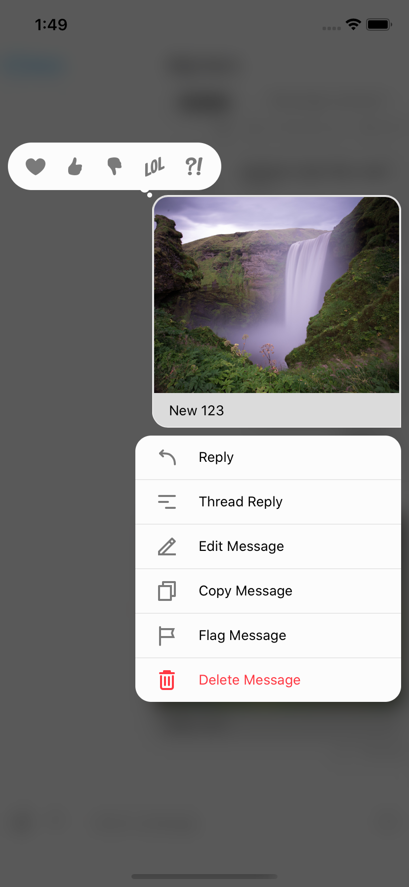</td>
    <td align='center' width="33%">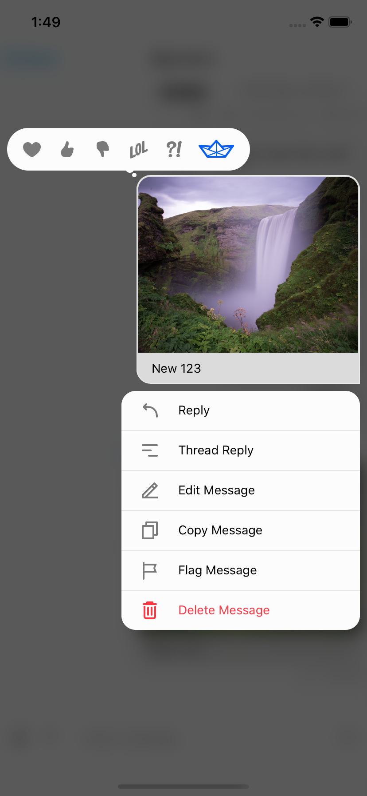</td>
    <td align='center' width="33%"></td>
  </tr>
  <tr></tr>
  <tr>
    <td align='center'>Standard Reactions</td>
    <td align='center'>Modified Reactions</td>
    <td align='center'>Modified Reaction</td>
  </tr>
</table>

### Instagram style double-tap reaction

`stream-chat-react-native` uses a combination of `react-native-gesture-handler` and standard `react-native` touchables to provide animations to the UI. Because of this there are conditions in which multiple interactions are taking place at once.

**e.g.** If you press on a message it begins to depress and after a long hold will present the context menu for the message. But release sooner and if you are pressing on an image, the image viewer will appear.

Therefore to allow for something like double-tap reactions three props are required, `onPressInMessage`, `onLongPressMessage`, and `onDoubleTapMessage`. The first is used to prevent the `onPress` of inner `react-native` touchable components from firing while waiting for the double press to be evaluated by `react-native-gesture-handler`. Using a timeout the original `onPress` can be called if a second press has not ocurred in the expected time for the double tap to fire.

To prevent this event from firing when a long press occurs `onLongPressMessage` should be set to a function that cancels the timeout.

The `onDoubleTapMessage` prop can then be used to add a reaction as it is a function that is provided the message for which it is double tapped. This uses `react-native-gesture-handler` to track double taps. For convenience, as this is a common design pattern, the function is also is passed the `handleReactionDoubleTap` function. If defined (this is `undefined` when there is an error message or the `status` of the message is `failed`), this function can be passed a `string` of the reaction `type` to add or remove a reaction.

To complete the Instagram feel, setting the `OverlayReactionList` component to an empty component and limiting the `supportedReactions` as shown allows only 1 type of reaction and limits the UI to double-tap only to add or remove it.

```tsx
const lastTap = React.useRef<number | null>(null);
const timeOut = React.useRef<NodeJS.Timeout | null>(null);
const handleDoubleTap = (
  _: GestureResponderEvent,
  defaultTap?: () => void,
) => {
  const now = Date.now();
  if (lastTap.current && now - lastTap.current < 500) {
    if (timeOut.current) {
      clearTimeout(timeOut.current);
    }
  } else {
    lastTap.current = now;
    timeOut.current = setTimeout(() => {
      if (defaultTap) {
        defaultTap();
      }
    }, 500);
  }
};

const onLongPressMessage = () => {
  if (timeOut.current) {
    clearTimeout(timeOut.current);
  }
};

<Channel
  channel={channel}
  keyboardVerticalOffset={headerHeight}
  onDoubleTapMessage={(_message, handleReactionDoubleTap) =>
    if (handleReactionDoubleTap) {
      handleReactionDoubleTap('stream')
    }
  }
  onLongPressMessage={onLongPressMessage}
  onPressInMessage={handleDoubleTap}
  OverlayReactionList={() => null}
  supportedReactions={[{ type: 'stream', Icon: StreamReaction }]}
  thread={thread}
>
```

### Slack style messages all on the left side

By default, received messages are shown on left side of the `MessageList` and sent messages are shown on right side of the `MessageList`.

You can change this at the `Message` level via the prop `forceAlignMessages` or set the alignment for the entire `Channel` using the same `forceAlignMessages` prop.

```tsx
<Channel
  channel={channel}
  forceAlignMessages='left'
  keyboardVerticalOffset={headerHeight}
  thread={thread}
>
```

### Message bubble with name of sender

In group messaging it's important to show the name of the sender associated message bubble - similar to Slack or WhatsApp. By default this is done in the `MessageFooter` component. This component is fully replaceable via props on `Channel` and is provided a set of props itself, `MessageFooterProps`, that can be used for rendering. Any additional data for rendering a custom footer can be pulled from contexts such as the `MessageContext` via the `useMessageContext` hook.

If you wanted to move the information about the sender to the top of the message you can provide a `MessageHeader` component to `Channel` which is provided the same props, `MessageHeaderProps`, as the footer, `MessageFooterProps`, and again can utilize the contexts as needed.

```tsx
<Channel
  channel={channel}
  keyboardVerticalOffset={headerHeight}
  MessageHeader={(props) =>
    props.message?.user?.id !== chatClient.userID ? (
      <View
        style={{ flexDirection: 'row' }}
      >
        {Object.keys(props.members).length > 2 &&
          props.message.user?.name ? (
            <Text style={[{ color: grey, marginRight: 8 }]}>
              {props.message.user.name}
            </Text>
          ) : null}
        <Text style={[{ color: grey, textAlign: props.alignment }]}>
          {props.formattedDate}
        </Text>
      </View>
    ) : null
  }
  MessageFooter={() => null}
  thread={thread}
>
```

<table>
  <tr>
    <td align='center' width="33%"></td>
    <td align='center' width="33%">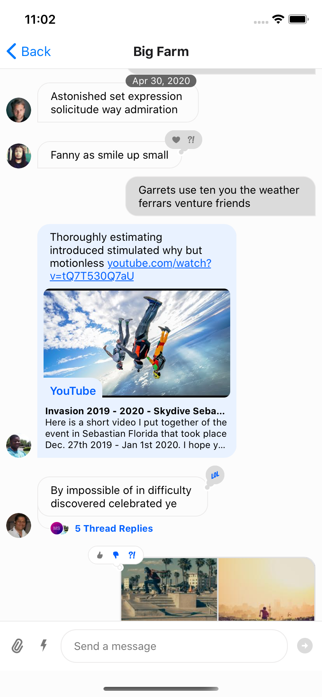</td>
    <td align='center' width="33%">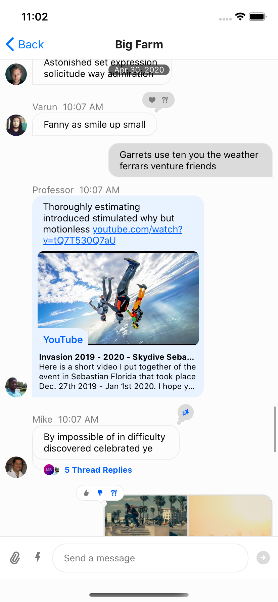</td>
  </tr>
  <tr></tr>
  <tr>
    <td align='center'>Standard Footer</td>
    <td align='center'>No Footer</td>
    <td align='center'>Header Added</td>
  </tr>
</table>

### Swipe message left to delete and right to reply

To add swipe controls to your messages it is suggested that you create a custom `Message` component to replace the default one. An easy solution is to wrap the standard exported message component from `stream-chat-react-native` in a `Swipeable` from `react-native-gesture-handler/Swipeable`. You can then use the functions provided by `Swipeable` to fine tune to functionality to your liking.

You can add reply functionality by calling `setQuotedMessageState`, available from the `useMessagesContext` hook. Or you can delete the message using a combination of `client.deleteMessage` and `updateMessage`, the latter of which is also available from the `useMessagesContext` hook. You can find the internal implementation of these functions in the `Message` component; or you can add any other functionality you like. It is suggested to add custom logic when implementing swipeable messages to ensure you only can swipe appropriate messages, **i.e.**  you can only swipe to delete messages you have the ability to delete and have not yet been deleted. Using `Message` props and contexts this is easily achievable.

```tsx
const SwipeableMessage = (
  props: MessageProps<
    AttachmentType,
    ChannelType,
    CommandType,
    EventType,
    MessageType,
    ResponseType,
    UserType
  >,
) => {
  return (
    <Swipeable
      onSwipeableLeftOpen={reply(props.message)}
      onSwipeableRightOpen={delete(props.message)}
      overshootLeft={false}
      overshootRight={false}
      renderLeftActions={(progress) => (
        <Animated.View
          style={{
            backgroundColor: 'blue',
            transform: [
              {
                translateX: progress.interpolate({
                  inputRange: [0, 1],
                  outputRange: [-100, 0],
                }),
              },
            ],
            width: 100,
          }}
        />
      )}
      renderRightActions={(progress) => (
        <Animated.View
          style={{
            justifyContent: 'center',
            opacity: progress.interpolate({
              inputRange: [0, 1],
              outputRange: [0, 1],
            }),
          }}
        >
          <StreamReaction />
        </Animated.View>
      )}
    >
      <Message {...props} />
    </Swipeable>
  );
};
```

<table>
  <tr>
    <td align='center' width="33%">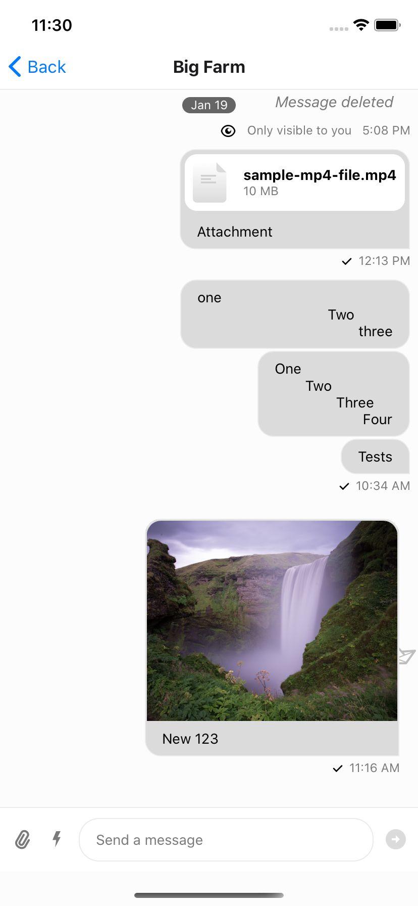</td>
    <td align='center' width="33%">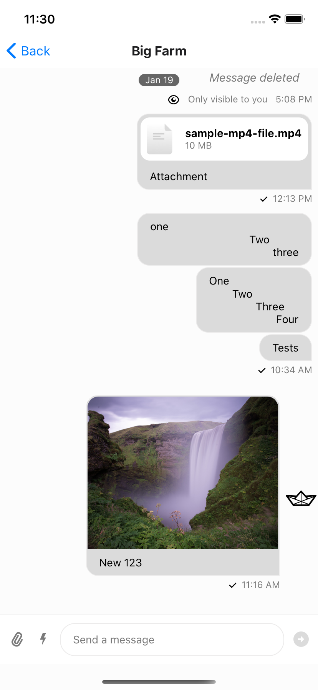</td>
    <td align='center' width="33%"></td>
  </tr>
  <tr></tr>
  <tr>
    <td align='center'>Swiping partially open (opacity partial)</td>
    <td align='center'>Swiping all the way open</td>
    <td align='center'>Swiping using transform -> translateX</td>
  </tr>
</table>

### Keyboard

React Native provides an in built component called `KeyboardAvoidingView`. This component works well for most of the cases where height of the component is 100% relative to screen. If you have a fixed height then it may create some issues (it depends on your use case - and how you use wrappers such as navigation around chat components).

To avoid this issue we built our own component - `KeyboardCompatibleView`. It contains simple logic - when keyboard is opened (which we can know from events of Keyboard module), adjust the height of `Channel` component, and when keyboard is dismissed, again adjust the height of `Channel` component accordingly. `KeyboardCompatibleView` is near identical to `KeyboardAvoidingView` from `react-native`, with some adjustments for app state.

You can provide following props to `Channel` to customize the builtin `KeyboardCompatibleView` behavior. 

```
disableKeyboardCompatibleView - boolean 
keyboardBehavior - 'padding' | 'position' | 'height'
keyboardVerticalOffset  - number
```

You can pass additional props directly to the component using the `additionalKeyboardAvoidingViewProps`.

You can also replace the `KeyboardCompatibleView` with your own custom component by passing it as a prop to channel.

```tsx
<Channel
  KeyboardCompatibleView={CustomizedKeyboardView}
  ...
/>
```

Or disable the `KeyboardCompatibleView` and use the standard `KeyboardAvoidingView` from `react-native`.
You can disable `KeyboardCompatibleView` by using prop `disableKeyboardCompatibleView` on the `Channel` component.

```tsx
<Channel
  disableKeyboardCompatibleView
  ...
/>
```

### How to modify the underlying `FlatList` of `MessageList` or `ChannelList`

You can additionally pass [props](https://reactnative.dev/docs/flatlist#props) to the underlying `FlatList` using `additionalFlatListProps` prop.

```tsx
<ChannelList
  additionalFlatListProps={{ bounces: true }}
  filters={filters}
  sort={sort}
/>
```

```tsx
<MessageList additionalFlatListProps={{ bounces: true }} />
```

### Image compression

If an image is too big it may cause a delay while uploading to our server. You can elect to compress images prior to upload by adding the `compressImageQuality` prop to `Channel`.

`compressImageQuality` can be a value from `0` to `1`, where 1 is the best quality, i.e. no compression. On iOS, values larger than 0.8 don't decrease the quality a noticeable amount on most images, while still reducing the file size significantly when compared to the uncompressed version.

### Override or intercept message actions (edit, delete, reaction, reply, etc.)

There are a number of message actions you may want to intercept or override. `Channel` takes as props and passes on to the `MessagesContext` all of these intercepts and overrides.

The intercepts will not change the standard functions but will be called during their calls if provided. For actions such as analytics these are good to take advantage of. All of these intercept functions receive the message they are called on, and `handleReaction` additionally receives the reaction type.

You can also override the built in functions for these actions if you so choose. With the exception of `selectReaction` all of the functions are provided the `message` they are called on and must return a `MessageAction` for use in the context menu. `selectReaction` is also provided the `message` but should return an async function that takes a `reactionType`. This is called with the selected reaction type when a reaction is selected in the context menu.

```tsx
type MessageAction = {
  action: () => void;
  title: string;
  icon?: React.ReactElement;
  titleStyle?: StyleProp<TextStyle>;
};
```

`MessageAction` is provided to the context menu where when selected `action` is called for the item. `title`, `icon`, and `titleStyle` are used to modify the appearance.

```tsx
<Channel
  channel={channel}
  editMessage={(message) => ({
    action: () => console.log(message.text),
    icon: <StreamReaction />,
    title: 'Custom Edit',
    titleStyle: { color: '#005FFF' },
  })}
  keyboardVerticalOffset={headerHeight}
  thread={thread}
>
```

<table>
  <tr>
   <td width="33%">
      <ul>
        <li>handleBlock</li>
        <li>handleCopy</li>
        <li>handleDelete</li>
        <li>handleEdit</li>
        <li>handleFlag</li>
        <li>handleMute</li>
        <li>handleReaction</li>
        <li>handleReply</li>
        <li>handleRetry</li>
        <li>handleThreadReply</li>
      </ul>
    </td>
    <td  width="33%">
      <ul>
        <li>blockUser</li>
        <li>copyMessage</li>
        <li>deleteMessage</li>
        <li>editMessage</li>
        <li>flagMessage</li>
        <li>muteUser</li>
        <li>selectReaction</li>
        <li>reply</li>
        <li>retry</li>
        <li>threadReply</li>
      </ul>
    </td>
    <td align='center' width="33%"></td>
  </tr>
  <tr></tr>
  <tr>
    <td align='center'>Props for intercepting</td>
    <td align='center'>Props for overriding</td>
    <td align='center'>editMessage override example</td>
  </tr>
</table>

### How to change the layout of `MessageInput` component

We provide the `MessageInput` container out of the box in a fixed configuration with many customizable features. Similar to other components it accesses most customizations via context, specially the `MessageInputContext` which is instantiated in `Channel`. You can also pass the same props as the context provides directly to the `MessageInput` component to override the context values.

```tsx
<Channel
  channel={channel}
  Input={() => null}
  keyboardVerticalOffset={headerHeight}
  Message={CustomMessageComponent}
>
  <View style={{ flex: 1 }}>
    <MessageList />
    <MessageInput
      Input={() => <View style={{ height: 40, backgroundColor: 'red' }} />}
    />
  </View>
</Channel>
```

The code above would render the red `View` and not `null` as the props take precedence over the context value.

You can modify `MessageInput` in a large variety of ways. The type definitions for the props give clear insight into all of the options. You can replace the `Input` wholesale, as above, or create you own `MessageInput` component using the provided hooks to access context.

<table>
  <tr>
    <td align='center' width="33%">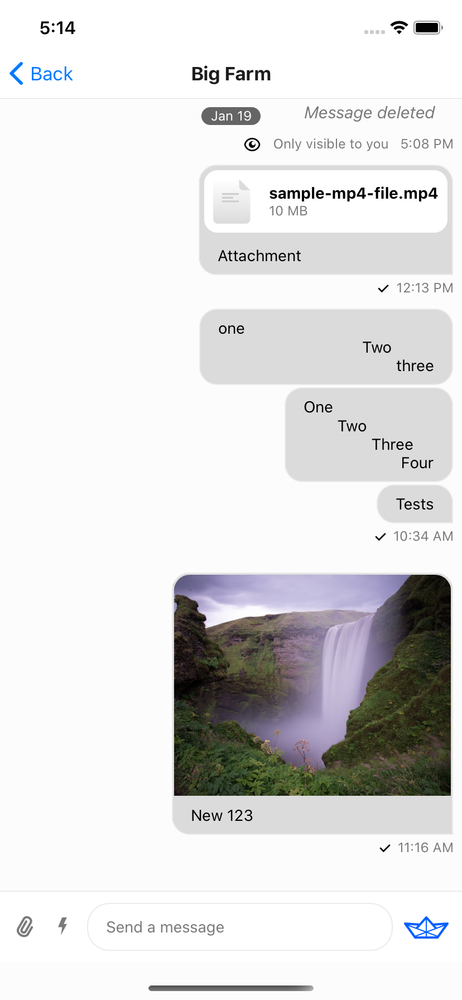</td>
    <td align='center' width="33%"></td>
    <td align='center' width="33%">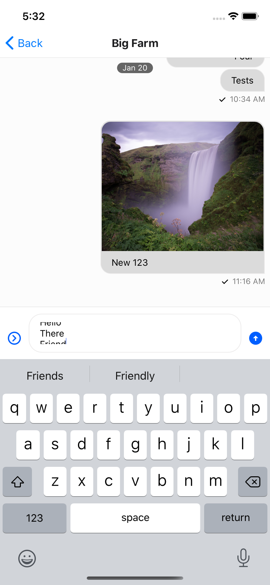</td>
  </tr>
  <tr></tr>
  <tr>
    <td align='center'>Replace SendButton</td>
    <td align='center'>hasFilePicker & hasImagePicker - false</td>
    <td align='center'>numberOfLines={2}</td>
  </tr>
</table>

**NOTE:** The `additionalTextInputProps` prop of both `Channel` and `MessageInput` is passed the the internal [`TextInput`](https://reactnative.dev/docs/textinput) component from `react-native`. If you want to change the `TextInput` component props directly this can be done using this prop.

### Disable autocomplete feature on input (mentions and commands)

The auto-complete trigger settings by default include `/`, `@`, and `:` for slash commands, mentions, and emojis respectively. These triggers are created by the exported function `ACITriggerSettings`, which takes `ACITriggerSettingsParams` and returns `TriggerSettings`. You can override this function to remove some or all of the trigger settings via the `autoCompleteTriggerSettings` prop on `Channel`. If you remove the slash commands it is suggested you also remove the commands button using the prop on `Channel` `hasCommands`. You can remove all of the commands by returning an empty object from the function given to `autoCompleteTriggerSettings`.

```tsx
<Channel
  autoCompleteTriggerSettings={() => ({})}
  channel={channel}
  hasCommands={false}
  keyboardVerticalOffset={headerHeight}
  thread={thread}
>
```

### Push Notifications

#### Setup

##### iOS

- https://getstream.io/chat/docs/push_ios/?language=java
- https://getstream.io/chat/docs/rn_push_initial/?language=java
- https://getstream.io/chat/docs/rn_push_ios/?language=java

##### Android

- https://getstream.io/chat/docs/push_android/?language=java
- https://getstream.io/chat/docs/rn_push_initial/?language=java
- https://getstream.io/chat/docs/rn_push_android/?language=java

#### Requirements

- A user must be a member of channel if they expect a push notification for a message on that channel to be sent.

- We only send a push notification when a user is **NOT** connected to chat, i.e. if a user **does NOT have any active WS (websocket) connection**. A WS connection is established when you call `connectUser` on the instance of `StreamChat`. You must also call `addDevice` with the users device token on the instance of `StreamChat` to provide the token to the server for push.

#### Caveats
Usually you want to receive push notification when your app is in the background. When your app is closed (not quit) the WS connection stays active for approximately 15-20 seconds; after which the system will break the connection automatically. For these 15-20 seconds you won't receive any push notifications since the WS is still active.

To handle this case you have to manually break the WS connection when your app is closed.

```js
await client.wsConnection.disconnect();
```

And when app is re-opened (brought to foreground) you need to re-establish the connection.

```js
await client._setupConnection();
```

You can use [`AppState`](https://reactnative.dev/docs/appstate) from `react-native` to detect whether the app is in the foreground or background on change.
