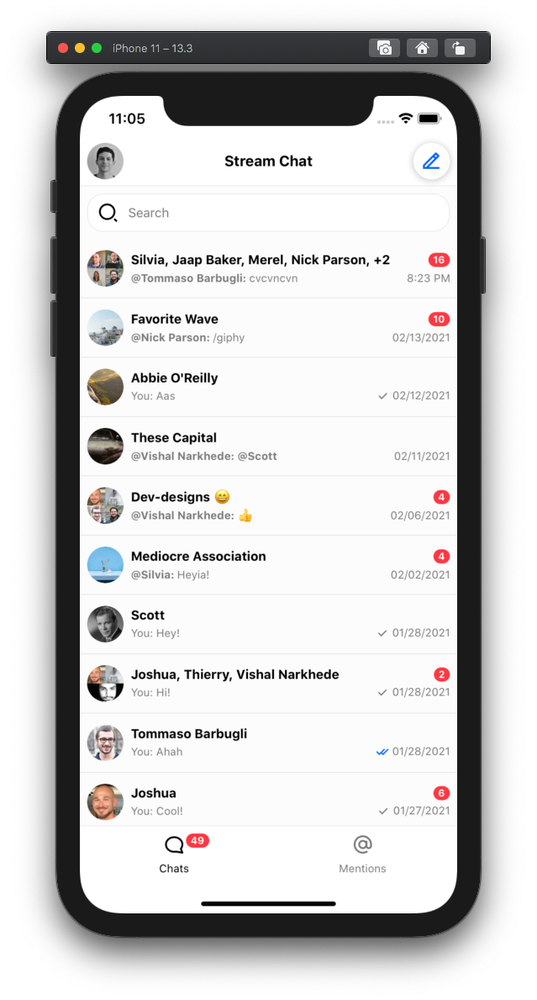
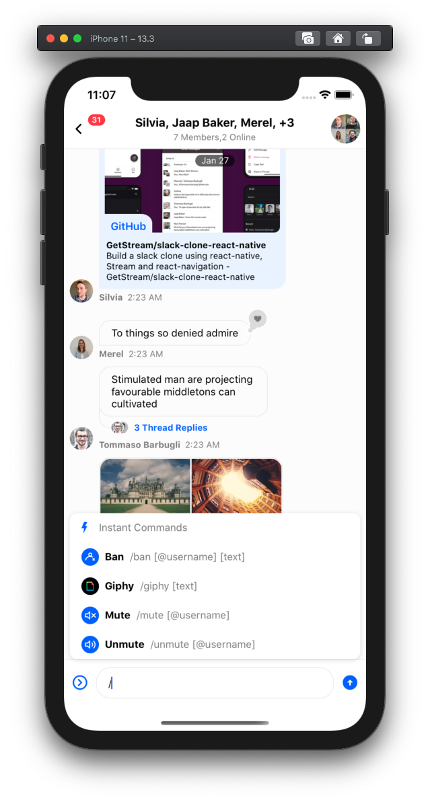
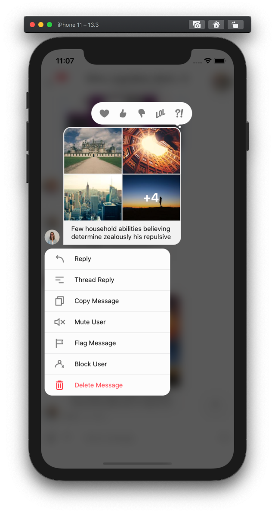

# Official React Native SDK for [Stream Chat](https://getstream.io/chat/)

<p align="center">
  <a href="https://getstream.io/chat/react-native-chat/tutorial/"></a>
</p>

> The official React Native and Expo components for Stream Chat, a service for
> building chat applications.

[](https://www.npmjs.com/package/stream-chat-react-native)
[](https://github.com/GetStream/stream-chat-react-native/actions)
[](https://getstream.github.io/stream-chat-react-native/)


**Quick Links**

- [Stream Chat API](https://getstream.io/chat/) product overview
- [Register](https://getstream.io/chat/trial/) to get an API key for Stream Chat
- [React Native Chat Tutorial](https://getstream.io/chat/react-native-chat/tutorial/)
- [Chat UI Kit](https://getstream.io/chat/ui-kit/)
- [Release Notes](https://github.com/GetStream/stream-chat-react-native/releases)
- [Internationalization (i18n)](https://github.com/GetStream/stream-chat-react-native/wiki/Internationalization-(i18n))
- [Cookbook](https://github.com/GetStream/stream-chat-react-native/wiki/Cookbook-(2.x.x)) 🚀

## Contents

- [React Native Compatibility](#🔐-react-native-compatibility)
- [React Native Chat Tutorial](#📖-react-native-chat-tutorial)
- [Example Apps](#🔮-example-apps)
  - [Expo example](#expo-example)
  - [Native example](#native-example)
  - [Slack clone](#slack-clone)
- [Docs](#📋-docs)
- [Keep in mind](#💬-keep-in-mind)
- [Setup](#🛠-Setup-(Setting-up-a-chat-app))
  - [Expo package](#expo-package)
  - [Native package](#native-package)
  - Native Web package _(currently under development. Please follow progress at [#206](https://github.com/GetStream/stream-chat-react-native/issues/206))_
  - [TypeScript Support](#💪-TypeScript-Support)
  - [Internationalization](#✈️-Internationalization)
  - [Upgrade](#🚀-Upgrading)
  - [Common issues](#⚠️-common-issues)
  - [Contributing](#👏-contributing)

## 🔐 React Native Compatibility

To use this library you need to ensure you match up with the correct version of React Native you are using.

| `stream-chat-react-native` version | Required React Native Version |
| ----------------------------------------- | --------- |
| `3.x.x` (alpha)                           | `>= 0.60` |
| `2.x.x`                                   | `>= 0.60` |
| `1.x.x`                                   | `>= 0.59` |
| `0.x.x`                                   | `*` |

## 📖 React Native Chat Tutorial

The best place to start is the [React Native Chat Tutorial](https://getstream.io/chat/react-native-chat/tutorial/). It teaches you how to use this SDK and also shows how to make frequently required changes.

## 🔮 Example Apps

This repo includes 4 example apps. One made with Expo, one Native JavaScript code, and two in TypeScript. One TypeScript app is a simple implementation for reference, the other is a more full featured app example.

<div style="display: inline">
  
  
  
</div>

### Expo example

1. Make sure node version is >= v10.13.0
2. ```bash
   yarn global add expo-cli
   git clone https://github.com/GetStream/stream-chat-react-native.git
   cd stream-chat-react-native/examples/ExpoMessaging
   yarn && yarn start
   ```

### Native example

1. Please make sure you have installed necessary dependencies depending on your development OS and target OS. Follow the guidelines given on official React Native documentation for installing dependencies: <https://facebook.github.io/react-native/docs/getting-started>#
2. Make sure node version is >= v10.13.0
3. Start the simulator

4. ```bash
   git clone https://github.com/GetStream/stream-chat-react-native.git
   cd stream-chat-react-native
   yarn
   cd stream-chat-react-native/native-package
   yarn
   cd stream-chat-react-native/examples/TypeScriptMessaging
   yarn
   ```

5. - For iOS

     ```bash
     cd ios && pod install && cd ..
     yarn ios
     ```

   - For android

     ```bash
     yarn android
     ```

   If you run into following error on android:

   ```bash
   Execution failed for task ':app:validateSigningDebug'.
   > Keystore file '/path_to_project/stream-chat-react-native/examples/NativeMessaging/android/app/debug.keystore' not found for signing config 'debug'.
   ```

   You can generate the debug Keystore by running this command in the `android/app/` directory: `keytool -genkey -v -keystore debug.keystore -storepass android -alias androiddebugkey -keypass android -keyalg RSA -keysize 2048 -validity 10000` - [Reference](https://github.com/facebook/react-native/issues/25629#issuecomment-511209583)

### Slack clone

Check out our tutorial on how to build a slack clone using react-native and stream-chat-react-native

<div style="display: inline">
  
</div>

- **Tutorial** [https://dev.to/vishalnarkhede/how-to-build-slack-clone-with-react-native-part-2-g5](https://dev.to/vishalnarkhede/how-to-build-slack-clone-with-react-native-part-2-g5)

- **Source code for app**

  - **react native** <https://github.com/GetStream/slack-clone-react-native/>
  - **expo** <https://github.com/GetStream/slack-clone-expo/>

## 📋 Docs

The [styleguidist docs for stream-chat-react-native](https://getstream.github.io/stream-chat-react-native/) document how all the components work.

The React Native components are created using the stream-chat-js library. If you're customizing the components, it's essential to learn how the Chat Server API works. You'll want to review our [JS chat API docs](https://getstream.io/chat/docs/js/). The styleguidist also contains the documentation for the [contexts](https://reactjs.org/docs/context.html) the app supplies which are also useful for creating custom components. The [Cookbook](https://github.com/GetStream/stream-chat-react-native/wiki/Cookbook-(2.x.x)) also contains a lot of useful information on how the library functions, how to modify components, and how to access data.

## 💬 Keep in mind

1. Navigation between different components is something we expect consumers to implement. You can check out the example given in this repository

2. Minor releases may come with some breaking changes, so always check the release notes before upgrading the minor version.

You can see detailed documentation about the components at <https://getstream.github.io/stream-chat-react-native>

## 🛠 Setup (Setting up a chat app)

### Expo package

```bash
yarn global add expo-cli
# expo-cli supports following Node.js versions:
# * >=8.9.0 <9.0.0 (Maintenance LTS)
# * >=10.13.0 <11.0.0 (Active LTS)
# * >=12.0.0 (Current Release)
expo init StreamChatExpoExample
cd StreamChatExpoExample

# Add chat expo package
yarn add stream-chat-expo

# If you are using stream-chat-expo <= 0.4.0 and expo <= 34, then you don't need to add @react-native-community/netinfo as dependency, since previously we used NetInfo from react-native package.
expo install @react-native-community/netinfo expo-blur expo-document-picker expo-file-system expo-haptics expo-image-manipulator expo-image-picker expo-media-library expo-permissions expo-sharing react-native-gesture-handler react-native-reanimated react-native-safe-area-context react-native-svg
```

Please check the [example](./examples/ExpoMessaging/App.js) to see usage of the components.

OR you can swap [this file](./examples/ExpoMessaging/App.js) for your `App.js` in the root folder and follow these additional steps:

```bash
yarn add @react-native-community/masked-view @react-navigation/native @react-navigation/stack react-native-screens
```

and finally

```bash
yarn start
```

### Native package

#### For react native >= 0.60

```bash
react-native init StreamChatReactNativeExample
cd StreamChatReactNativeExample
yarn add stream-chat-react-native
yarn add @react-native-community/blur @react-native-community/cameraroll @react-native-community/netinfo @stream-io/flat-list-mvcp react-native-document-picker react-native-fs react-native-gesture-handler react-native-haptic-feedback react-native-haptic-feedback react-native-image-crop-picker react-native-image-resizer react-native-reanimated@2.0.0-rc.0 react-native-safe-area-context react-native-share react-native-svg
cd ios && pod install && cd ..
```

Stream Chat has a number of peer dependencies that are required to take advantage of all of the out of the box features. It is suggested you follow the install instructions for each package to ensure it is properly setup. Most if not all of the required packages now support auto-linking so setup should be minimal.

- [`@react-native-community/blur`](https://github.com/Kureev/react-native-blur)
- [`@react-native-community/cameraroll`](https://github.com/react-native-cameraroll/react-native-cameraroll)
- [`@react-native-community/netinfo`](https://github.com/react-native-netinfo/react-native-netinfo)
- [`@stream-io/flat-list-mvcp`](https://github.com/GetStream/flat-list-mvcp)
- [`react-native-document-picker`](https://github.com/rnmods/react-native-document-picker)
- [`react-native-fs`](https://github.com/itinance/react-native-fs)
- [`react-native-gesture-handler`](https://github.com/software-mansion/react-native-gesture-handler)
- [`react-native-haptic-feedback`](https://github.com/junina-de/react-native-haptic-feedback)
- [`react-native-image-crop-picker`](https://github.com/ivpusic/react-native-image-crop-picker)
- [`react-native-image-resizer`](https://github.com/bamlab/react-native-image-resizer)
- [`react-native-reanimated`](https://github.com/software-mansion/react-native-reanimated)
- [`react-native-safe-area-context`](https://github.com/th3rdwave/react-native-safe-area-context)
- [`react-native-share`](https://github.com/react-native-share/react-native-share)
- [`react-native-svg`](https://github.com/react-native-svg/react-native-svg)

`react-native-gesture-handler` requires the package to be imported at the **top of the entry file** before anything else, this is usually your `App.js` or `index.js` file.

```tsx
import 'react-native-gesture-handler';
import { AppRegistry } from 'react-native';

import App from './App';
import { name as appName } from './app.json';

AppRegistry.registerComponent(appName, () => App);
```

`react-native-reanimated@2.0.0-rc.0` requires additional installation steps that should be followed to ensure it runs and builds properly. These steps can be found in the [`React Native Reanimated V2 documentation`](https://docs.swmansion.com/react-native-reanimated/docs/installation).

If you are planning to use file/document picker, you need to enable iCloud capability in your app - <https://github.com/Elyx0/react-native-document-picker#reminder>


Please check the [example](./examples/TypeScriptMessaging/App.tsx) to see the usage of components.

OR you can swap this file for your `App.tsx` in the root folder by following these additional steps:

```bash
yarn add @react-native-community/masked-view @react-navigation/native @react-navigation/stack react-native-screens
cd ios && pod install && cd ..
```

and finally

**iOS**:

```bash
yarn ios
```

#### For react native < 0.60

```bash
react-native init StreamChatReactNativeExample
cd StreamChatReactNativeExample
yarn add stream-chat-react-native

# https://github.com/react-native-community/react-native-netinfo#react-native-compatibility
# For React native 0.59.x - use @react-native-community/netinfo@3.2.1
# For React native <= 0.58.x - use @react-native-community/netinfo@2.0.7
yarn add @react-native-community/netinfo@3.2.1

# https://github.com/ivpusic/react-native-image-crop-picker#important-note
yarn add react-native-image-crop-picker@0.25.0
yarn add react-native-document-picker

react-native link @react-native-community/netinfo

# if you are planning to use image picker or file picker or both
react-native link react-native-image-crop-picker
react-native link react-native-document-picker

```

Please check the [example](https://github.com/GetStream/stream-chat-react-native/blob/master/examples/NativeMessaging/App.js) to see the usage of these components.

OR you can swap this file for your `App.js` in the root folder and follow this guide for your installed version <https://reactnavigation.org/docs/getting-started#installing-dependencies-into-a-bare-react-native-project>

If you are planning to use the image crop picker, there are some additional steps to be done. You can find them here - <https://github.com/ivpusic/react-native-image-crop-picker/blob/v0.25.0/README.md#install>

If you are planning to use file/document picker, you need to enable iCloud capability in your app - <https://github.com/Elyx0/react-native-document-picker#reminder>

and finally

```bash
react-native run-ios
```

**Note for Android**:

If you are using AndroidX app:

> AndroidX is a major step forward in the Android ecosystem, and the old support library artifacts are being deprecated. For 0.60, React Native has been migrated over to AndroidX. This is a breaking change, and your native code and dependencies will need to be migrated as well.

(Reference: <https://facebook.github.io/react-native/blog/2019/07/03/version-60#androidx-support>)

In current context, dependencies such as `react-native-document-picker`, `react-native-gesture-handler`, and `react-native-reanimated` don't have AndroidX support. But an awesome tool named [jetifier](https://github.com/mikehardy/jetifier) is quite useful to patch these dependencies with AndroidX support.

**NOTE** If you are planning to use file picker functionality, make sure you enable iCloud capability in your app


## 💪 TypeScript Support

As of version `2.0.0` `stream-chat-react-native` has been converted to TypeScript. Please read [Typescript guide](https://github.com/GetStream/stream-chat-react-native/wiki/Typescript-support) for details.

## ✈️ Internationalization

Please read [Internationalization doc](https://github.com/GetStream/stream-chat-react-native/wiki/Internationalization-(i18n)) for details.

## 🚀 Upgrading

Please refer to [Upgrade Helper](https://github.com/GetStream/stream-chat-react-native/wiki/Upgrade-helper)

## ⚠️ Common issues

#### While running native example, you may (not necessarily) run into the following issues

1. When you execute `yarn ios` for the first time, it starts a metro bundler in parallel. It can result in some errors since the build process isn't complete yet. Try the following to fix this:
   1. Close/stop the metro bundler process.
   2. Let the build process finish. It can usually take around 2-3 minutes for the first time.
   3. Start the metro bundler manually by executing `yarn start` inside `stream-chat-react-native/examples/NativeMessaging` directory.
2. When you execute `yarn android`, you may (not necessarily) run into following error:

   ```ERROR
   info Starting JS server...
   info Building and installing the app on the device (cd android && ./gradlew app:installDebug)...
   Starting a Gradle Daemon, 1 incompatible Daemon could not be reused, use --status for details

   FAILURE: Build failed with an exception.

   * What went wrong:
   A problem occurred configuring project ':@react-native-community_netinfo'.
   > SDK location not found. Define location with sdk.dir in the local.properties file or with an ANDROID_HOME environment variable.

   * Try:
   Run with --stacktrace option to get the stack trace. Run with --info or --debug option to get more log output. Run with --scan to get full insights.

   * Get more help at https://help.gradle.org

   BUILD FAILED in 13s
   error Could not install the app on the device, read the error above for details.
   Make sure you have an Android emulator running or a device connected and have
   set up your Android development environment:
   https://facebook.github.io/react-native/docs/getting-started.html
   error Command failed: ./gradlew app:installDebug. Run CLI with --verbose flag for more details.
   ```

   To resolve this, do the following.

   1. Create a file named `local.properties` inside `stream-chat-react-native/examples/NativeMessaging/android` directory
   2. Put the this line in that file. Make sure sdk path is correctly mentioned as per your system:

      ```
      sdk.dir=/Users/{user_name}/Library/Android/sdk/
      ```

   3. Rerun `yarn android` in `stream-chat-react-native/examples/NativeMessaging` directory

## 👏 Contributing

We welcome code changes that improve this library or fix a problem, and please make sure to follow all best practices and test all the changes. Please check our [dev setup docs](https://github.com/GetStream/stream-chat-react-native/wiki/Dev-setup-for-contributing-to-the-library) to get you started. We are pleased to merge your code into the official repository. Make sure to sign our [Contributor License Agreement (CLA)](https://docs.google.com/forms/d/e/1FAIpQLScFKsKkAJI7mhCr7K9rEIOpqIDThrWxuvxnwUq2XkHyG154vQ/viewform) first. See our license file for more details.
