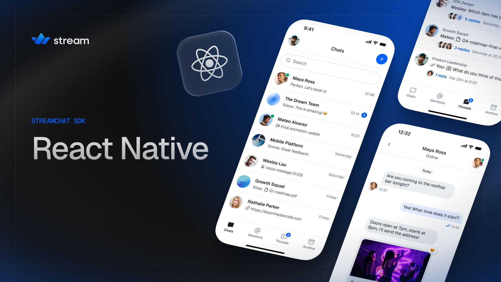

# Official React Native SDK for Stream Chat

<p align="center">
  <a href="https://getstream.io/chat/react-native-chat/tutorial/"></a>
</p>

> The official React Native and Expo components for Stream Chat, a service for
> building chat applications.

[](https://www.npmjs.com/package/stream-chat-react-native)
[](https://github.com/GetStream/stream-chat-react-native/actions)
[](https://getstream.io/chat/docs/sdk/reactnative)


**Quick Links**

- [Stream Chat API](https://getstream.io/chat/) product overview
- [Register](https://getstream.io/chat/trial/) to get an API key for Stream Chat
- [React Native Chat Tutorial](https://getstream.io/chat/react-native-chat/tutorial/)
- [AI Agent Skills](#-build-with-ai-agents) for Claude Code, Cursor, and Codex
- [Chat UI Kit](https://getstream.io/chat/ui-kit/)
- [Documentation](https://getstream.io/chat/docs/sdk/reactnative)
- [Release Notes](https://github.com/GetStream/stream-chat-react-native/releases)

## Contents

- [Official React Native SDK for Stream Chat](#official-react-native-sdk-for-stream-chat)
  - [Contents](#contents)
  - [📖 React Native Chat Tutorial](#-react-native-chat-tutorial)
  - [🤖 Build with AI Agents](#-build-with-ai-agents)
  - [Free for Makers](#free-for-makers)
  - [🔮 Example Apps](#-example-apps)
  - [💬 Keep in mind](#-keep-in-mind)
  - [👏 Contributing](#-contributing)
  - [Git flow \& Release process](#git-flow--release-process)
  - [We are hiring](#we-are-hiring)

## 📖 React Native Chat Tutorial

The best place to start is the [React Native Chat Tutorial](https://getstream.io/chat/react-native-chat/tutorial/). It teaches you how to use this SDK and also shows how to make frequently required changes.

## 🤖 Build with AI Agents

If you build with an AI coding agent, our [agent skills](https://getstream.io/agent-skills/docs/installation/) teach it how to use this SDK correctly. Install them once:

```bash
curl -fsSL https://getstream.io/cli.sh | bash
getstream init
```

Then reach for the [`/stream-react-native`](https://getstream.io/agent-skills/docs/skills/stream-react-native/) skill:

```
/stream-react-native create a new Expo chat app
/stream-react-native upgrade stream-chat-react-native to v9
```

It can scaffold a new Expo or React Native CLI app with the SDK wired up, add Stream to an app you already have, audit an existing integration, or migrate between SDK major versions (including from Sendbird). Works with Claude Code, Cursor, Codex, and any other agent that reads the universal `.agents` location.

Contributing to this repository with an agent instead? See [AGENTS.md](./AGENTS.md) for repository structure, commands, and conventions.

## Free for Makers

Stream is free for most side and hobby projects. To qualify your project/company needs to have < 5 team members and < $10k in monthly revenue.
For complete pricing details visit our [Chat Pricing Page](https://getstream.io/chat/pricing/)

## 🔮 Example Apps

This repo includes 2 example apps. One made with Expo, and a more full featured app example built with the React Native CLI.

- [Expo example](https://github.com/GetStream/stream-chat-react-native/tree/develop/examples/ExpoMessaging)
- [Fully featured messaging application](https://github.com/GetStream/stream-chat-react-native/tree/develop/examples/SampleApp)

Besides, our team maintains a dedicated repository for fully-fledged sample applications and demos at [GetStream/react-native-samples](https://github.com/GetStream/react-native-samples). Please consider checking following sample applications:

- [Slack Clone](https://github.com/GetStream/react-native-samples/tree/main/projects/SlackClone#slack-clone-using-react-native-and-stream-chat)
- [iMessage Clone](https://github.com/GetStream/react-native-samples/tree/main/projects/iMessageClone#imessage-clone)
- [WhatsApp Clone](https://github.com/GetStream/react-native-samples/tree/main/projects/WhatsAppClone#whatsapp-clone-using-react-native-and-stream-chat)

## 💬 Keep in mind

1. Navigation between different components is something we expect consumers to implement. You can check out the example given in this repository

2. Minor releases may come with some breaking changes, so always check the release notes before upgrading the minor version.

You can see detailed documentation about the components at <https://getstream.io/chat/docs/sdk/reactnative/>

## 👏 Contributing

We welcome code changes that improve this library or fix a problem, and please make sure to follow all best practices and test all the changes. Please check our [dev setup docs](https://github.com/GetStream/stream-chat-react-native/wiki/Dev-setup-for-contributing-to-the-library) to get you started. We are pleased to merge your code into the official repository. Make sure to sign our [Contributor License Agreement (CLA)](https://docs.google.com/forms/d/e/1FAIpQLScFKsKkAJI7mhCr7K9rEIOpqIDThrWxuvxnwUq2XkHyG154vQ/viewform) first. See our license file for more details.

## Git flow & Release process

We enforce conventional commits and have an automated releasing process using workspaces and semantic-release. Read our [git flow & release process guide](https://github.com/GetStream/stream-chat-react-native/blob/main/RELEASE_PROCESS.md) for more information

## We are hiring

We've recently closed a [\$38 million Series B funding round](https://techcrunch.com/2021/03/04/stream-raises-38m-as-its-chat-and-activity-feed-apis-power-communications-for-1b-users/) and we keep actively growing.
Our APIs are used by more than a billion end-users, and you'll have a chance to make a huge impact on the product within a team of the strongest engineers all over the world.

Check out our current openings and apply via [Stream's website](https://getstream.io/team/#jobs).
