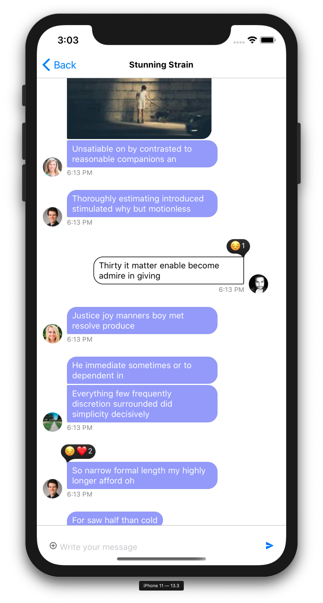
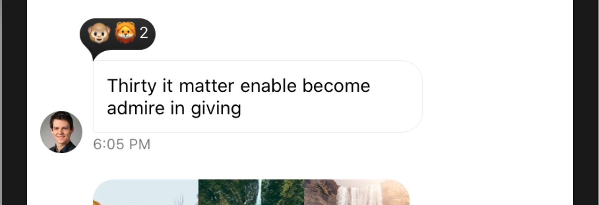
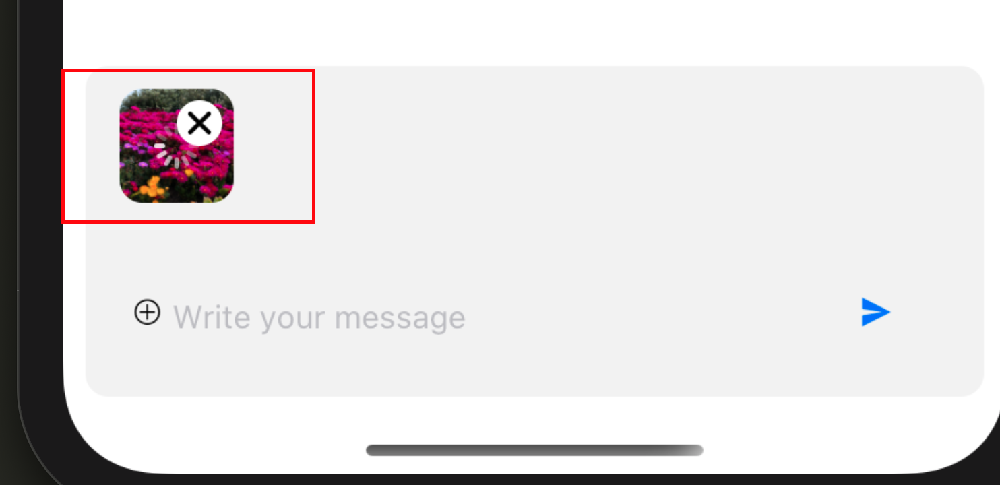
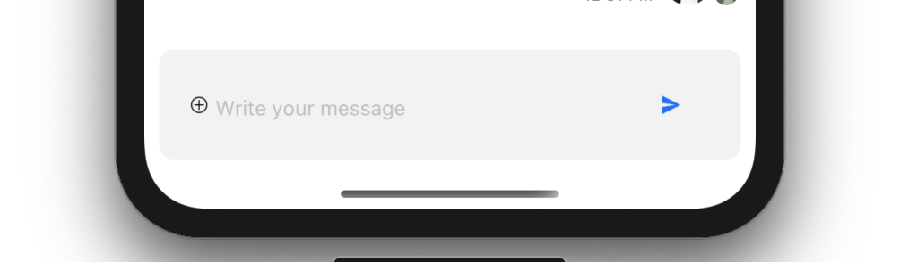
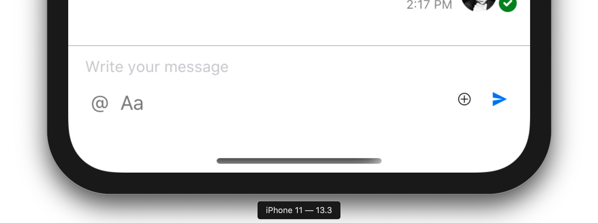

# Cookbook

- [How to customize message component](#how-to-customize-message-component)

    - [Show alert box with confirm/cancel buttons when message is deleted](#show-alert-box-with-confirmcancel-buttons-when-message-is-deleted)

    - [Message bubble with custom text styles/font](#message-bubble-with-custom-text-stylesfont)

    - [Custom/different style for received and sent messages](#customdifferent-style-for-received-and-sent-messages)

    - [Message with custom reactions](#message-with-custom-reactions)

    - [Instagram style double-tap reaction](#instagram-style-double-tap-reaction)

    - [Message bubble with reactions at bottom of message](#message-bubble-with-reactions-at-bottom-of-message)

    - [Slack style - all the messages on left side ](#slack-style---all-the-messages-on-left-side)

    - [Message bubble with name of sender ](#message-bubble-with-name-of-sender)

    - [Swipe message left to delete and right to reply](#swipe-message-left-to-delete-and-right-to-reply-message-example-9)

- [How to customize actionsheet styles](#actionsheet-styling)
- [What is KeyboardCompatibleView and how to customize collapsing/expanding animation](#keyboard)
- [How to customize underlying `FlatList` in `MessageList` or `ChannelList`?](#how-to-customizemodify-underlying-flatlist-of-messagelist-or-channellist)
- [Image upload takes too long. How can I fix it?](#image-upload-takes-too-long-how-can-i-fix-it)
- [How can I override/intercept message actions such as edit, delete, reaction, reply? e.g. to track analytics](#how-can-i-overrideintercept-message-actions-such-as-edit-delete-reaction-reply-eg-to-track-analytics)

- MessageInput customizations

    - [How to change layout of MessageInput (message text input box) component](#how-to-change-layout-of-messageinput-message-text-input-box-component)

    - [Separate buttons for file picker and image picker](#separate-buttons-for-file-picker-and-image-picker)

    - [Add some extra props to inner `TextInput` of `MessageInput` component](#adding-extra-props-to-inner-textinput-of-messageinput-component)

    - [Growing input box with content](#growing-input-box-with-content)

# How to customize message component

`MessageList` component accepts `Message` prop, where you can mention or provide custom message (UI) component.
You can use built-in component as it is, but every product requires its own functionality/behaviour and styles.
For this you can either build your own component or you can also use in-built components with some modifications.

Here I am going to build some custom components, which use in-built components underneath with some modifications to its props.
All the props accepted by MessageSimple component are mentioned here - https://getstream.github.io/stream-chat-react-native/#messagesimple

Then all you need to do is to pass this component to MessageList component:

e.g.,

```js
<Chat client={chatClient}>
  <Channel>
    <MessageList Message={MessageSimpleModified} />
    <MessageInput />
  </Channel>
</Chat>
```

## Show alert box with confirm/cancel buttons when message is deleted

`MessageSimple` accepts a prop function - `handleDelete`. Default value (function) is provided by HOC Message component - https://github.com/GetStream/stream-chat-react-native/blob/master/src/components/Message.js#L150

So in this example we will override `handleDelete` prop:


```js
import { Alert } from 'react-native';
import { MessageSimple } from 'stream-chat-react-native';

const MessageSimpleModified = (props) => {
  const onDelete = () => {
    // Custom behaviour
    // If you face the issue of Alert disappearing instantly,
    // then refer to this answer:
    // https://stackoverflow.com/a/40041564/1460210
    Alert.alert(
      'Deleting message',
      'Are you sure you want to delete the message?',
      [
        {
          text: 'Cancel',
          onPress: () => console.log(`Message won't be deleted`),
          style: 'cancel',
        },
        {
          text: 'OK',
          onPress: () => {
            // If user says ok, then go ahead with
            // deleting the message.
            props.handleDelete();
          },
        },
      ],
      { cancelable: false },
    );
    // Continue with original handler.
  };

  return <MessageSimple {...props} handleDelete={onDelete} />;
};
```


## Message bubble with custom text styles/font

We use `react-native-simple-markdown` library internally in `MessageSimple` component, to render markdown
content of the text. Styling text in MessageSimple component needs a little different approach than styling
rest of the Stream chat components.

As you have already read in tutorial, to style any other component, you simply pass the theme object to Chat component, which forwards and applies styles to all the its children.

e.g.,

```js

const theme = {
  avatar: {
    image: {
      size: 32,
    },
  },
  colors: {
    primary: 'green',
  },
  // Following styles can also be provided as string directly to spinner:
  // spinner: `
  //    width: 15px;
  //    height: 15px;
  //  `
  spinner: {
    css: `
      width: 15px;
      height: 15px;
    `,
  },
  'messageInput.sendButton': 'padding: 20px',
};

<Chat client={chatClient} style={theme}>
...
</Chat>
```

To customize the styles of text, all you need to do is to add [markdown styles](https://github.com/CharlesMangwa/react-native-simple-markdown/tree/next#styles-1) to the key `message.content.markdown` of this theme object. The provided markdown styles will be forwarded to internal Markdown component

e.g.
```js
const theme = {
    'message.content.markdown': {
        // list of all available options are here: https://github.com/CharlesMangwa/react-native-simple-markdown/tree/next#styles-1
        text: {
            color: 'pink',
            fontFamily: 'AppleSDGothicNeo-Bold'
        },
        url: {
            color: 'red'
        }
    }
}

<Chat client={chatClient} style={theme}>
...
</Chat>

```

## Custom/different style for received and sent messages

**NOTE:** Please read [Message bubble with custom text styles/font](#message-bubble-with-custom-text-stylesfont) before proceeding.

Global style will apply to both received and sent message. So in this case, we will provide styles to MessageSimple component separately, depending on whether the message belongs to current user or not.

Here I am aiming for following styles:

- If message belongs to me

  - White background
  - Black colored text

- If message doesn't belong to me
  - Blue background
  - white colored text



```js
const MessageSimpleStyled = (props) => {
  const { isMyMessage, message } = props;

  const sentMessageStyles = {
    'message.content.markdown': {
      text: {
        color: 'black',
      },
    },
    'message.content.textContainer':
      'background-color: white; border-color: black; border-width: 1',
  };

  const receivedMessageStyles = {
    'message.content.markdown': {
      text: {
        color: 'white',
      },
    },
    'message.content.textContainer': 'background-color: #9999FF;',
  };

  if (isMyMessage(message)) {
    return <MessageSimple {...props} style={sentMessageStyles} />;
  } else {
    return <MessageSimple {...props} style={receivedMessageStyles} />;
  }
};
```

## Message with custom reactions

`MessageSimple` accepts a prop - `supportedReactions`. You can pass your emoji data to this prop to set your own reactions.

In this example I will support only two reactions - Monkey face (🐵) and Lion (🦁)



```js
const MessageSimpleWithCustomReactions = (props) => (
    <MessageSimple
      {...props}
      supportedReactions={[
        {
          id: 'monkey',
          icon: '🐵',
        },
        {
          id: 'lion',
          icon: '🦁',
        },
      ]}
    />
  );
```

## Instagram style double-tap reaction

This case has two aspects:

1. Handle double tap and send `love` reaction

  There is no built-in way of handling double-taps in react-native. So we will implement it on our own (thanks to this blog - https://medium.com/handlebar-labs/instagram-style-double-tap-with-react-native-49e757f68de)

2. Remove `Add Reaction` option from actionsheet, which is shown when message is long pressed.
   `MessageSimple` accepts a array prop - `messageActions`. You can use this prop to remove `Add Reaction` option from actionsheet.

3. Limit the reactions to only `love` - [Message with custom reactions](#message-with-custom-reactions)

```js
import { MessageSimple } from 'stream-chat-react-native';

const MessageSimpleIgReaction = (props) => {
  let lastTap = null;
  const handleDoubleTap = () => {
    const now = Date.now();
    if (lastTap && now - lastTap < 300) {
      props.handleReaction('love');
    } else {
      lastTap = now;
    }
  };

  return (
    <MessageSimple
      {...props}
      onPress={handleDoubleTap}
      supportedReactions={[
        {
          id: 'love',
          icon: '❤️️',
        },
      ]}
      messageActions={['edit', 'delete', 'reply']} // not including `reactions` here.
    />
  );
};
```

## Message bubble with reactions at bottom of message

By default we show reactions on message on top of message. But in some designs, you may want
to show it at bottom of message.

First you want to disable/hide the original reaction selector. `MessageSimple` component accepts a custom
UI component as prop - `ReactionList`. If you set this prop to null, then original reaction list and thus reaction selector
will be hidden/disabled


```js static
const MessageWithoutReactionPicker = props => {
  return (
    <MessageSimple
      {...props}
      ReactionList={null}
    />
  );
};

```

Next, you want to introduce your own reaction selector or reaction picker. For this purpose, you can use
`ReactionPickerWrapper` HOC (higher order component). `ReactionPickerWrapper` component simply wraps its children
wtih `TouchableOpacity`, which when pressed/touched - opens the reaction picker.

In following example, I am going to build my own reaction list component. And and add the wrapper `ReactionPickerWrapper`
around it, so that when user touches/presses on reaction list, it opens reaction picker.

```js
import { renderReactions, MessageSimple } from 'stream-chat-react-native';

const reactionListStyles = StyleSheet.create({
  container: {
    backgroundColor: 'black',
    flexDirection: 'row',
    borderColor: 'gray',
    borderWidth: 1,
    padding: 5,
    borderRadius: 10,
  },
});

const CustomReactionList = props => (
    <View style={reactionListStyles.container}>
      {renderReactions(
        props.message.latest_reactions,
        props.supportedReactions,
      )}
    </View>
)

const MessageFooterWithReactionList = props => {
  return (
    <ReactionPickerWrapper {...props}>
      {props.message.latest_reactions.length > 0 && <CustomReactionList {...props} />}
    </ReactionPickerWrapper>
  );
};

const MessageWithReactionsAtBottom = props => {
  return (
    <MessageSimple
      {...props}
      ReactionList={null}
      MessageFooter={MessageFooterWithReactionList}
    />
  );
};
```

And thats it, you have reactions at bottom of the message.

## Slack style - all the messages on left side

By default, received messages are shown on left side of MessageList and sent messages are shown on right side of the message list. 

`MessageSimple` component accepts the boolean prop - `forceAlign`, which can be used to override the alignment of message bubble relative to MessageList component.
Its value could be either `left` or `right`.

```js

const MessageSimpleLeftAligned = props => {
  return <MessageSimple {...props} forceAlign="left" />;
};

```

## Message bubble with name of sender


In group messaging, its important to show the name of the sender with message bubble - similar to
slack or whatsapp. In this example we are going to add name of the sender on top of message content.

I can foresee different types of designs for this:

### Sender's name on the very top of message bubble (above text container, attachments)

  In this case, we are going to override `MessageContent` component via prop to add
  the name of sender, right before MessageContent (which includes attachments and message text)
  For the sake of simplicity, I am going to disable reaction selector (using `ReactionList={null}`), since it will create conflict
  in design. Check the [example](#message-bubble-with-reactions-at-bottom-of-message) for moving reactions at bottom of the bubble.

```js static

class MessageContentWithName extends React.PureComponent {
  render() {
    return (
      <View style={{flexDirection: 'column', padding: 5}}>
        <Text style={{fontWeight: 'bold'}}>{this.props.message.user.name}</Text>
        <MessageContent {...this.props} />
      </View>
    );
  }
}

const MessageWithSenderName = props => {
  return (
    <MessageSimple
      {...props}
      ReactionList={null}
      MessageContent={MessageContentWithName}
    />
  );
};
```

### Sender's name inside text bubble/container

In this case, you want to override the `MessageText` component.

```js static

const MessageTextWithName = props => {
  const markdownStyles = props.theme
    ? props.theme.message.content.markdown
    : {};

  return (
    <View style={{flexDirection: 'column', padding: 5}}>
      <Text style={{fontWeight: 'bold'}}>{props.message.user.name}</Text>
      {props.renderText(props.message, markdownStyles)}
    </View>
  );
};

const MessageWithSenderNameInTextContainer = props => {
  return <MessageSimple {...props} MessageText={MessageTextWithName} />;
};
```

_**TIP** you can also mix above two cases. If there is an attachment to message, then show the name on top of everything, and if there is no attachment, then show the name inside text container/bubble. You can
conditionally render sender's name both in MessageText and MessageContent based on - `message.attachments.length > 0`_

### Sender's name at bottom of the message

In this case, we can use `MessageFooter` UI component prop to add name of the sender.


```js static
const MessageWithSenderNameAtBottom = props => {
  return (
    <MessageSimple
      {...props}
      MessageFooter={props => <Text>{props.message.user.name}</Text>}
    />
  );
};
```

## Swipe message left to delete and right to reply {#message-example-9}

Some messaging apps usually show extra options such as delete or reply when you swipe the message.
In this example we will build a message which opens `delete` option when swiped left, and will reply
to the message when swiped to left.

For swiping gesture, we are going to use external library called [react-native-swipe-list-view](https://github.com/jemise111/react-native-swipe-list-view)

Also I am going to use following styles for this example:

```js static
const messageSwipeableStyles = StyleSheet.create({
  row: {
    flex: 1,
    backgroundColor: 'blue',
  },
  messageActionsContainer: {
    backgroundColor: '#F8F8F8',
  },
  deleteButton: {
    alignSelf: 'flex-end',
    width: 50,
    height: '100%',
    justifyContent: 'center',
    alignContent: 'center',
    borderLeftColor: '#A8A8A8',
    borderLeftWidth: 1,
  },
  deleteIcon: {
    width: 30,
    height: 30,
    alignSelf: 'center',
  },
  messageContainer: {
    flex: 1,
    backgroundColor: 'white',
  },
  messageContainerSelected: {
    backgroundColor: '#F8F8F8',
  },
});
```

First lets just build a simple swipeable message component, which when swiped left, opens the delete button.
We will use `SwipeRow` as wrapper around our MessageSimple component.

```js
import {SwipeRow} from 'react-native-swipe-list-view';
...

class MessageSwipeable extends React.Component {
  render() {
    return (
      <SwipeRow
        rightOpenValue={-55}
        leftOpenValue={30}
        recalculateHiddenLayout>
        <View>
            <TouchableOpacity style={messageSwipeableStyles.deleteButton}>
              <Image source={deleteIcon} styles={messageSwipeableStyles.deleteIcon} />
            </TouchableOpacity>
        </View>
        <View>
          <MessageSimple {...this.props} />
        </View>
      </SwipeRow>
    );
  }
}
```

You will see some really distorted UI at this point. Don't worry, we just need to add some nice styles to fix it:

```diff
class MessageSwipeable extends React.Component {
  render() {
    return (
      <SwipeRow
        rightOpenValue={-55}
        leftOpenValue={30}
+       style={messageSwipeableStyles.row}
        recalculateHiddenLayout>
-        <View>
+        <View style={messageSwipeableStyles.messageActionsContainer}>
-          <TouchableOpacity>
+          <TouchableOpacity style={messageSwipeableStyles.deleteButton}>
            <Image
              source={deleteIcon}
+             style={messageSwipeableStyles.deleteIcon}
            />
          </TouchableOpacity>
        </View>
-        <View>
+        <View style={messageSwipeableStyles.messageContainer}>
          <MessageSimple {...this.props} />
        </View>
      </SwipeRow>
    );
  }
}
```

You will see a nice button appearing on right on the message, when message is swiped left.

Next, we want to open a thread or reply screen when message is swiped right. For this we are going to use `onRowOpen`
callback prop function on `SwipeRow`. This callback gets the swipe offset as parameter. When this offset is positive,
that means its a right swipe, otherwise left.

So when user swipes right on message, we want to call the function `onThreadSelect()`, which is available
in props of message component. 

Also we are going to add some different styles when delete button/option is visible on message. For this we add a state variable
`menuOpen` to keep track of whether delete button is visible or not.

```diff
class MessageSwipeable extends React.Component {
+  rowRef = null;
+  state = {menuOpen: false};

  render() {
    return (
      <SwipeRow
        rightOpenValue={-55}
        leftOpenValue={30}
        style={messageSwipeableStyles.row}
        recalculateHiddenLayout
+        onRowOpen={value => {
+          if (value > 0) {
+            this.props.onThreadSelect(this.props.message);
+            this.rowRef.closeRow();
+          } else {
+            this.setState({menuOpen: true});
+          }
+        }}
+        ref={ref => {
+          this.rowRef = ref;
+        }}>
        <View style={messageSwipeableStyles.messageActionsContainer}>
          <TouchableOpacity style={messageSwipeableStyles.deleteButton}>
            <Image
              source={deleteIcon}
              style={messageSwipeableStyles.deleteIcon}
            />
          </TouchableOpacity>
        </View>
-        <View style={messageSwipeableStyles.messageContainer}>
+        <View
+          style={
+            this.state.menuOpen
+              ? {
+                  ...messageSwipeableStyles.messageContainer,
+                  ...messageSwipeableStyles.messageContainerSelected,
+                }
+              : {...messageSwipeableStyles.messageContainer}
+          }>
          <MessageSimple {...this.props} />
        </View>
      </SwipeRow>
    );
  }
}
```

Next, when delete button gets pressed, we want to delete the message and close the row.

```diff
class MessageSwipeable extends React.Component {
  rowRef = null;
  state = {menuOpen: false};

  render() {
    return (
      <SwipeRow
        rightOpenValue={-55}
        leftOpenValue={30}
        recalculateHiddenLayout
        onRowOpen={value => {
          if (value > 0) {
            this.props.onThreadSelect(this.props.message);
            this.rowRef.closeRow();
          } else {
            this.setState({menuOpen: true});
          }
        }}
        ref={ref => {
          this.rowRef = ref;
        }}>
        <View style={messageSwipeableStyles.messageActionsContainer}>
-          <TouchableOpacity style={messageSwipeableStyles.deleteButton}>
+          <TouchableOpacity
+            style={messageSwipeableStyles.deleteButton}
+            onPress={() => {
+              this.props.handleDelete();
+              this.rowRef.closeRow();
+            }}>
+            <Image
+              source={deleteIcon}
+              style={messageSwipeableStyles.deleteIcon}
+            />
          </TouchableOpacity>
        </View>
        <View
          style={
            this.state.menuOpen
              ? {
                  ...messageSwipeableStyles.messageContainer,
                  ...messageSwipeableStyles.messageContainerSelected,
                }
              : {...messageSwipeableStyles.messageContainer}
          }>
          <MessageSimple {...this.props} />
        </View>
      </SwipeRow>
    );
  }
}
```

Next, we to restrict swipeable functionality only for non-deleted messages.

```diff
class MessageSwipeable extends React.Component {
  rowRef = null;
  state = {menuOpen: false};

  render() {
    return (
      <SwipeRow
        rightOpenValue={-55}
        leftOpenValue={30}
        recalculateHiddenLayout
+        disableLeftSwipe={!!this.props.message.deleted_at}
+        disableRightSwipe={!!this.props.message.deleted_at}
        onRowOpen={value => {
          if (value > 0) {
            this.props.onThreadSelect(this.props.message);
            this.rowRef.closeRow();
          } else {
            this.setState({menuOpen: true});
          }
        }}
        ref={ref => {
          this.rowRef = ref;
        }}>
-        <View style={messageSwipeableStyles.messageActionsContainer}>
+        <View
+          style={
+            !this.props.message.deleted_at
+              ? messageSwipeableStyles.messageActionsContainer
+              : null
+          }>
+          {!this.props.message.deleted_at ? (
+            <TouchableOpacity
+              style={messageSwipeableStyles.deleteButton}
+              onPress={() => {
+                this.props.handleDelete();
+                this.rowRef.closeRow();
+              }}>
+              <Image
+                source={deleteIcon}
+                style={messageSwipeableStyles.deleteIcon}
+              />
+            </TouchableOpacity>
+          ) : null}
        </View>
        <View
          style={
            this.state.menuOpen
              ? {
                  ...messageSwipeableStyles.messageContainer,
                  ...messageSwipeableStyles.messageContainerSelected,
                }
              : {...messageSwipeableStyles.messageContainer}
          }>
          <MessageSimple {...this.props} />
        </View>
      </SwipeRow>
    );
  }
}
```

And we are done. Soon we will publish the running example of this on our repo!

_**in progress ...**_

## Final result:

```js
class MessageSwipeable extends React.Component {
  rowRef = null;
  state = {menuOpen: false};
  render() {
    return (
      <SwipeRow
        rightOpenValue={-55}
        leftOpenValue={30}
        disableLeftSwipe={!!this.props.message.deleted_at}
        disableRightSwipe={!!this.props.message.deleted_at}
        style={messageSwipeableStyles.row}
        recalculateHiddenLayout
        onRowClose={() => {
          this.setState({menuOpen: false});
        }}
        onRowOpen={value => {
          if (value > 0) {
            this.props.onThreadSelect(this.props.message);
            this.rowRef.closeRow();
          } else {
            this.setState({menuOpen: true});
          }
        }}
        ref={ref => {
          this.rowRef = ref;
        }}>
        <View
          style={
            !this.props.message.deleted_at
              ? messageSwipeableStyles.messageActionsContainer
              : null
          }>
          {!this.props.message.deleted_at ? (
            <TouchableOpacity
              style={messageSwipeableStyles.deleteButton}
              onPress={() => {
                this.props.handleDelete();
                this.rowRef.closeRow();
              }}>
              <Image
                source={deleteIcon}
                style={messageSwipeableStyles.deleteIcon}
              />
            </TouchableOpacity>
          ) : null}
        </View>
        <View
          style={
            this.state.menuOpen
              ? {
                  ...messageSwipeableStyles.messageContainer,
                  ...messageSwipeableStyles.messageContainerSelected,
                }
              : {...messageSwipeableStyles.messageContainer}
          }>
          <MessageSimple {...this.props} />
        </View>
      </SwipeRow>
    );
  }
}

const messageSwipeableStyles = StyleSheet.create({
  row: {
    flex: 1,
    backgroundColor: 'blue',
  },
  messageActionsContainer: {
    backgroundColor: '#F8F8F8',
  },
  deleteButton: {
    alignSelf: 'flex-end',
    width: 50,
    height: '100%',
    justifyContent: 'center',
    alignContent: 'center',
    borderLeftColor: '#A8A8A8',
    borderLeftWidth: 1,
  },
  deleteIcon: {
    width: 30,
    height: 30,
    alignSelf: 'center',
  },
  messageContainer: {
    flex: 1,
    backgroundColor: 'white',
  },
  messageContainerSelected: {
    backgroundColor: '#F8F8F8',
  },
});
```


_**in progress ...**_

## Actionsheet Styling

Internally we use [react-native-actionsheet](https://github.com/beefe/react-native-actionsheet) library. This library supports style customizations.
But used our own components for header and actionsheet. So some basic styling could be done using theme object (provided to Chat component)

We use actionsheet at two places in our library.

### Message actions
_(to display list of message options, when message is long pressed - in `MessageContent` component inside `MessageSimple`)_

Basic styling can be achieved by providing styles for keys given in following example, in theme object.

```js
const theme = {
  'messageInput.actionSheet.titleContainer': `background-color: 'black', padding: 10px`,
  'messageInput.actionSheet.titleText': `color: 'white'`
  'messageInput.actionSheet.buttonContainer': `background-color: 'black', padding: 5px`,
  'messageInput.actionSheet.buttonText': `color: 'white', margin-left: 20px`
}

<Chat client={chatClient} style={theme}></Chat>
```
If you want to customize further, e.g., container of the whole actionsheet or backdrop, then you need to add styles directly for
internal react-native-actionsheet component. You can do that by passing prop `actionSheetStyles` to MessageInput component.

_Full list of options: https://github.com/beefe/react-native-actionsheet/blob/master/lib/styles.js_

```js
import { Chat, Channel, MessageList, MessageInput, MessageSimple } from 'stream-chat-react-native';

const actionsheetStyles = {
  overlay: {
    backgroundColor: 'grey',
    opacity: 0.6
  },
  wrapper: {
    flex: 1,
    flexDirection: 'row'
  },
};

<Chat client={chatClient}>
  <Channel>
    <MessageList />
    <MessageInput actionsheetStyles={actionsheetStyles} />
  </Channel>
</Chat>
```

**Note** `titleBox`, `titleText`, `buttonBox` and `buttonText` won't work in above styles, since we have overridden those components with our own components.

### MessageInput attachments
_(attachment options, when `+` icon is pressed in MessageInput component.)_

Basic styling can be achieved by providing styles for keys given in following example, in theme object.

```js
const theme = {
  'message.actionSheet.titleContainer': `background-color: 'black', padding: 10px`,
  'message.actionSheet.titleText': `color: 'white'`,
  'message.actionSheet.buttonContainer': `background-color: 'black', padding: 10px`,
  'message.actionSheet.buttonText': `color: 'white'`,
  'message.actionSheet.cancelButtonContainer': `background-color: 'red', padding: 10px`,
  'message.actionSheet.cancelButtonText': `color: 'white'`,
};

<Chat client={chatClient} style={theme}></Chat>
```
If you want to customize further, e.g., container of the whole actionsheet or backdrop, then you need to add styles directly for
internal react-native-actionsheet component. You can do that by passing prop `actionSheetStyles` to `MessageSimple` component.

_Full list of options: https://github.com/beefe/react-native-actionsheet/blob/master/lib/styles.js_

```js
import { Chat, Channel, MessageList, MessageInput, MessageSimple } from 'stream-chat-react-native';

const actionsheetStyles = {
  overlay: {
    backgroundColor: 'grey',
    opacity: 0.6
  },
  wrapper: {
    flex: 1,
    flexDirection: 'row'
  },
};

const MessageSimpleWithCustomActionsheet = props => (
  <MessageSimple
    {...props}
    actionsheetStyles={actionsheetStyles} />
  )}
);

// When you render chat components ...
<Chat client={chatClient}>
  <Channel>
    <MessageList Message={MessageSimpleWithCustomActionsheet} />
    <MessageInput/>
  </Channel>
</Chat>

```

## Keyboard

React native provides an in built component called `KeyboardAvoidingView`. This component works well for most of the cases where height of the component is 100% relative to screen. If you have some fixed height then it may create some issue (it depends on your case - how you use wrappers around chat components).

To avoid this issue we built our own component - `KeyboardCompatibleView`. It contains simple logic - when keyboard is opened (which we can know from events of `Keyboard` module), adjust the height of Channel component and when keyboard is dismissed, then again adjust the height of Channel component accordingly. While building this component, we realized that it has certain limitations. e.g., Keyboard module on emits the event keyboardDidHide, which means we can only adjust the height of Channel component after dismissal of keyboard has already started (which results in white gap between keyboard and Channel component during keyboard dismissal)

There are few customizations you can do regarding the keyboard behaviour (min required sdk version - `0.6.6`)

### Changing the animation duration/time of height adjustment of MessageList

You can pass the custom component as prop - `KeyboardCompatibleView` to channel component. Add the custom animation duration
to `KeyboardCompatibleView` using props `keyboardDismissAnimationDuration` and `keyboardOpenAnimationDuration`, and pass it to `Channel` component (as done in following example):

```js
import { KeyboardCompatibleView } from 'stream-chat-react-native';

const CustomizedKeyboardView = props => (
  <KeyboardCompatibleView keyboardDismissAnimationDuration={200} keyboardOpenAnimationDuration={200}>
    {props.children}
  </KeyboardCompatibleView>
)

// When you render the chat component
<Chat client={chatClient}>
  <Channel
    KeyboardCompatibleView={CustomizedKeyboardView}
    ...
  />
</Chat>
```

### Disable KeyboardCompatibleView and use KeyboardAvoidingView from react-native

You can disable `KeyboardCompatibleView` by using prop `disableKeyboardCompatibleView` on `Channel` component.

Following example shows how to use `KeyboardAvoidingView` instead:

```js static
<SafeAreaView>
  <Chat client={chatClient}>
    // Note: Android and iOS both interact with `padding` prop differently.
    // Android may behave better when given no behavior prop at all, whereas iOS is the opposite.
    // reference - https://reactnative.dev/docs/keyboardavoidingview#behavior
    <KeyboardAvoidingView behavior="padding">
      <View style={{display: 'flex', height: '100%'}}>
        <Channel channel={channel} disableKeyboardCompatibleView>
          <MessageList />
          <MessageInput />
        </Channel>
      </View>
    </KeyboardAvoidingView>
  </Chat>
</SafeAreaView>
```

## How to customize/modify underlying `FlatList` of `MessageList` or `ChannelList`?

  You can pass additional any number of props to underlying FlatList using `additionalFlatListProps` prop:

 ```js static
  <ChannelList
    filters={filters}
    sort={sort}
    additionalFlatListProps={{ bounces: true }}
  />
 ```

  ```js static
    <MessageList additionalFlatListProps={{ bounces: true }} />
  ```
Please find list of all available FlatList props here - https://reactnative.dev/docs/flatlist#props

## Image upload takes too long. How can I fix it?

For image picker in our library, we use lightweight third party [react-native-image-picker](https://github.com/react-native-community/react-native-image-picker) library. It works perfectly for basic image picking functionality. Although if the image is heavy in size (e.g., photo taken by iPhone XS camera can be between 8-12 MB), it takes long to upload a picture on stream server. Thats when you will see ever-lasting loader on image being uploaded (as shown in following screenshot).

<div style="display: inline">

</div>

Image compression is the solution here. But react-native-image-picker doesn't offer compression option. So we need to instead use [react-native-image-crop-picker](https://github.com/ivpusic/react-native-image-crop-picker) _(or you can implement your own functionality as well ofcourse)_

1. Install  `react-native-image-crop-picker` in your app/project. Please pay attention to the version that you are installing. If you are using  RN 0.61+, then may use latest version of image-crop picker, otherwise use 0.25.3 - [reference](https://github.com/ivpusic/react-native-image-crop-picker/issues/1143)

`yarn add react-native-image-crop-picker`

2. Follow the steps mentioned here along with post installation steps  - https://github.com/ivpusic/react-native-image-crop-picker#react-native--060-with-cocoapods

3. In your app, on chat screen - register the pickImage handler as follow:

```js
import ImagePicker from 'react-native-image-crop-picker';
import {registerNativeHandlers} from 'stream-chat-react-native-core';

registerNativeHandlers({
  pickImage: () =>
    new Promise((resolve, reject) => {
      ImagePicker.openPicker({
       // Add your compression related config here.
        height: 400,
        width: 400,
        cropping: false,
      }).then(
        image => {
          resolve({
            cancelled: false,
            uri: `${image.path}`,
          });
        },
        () => {
          resolve({
            cancelled: true,
          });
        },
      );
    }),
});

```

You can provide your compression config to `ImagePicker.openPicker({ ... })`  function. This library provides plenty of options for cropping or compression - https://github.com/ivpusic/react-native-image-crop-picker#request-object

And you are good to go :)


## How can I override/intercept message actions such as edit, delete, reaction, reply? e.g. to track analytics

By default our library uses MessageSimple as UI component for message. It accepts following props:

  - handleEdit
  - handleDelete
  - handleReaction
  - handleAction
  - handleRetry

Please find entire list of props here - https://getstream.github.io/stream-chat-react-native/#messagesimple

So lets take an example of tracking these function calls for analytics. We want to retain the original functionality,
but just want to introduce a custom tracking call right before original call gets gets executed:

So in this case, create a UI component, which uses MessageSimple underneath and intercept functions such as handleDelete, handleEdit etc.

```js
const CustomMessageComponent = (props) => {

    const handleEdit = () => {
        // This is call to your analytics related function.
        handleEditAnalyticsCall(props.message);

        // continue with original call
        props.handleEdit();
    }

    const handleDelete = () => {
        // This is call to your analytics related function.
        handleDeleteAnalyticsCall(props.message);

        // continue with original call
        props.handleDelete();
    }

    const handleReaction = (type) => {
        // This is call to your analytics related function.
        handleReactionAnalyticsCall(props.message);

        // continue with original call
        props.handleReaction(type);
    }

    return (
        <MessageSimple
            handleDelete={handleDelete}
            handleEdit={handleEdit}
            handleReaction={handleReaction}
        />
    )
}

// Use the custom message component in MessageList
<MessageList
  Message={CustomMessageComponent}
/>
```

## How to change layout of MessageInput (message text input box) component

We provide MessageInput component OOTB which looks something like this:




But your design may require a bit different layout or positioning of inner components, such as send button, attachment button or inputbox inself. One use case could be Slack (workplace chat application) style - where all the buttons are bellow the inputbox.



Here I will show you how you can build above design with some small modifications to `MessageInput`

MessageInput component accepts Input as a UI component prop. Library also exports all the inner components of MessageInput.
So all you need to do is build a UI component which arranges those inner child components in whatever layout you prefer and pass it to MessageInput.

```js
import React from 'react';
import {TouchableOpacity, View, Text, StyleSheet} from 'react-native';
import {
  AutoCompleteInput,
  AttachButton,
  SendButton,
} from 'stream-chat-react-native';

const InputBox = props => {
  return (
    <View style={inputBoxStyles.container}>
      <AutoCompleteInput {...props} />
      <View style={inputBoxStyles.actionsContainer}>
        <View style={inputBoxStyles.row}>
          <TouchableOpacity
            onPress={() => {
              props.appendText('@');
            }}>
            <Text style={inputBoxStyles.textActionLabel}>@</Text>
          </TouchableOpacity>
          {/* Text editor is not functional yet. We will cover it in some future tutorials */}
          <TouchableOpacity style={inputBoxStyles.textEditorContainer}>
            <Text style={inputBoxStyles.textActionLabel}>Aa</Text>
          </TouchableOpacity>
        </View>
        <View style={inputBoxStyles.row}>
          <AttachButton {...props} />
          <SendButton {...props} />
        </View>
      </View>
    </View>
  );
};

const inputBoxStyles = StyleSheet.create({
  container: {
    flexDirection: 'column',
    flex: 1,
    height: 60,
  },
  actionsContainer: {
    flexDirection: 'row',
    justifyContent: 'space-between',
    alignContent: 'center',
    height: 30,
  },
  row: {flexDirection: 'row'},
  textActionLabel: {
    color: '#787878',
    fontSize: 18,
  },
  textEditorContainer: {
    marginLeft: 10,
  },
});
```

And then pass this InputBox component to `MessageInput`. I am adding some additional styles in theme to make it look more like Slack's input box.

```js
const theme = {
  'messageInput.container':
    'border-top-color: #979A9A;border-top-width: 0.4; background-color: white; margin: 0; border-radius: 0;',
}

<Chat client={chatClient} style={theme}>
  <Channel>
    <MessageList />
    <MessageInput Input={InputBox} />
  </Channel>
</Chat>
```

## Separate buttons for file picker and image picker

Additionally if you want separate buttons for file picker and image picker or just want to open either one of them on some action, you can use _pickImage() and _pickFile() functions available on props of `InputBox` component (in above example)

So basically you can add some button in `InputBox` component following way

```js
const InputBox = props => {
  return (
    <View style={inputBoxStyles.container}>
        {/** Here you will put all the other components such as AutoCompleteInput */}
        {/** Following button will only open filePicker */}
        <Button onPress={props._pickFile()} />
        {/** Following button will only open image picker */}
        <Button onPress={props._pickImage()} />
    </View>
  );
};

// And then pass this InputBox to MessageInput

<MessageInput Input={InputBox} />
```

## Adding extra props to inner `TextInput` of `MessageInput` component

`MessageInput` internally uses [TextInput](https://reactnative.dev/docs/textinput.html) component from react-native. We attach some default props to it internally. But if you want to add some additional props, you can do it via `additionalTextInputProps`

```js
<MessageInput
  additionalTextInputProps={{
    allowFontScaling: true,
    clearTextOnFocus: true
  }}
/>
```

## Growing input box with content

For general idea, you may want to read this post first (thanks to [@manojsinghnegi](https://medium.com/@manojsinghnegi)) - https://medium.com/@manojsinghnegi/react-native-auto-growing-text-input-8638ac0931c8

```js
// Override the default max-height on inner TextInput
const theme = {
  'messageInput.inputBox': 'max-height: 250px',
}

class ChannelScreen extends React.Component {
  constructor(props) {
    this.state = {
      height: 40,
    }
  }

  updateSize = (height) => {
    this.setState({
      height
    });
  }

  render() {
    return (
      <Chat>
        <Channel>
          <MessageInput
            additionalTextInputProps={{
              onContentSizeChange: e =>
                this.updateSize(e.nativeEvent.contentSize.height),
              style: {height: this.state.height},
            }}
          />
        </Channel>
      </Chat>
    )
  }
}
```