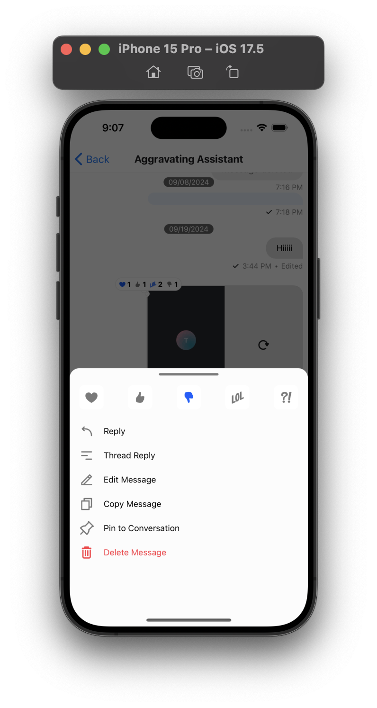
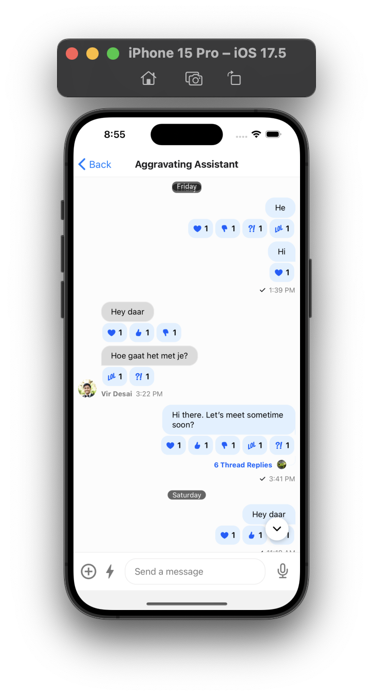

## Dependency changes

The following are the crucial changes of the Stream Chat React Native SDK from version 5.x to 6.x:

### Change `react-native-fs` to `react-native-blob-util`

The `react-native-fs` package has been replaced to `react-native-blob-util` in favour of the former not being actively maintained. You can replace it by running the following commands:

```bash
yarn remove react-native-fs
yarn add react-native-blob-util
```

### Remove `react-native-image-resizer` dependency

The `react-native-image-resizer` package has been moved to the SDK so you can uninstall it from your app.

You can remove it by running the following commands:

```bash
yarn remove react-native-image-resizer
```

### Change `react-native-image-crop-picker` to `react-native-image-picker`

The `react-native-image-crop-picker` package has been replaced with `react-native-image-picker`. This is a better alternative, and can help us with our new architecture endeavors.

You can replace it by running the following commands:

```bash
yarn remove react-native-image-crop-picker
yarn add react-native-image-picker
```

Also, the dependency is made optional now, so if you don't want to use the image picker, you can remove it from your project and the camera selector icon on the Attachment picker will be simply hidden for you.

### Change `react-native-quick-sqlite` to `op-sqlite`

The `react-native-quick-sqlite` package has been replaced with `op-sqlite`. This is a faster alternative, and can help us with our new architecture endeavors.

:::note
For React Native version 0.74 and above, you need to install version `>=9.3.0` of the `op-sqlite`.
:::

You can replace it by running the following commands:

```bash
yarn remove react-native-quick-sqlite
yarn add op-sqlite
```

### Made `@stream-io/flat-list-mvcp` optional

The dependency on `@stream-io/flat-list-mvcp` package has been made optional in favour of React Native's [`FlatList`](https://reactnative.dev/docs/flatlist) component supporting [`maintainVisibleContentPosition`](https://reactnative.dev/docs/scrollview#maintainvisiblecontentposition) from React Native version `>=0.72`. If the package is installed it takes up the package or the default React Native [`FlatList`](https://reactnative.dev/docs/flatlist).

:::info
If you are on or above version **0.72** of React Native, please remove it.

```bash
yarn remove @stream-io/flat-list-mvcp
```

:::

## SDK changes

### Introduce new Message Menu design

The Message Menu design has been revamped to provide a better user experience. The new design is more intuitive and provides a better user experience.



:::note
The previous overlay design has been replaced with a bottom sheet modal design.
:::

### Introduce new ReactionList design

We have introduced a new ReactionList design that is more intuitive and provides a better user experience.



You can switch to `bottom` reaction list design by setting the [`reactionListPosition`](../core-components/channel.mdx#reactionlistposition) prop to `bottom` in the `Channel` component. The Reaction list component can be completely customized by providing a custom component to the [`ReactionListTop`](../core-components/channel.mdx#reactionlisttop) prop in the `Channel` component for top reactions list and [`ReactionListBottom`](../core-components/channel.mdx#reactionlistbottom) prop for bottom reactions list. The default mode is `top` as it was in the previous version.

#### Remove `StreamChatRN` and introduce `ChatConfigContext`

The `StreamChatRN` global config is removed in favour of the `ChatConfigContext`. The `ChatConfigContext` is a more versatile and feature-rich context that can be used to provide any global configuration to the chat application.

The `resizableCDNHosts` can be configured by wrapping the root of your Chat application with `ChatConfigProvider` as follows:

```tsx
import { Chat, ChatConfigProvider, OverlayProvider } from 'stream-chat-react-native';

const App = () => {
  return (
    <ChatConfigProvider
      value={{
        resizableCDNHosts: ['cdn.example.com'],
      }}
    >
      <OverlayProvider>
        <Chat client={client}>
          <ChannelList />
        </Chat>
      </OverlayProvider>
    </ChatConfigProvider>
  );
};
```

:::note
If nothing is provided, the `resizableCDNHosts` will default to `['.stream-io-cdn.com']`.
:::

### Removed `MessageOverlayContext` and `MessageOverlayProvider`

The `MessageOverlayContext` and `MessageOverlayProvider` have been removed.

### Removed props from `OverlayProvider`

The following props have been removed from the `OverlayProvider`:

- `MessageActionList`
- `MessageActionListItem`
- `OverlayReactions`
- `OverlayReactionsAvatar`
- `OverlayReactionsItem`
- `messageTextNumberOfLines`
- `error`, `isMyMessage`, `isThreadMessage`, `message` and `messageReactions`

### New `Channel` props

The props from the `OverlayProvider` have been moved to the `Channel` component. The following props have been added to the `Channel` component:

- `MessageActionList`
- `MessageActionListItem`
- `OverlayReactions` is changed to `MessageUserReactions`
- `OverlayReactionsAvatar` is changed to `MessageUserReactionsAvatar`
- `OverlayReactionsItem` is changed to `MessageUserReactionsItem`
- `messageTextNumberOfLines`

### Removed `MessageOverlay` in favour of `MessageMenu`.

The `MessageOverlay` component has been removed in favour of `MessageMenu`. The `MessageMenu` component is a more versatile and feature-rich component that can be used to show more than just reactions and actions.

The `MessageOverlay` component is removed from top level `OverlayProvider` and is replaced with `MessageMenu` in the level of the `Message` component.

#### Remove props from `Message` component.

The following props have been removed from the `Message` component:

- `setData`
- `setOverlay`
- `onLongPress`
- `onPress`
- `onPressIn`

The later 3 props are removed in favour of similar props on MessagesContext and is therefore not needed. The `setData` prop is removed in favour of the removal of `MessageOverlayContext` and the `setOverlay` is not needed as we don't set the message overlay in `OverlayProvider`.

### Removed props from `MessageContent` component

The following props have been removed from the `MessageContent` component:

- `hasReactions`, `lastGroupMessage`, `members`, `onlyEmojis`, `showMessageStatus` imported from the Message Context.
- `addtionalTouchableProps` is changed to `additionalPressableProps`.
- `MessageFooter`, `MessageHeader`, `MessageDeleted`, `MessagePinnedHeader`, `MessageReplies`, `MessageStatus`, `onPressInMessage` imported from the Messages Context.

The props were redundant as per the new fixes in the Reaction Design and message simple component's improvements.

### Add props to `MessageSimple` component

The components from the `MessageContent` components are rendered now in `MessageSimple` component so few of the props that were removed from `MessageContent` are added to `MessageSimple` component(as mentioned above).

- `isMyMessage`, `lastGroupMessage`, `members`, `onlyEmojis`, `otherAttachments`, `showMessageStatus` imported from the Message Context.
- `MessageDeleted`, `MessageFooter`, `MessageHeader`, `MessagePinnedHeader`, `MessageReplies`, `MessageStatus`, `ReactionListBottom`, `reactionListPosition` and `ReactionListTop` imported from the Messages Context.

### Added `BottomSheetModal` component

The version introduces a very basic `BottomSheetModal` component that can be used to show a modal at the bottom of the screen. This can be used to show the message actions and reactions.

### Remove `NetInfo` from the native handlers

The `NetInfo` package has been removed from the native handlers. This also involves not passing the `NetInfo` utility as a handler to [`registerNativeHandlers`](../customization/native-handlers.mdx#overriding-handlers) anymore.

```tsx
import { registerNativeHandlers } from 'stream-chat-react-native';

registerNativeHandlers({
  // removed-line
  NetInfo: NetInfo,
});
```

### Change the type of `quotedMessage` in `MessageInputContext`

The type of `quotedMessage` is changed from `MessageType |  boolean` to `MessageType | undefined` for better in the `MessageInputContext`.

### Refactor of theme object

The color of the sender and receiver messages are now changed to `light_blue` and `light_gray` keys respectively.

:::note
Please configure the `light_blue` and `light_gray` keys in the theme object to customize the sender and receiver messages for dark and light mode.
:::

The default theme object has been refactored to provide a better customization experience. The theme object is now more organized and provides better control over the customization. You can check the object [here](https://github.com/GetStream/stream-chat-react-native/blob/develop/package/src/contexts/themeContext/utils/theme.ts).

### Remove the deprecated code

- We have removed `loadChannelAtMessage` from channel context because it was no more used.
- We have removed the `handleDeleteMessage`, `handleEditMessage`, `handleQuotedReplyMessage`, `handleResendMessage`, `handleToggleBanUser` and `handleToggleMuteUser` from the message context because it was no more used. To customize the message actions follow the [customization documentation](../guides/custom-message-actions.mdx).
- Remove the `onMessageNew` prop from the [`ChannelList`](../core-components/channel-list.mdx) component. Use the [`onNewMessage`](../core-components/channel-list.mdx#onnewmessage) prop instead.
- Remove the `handleBlock` prop from the `Channel` component. Use [`handleBan`](../core-components/channel.mdx#handleban) instead.

## Other changes

- The `useMessageActions` hook doesn't take `setOverlay` anymore but takes in `dismissOverlay`.
- The MessageContext has a new prop - `dismissOverlay`. The definition of `showMessageOverlay` is changed to `(showMessageReactions?: boolean) => void`.
- The `isMessageActionsVisible` is changed to `showMessageReactions` in `messageAction.ts`.
- Removed the `useMessageActionAnimation` hook.
- Removed `alignment` prop from `MessagePinnedHeader` component.
