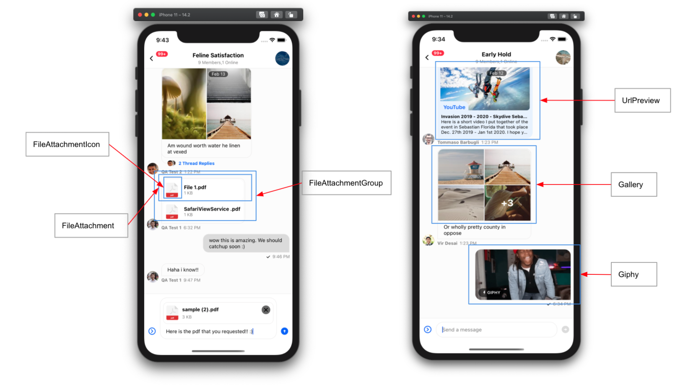

import Tabs from '@theme/Tabs';
import TabItem from '@theme/TabItem';

`Channel` is a higher order component. It doesn't provide any UI itself, but mainly acts as a bridge between its child components such as [MessageList](#), [MessageInput](#) and [Thread](#) components. Channel provides multiple contexts to the enclosed components and allows for modification of many of the enclosed components via props that are then kept in context.

Channel is provided by `stream-chat-react-native` and can be imported from the library as following

```tsx
import { Channel } from 'stream-chat-react-native';
```

<!-- TODO: Change to new docs -->
This component takes StreamChat `channel` as prop. You can either [create a channel](https://getstream.io/chat/docs/javascript/creating_channels/?language=javascript) before rendering Channel component. Or if you are navigating from [`ChannelList`](#) component, channel is available as parameter on [`onSelect`](#) prop function.

## Usage

```jsx
<OverlayProvider>
  <Chat client={client}>
    <Channel channel={channel}>
      <MessageList />
      <MessageInput />
    </Channel>
  </Chat>
</OverlayProvider>
```

## Context Providers

<!-- TODO: Change to new docs -->
Channel component is a provider of following contexts:

- [ChannelContext](#)
- [MessageInputContext](#)
- [MessagesContext](#)
- [PaginatedMessageListContext](#)
- [ThreadContext](#)
- [TypingContext](#)


## UI Customizations

Channel component makes it possible to customize any of the enclosed child components. For every child UI component of Channel, you can provide your own custom implementation. You can reference the following visuals, to check which prop to use for customizing.

For example, you can customize message avatar component as following:

```jsx
import { Channel, useMessageContext } from 'stream-chat-react-native';

const CustomAvatar = () => {
  const {message} = useMessageContext();

  return <Image source={{ src: message.user.image }} />
}

<Channel MessageAvatar={CustomAvatar} />
```

<Tabs
  defaultValue='messages'
  values={[
    { label: 'Messages', value: 'messages' },
    { label: 'Attachments', value: 'attachments' },
    { label: 'Indicators', value: 'indicators' },
    { label: 'Input', value: 'input' },
  ]}
>
<TabItem value='messages'>


</TabItem>
<TabItem value='attachments'>



</TabItem>
<TabItem value='indicators'>


</TabItem>
<TabItem value='input'>


</TabItem>
</Tabs>

## Props

### <div class="label required basic">Required</div> channel

<!-- TODO: Change to new docs -->
Instance of Channel from stream-chat package.

Please check the [reference docs](https://getstream.io/chat/docs/javascript/creating_channels/?language=javascript) around how to create or query channel


| Type |
|- -|
| [Channel](#) |

### <div class="label required basic">Required</div> keyboardVerticalOffset

Distance between top of the screen and top of Channel component. Generally this value needs to be - `headerHeight + topInset`.

| Type |
| - |
| number |

### additionalKeyboardAvoidingViewProps

Additional props passed to underlying keyboard avoiding view

| Type |
| - |
| [`KeyboardAvoidingView Props`](https://reactnative.dev/docs/keyboardavoidingview#props) |

### additionalTextInputProps

Additional props for underlying TextInput component of React Native, within MessageInput.

| Type |
| - |
| [`TextInput Props`](https://reactnative.dev/docs/textinput) |

### animatedLongPress

When false, pop-out animation will be disabled for message bubble, on long press.

| Type | Default |
| - | - |
| boolean | true |

### additionalTouchableProps

Additional props for `TouchableOpacity` (from React Native) which wraps inner MessageContent component here.

| Type |
| - |
| [`TouchableOpacity Props`](https://reactnative.dev/docs/touchableopacity#props) |

### allowThreadMessagesInChannel

When true, messages with property `show_in_channel`, will be displayed in MessageList component.

| Type | Default |
| - | - |
| boolean | true |

### autoCompleteTriggerSettings

### blockUser

Full override of the block user button in the Message Actions list, which shows up when user long presses a message.

<!-- TODO: Change to new docs -->
| Type |
| - |
| (message) => [`MessageAction`](#) |

<!-- ### closeSuggestions -->

### compressImageQuality

Compress image with quality (from 0 to 1, where 1 is best quality) before uploading.
On iOS, values larger than 0.8 don't produce a noticeable quality increase in most images,
while a value of 0.8 will reduce the file size by about half or less compared to a value of 1.
Image picker defaults to 0.8 for iOS and 1 for Android

| Type | Default |
| - | - |
| number | iOS - 0.8, Android - 1 |

### copyMessage

Full override of the copy message button in the Message Actions list, which shows up when user long presses a message.

| Type |
| - |
| (message) => [`MessageAction`](#) |

### deleteMessage

Full override of the delete message button in the Message Actions list, which shows up when user long presses a message.

| Type |
| - |
| (message) => [`MessageAction`](#) |

### disableIfFrozenChannel

If true, all the interactions with Channel component will be disabled if the channel is frozen.

| Type | Default |
| - | - |
| boolean | true |

### disableKeyboardCompatibleView

### disableTypingIndicator

If true, typing indicators won't be rendered within enclosed MessageList component.

| Type | Default |
| - | - |
| boolean | false |

### dismissKeyboardOnMessageTouch

If true, keyboard will be dismissed as soon as user touches any of the messages in list.

| Type | Default |
| - | - |
| boolean | false |

### doDocUploadRequest

Override file upload request, which occurs when user selects a file from file picker. Use this for storing attached files on your custom CDN.

```tsx
(file: { name, size, type, uri }, channel) => Promise
```

| Type |
| - |
| function |

### doImageUploadRequest

Override image upload request, which occurs when user selects an image from image picker. Use this for storing attached images on your custom CDN.

```tsx
(image: { name, uri }, channel) => Promise;
```

| Type |
| - |
| function |

### doMarkReadRequest

Overrides the Stream default mark read request for channel. This prop should be only used for some advanced purpose, where you want to conditionally allow or disallow some mark-read requests.

:::caution
Don't use this prop to disable read-recipts feature on chat. You should disable "Read Events" from dashboard for this purpose.
:::

```tsx
const doMarkReadRequest = (channel) => {
  /** Some custom logic here */
  return channel.markRead();
}
```

| Type |
| - |
| `(channel) => void` |

### doSendMessageRequest

Overrides the Stream default send message request. This prop should be only used for some advanced purpose, where you want override the message object before sending the request.

```tsx
const doSendMessageRequest = (channelId, messageObject) => {
  /** Some custom logic here */
  return channel.sendMessage(messageObject);
}
```

| Type |
| - |
| function |

### doUpdateMessageRequest

Overrides the Stream default update message request. This prop should be only used for some advanced purpose, where you want override the message object before sending the update request.

```tsx
const doUpdateMessageRequest = (channelId, messageObject) => {
  /** Some custom logic here */
  return client.updateMessage(messageObject);
}
```

| Type |
| - |
| function |

### editMessage

Full override of the "Edit Message" button in the Message Actions list, which shows up when user long presses a message.

Please refer to [Customize Message Actions](../guides/customize-message-actions) for details.

| Type |
| - |
| `null` \| (message) => [`MessageAction`](#) |

### enforceUniqueReaction

When set to true, reactions will be limited to 1 per user. If user selects another reaction then his previous reaction will be removed and replaced with new one.
This is similar to reaction UX on [iMessage application](https://en.wikipedia.org/wiki/IMessage).

| Type | Default |
| - | - |
| boolean | false |

### flagMessage

Full override of the "Flag Message" button in the Message Actions list, which shows up when user long presses a message.

Please refer to [Customize Message Actions](../guides/customize-message-actions) for details.

| Type |
| - |
| `null` \| (message) => [`MessageAction`](#) |

### forceAlignMessages

If true, all the messages will be aligned to the left side of screen, similar to Slack.
By default, received messages get aligned on left side of screen and sent messages go to right side of screen.

| Type               | Default      |
| ------------------ | ------------ |
| boolean            | false        |


### formatDate

Formatter function to custom format the message date on deleted messages and message status.

| Type |
| - |
| (date: string \| [Date](https://developer.mozilla.org/en-US/docs/Web/JavaScript/Reference/Global_Objects/Date) \| number) => string |

### giphyEnabled

When set to false, giphy commands feature will be disabled on MessageInput component.

| Type               | Default      |
| ------------------ | ------------ |
| boolean            | true        |

<!-- ### globalUnreadCountLimit -->

### handleBlock

Function to call, when "Block User" action is invoked from message actions list.
This interceptor will neither change the standard functions nor block them. Use this function to add any analytics tracking call.

Please refer to [Customize Message Actions](../guides/customize-message-actions) for details.

| Type |
| - |
| `(message) => void` |

### handleCopy

Function to call, when "Copy Message" action is invoked from message actions list.
This interceptor will neither change the standard functions nor block them. Use this function to add any analytics tracking call.

Please refer to [Customize Message Actions](../guides/customize-message-actions) for details.

| Type |
| - |
| `(message) => void` |

### handleDelete

Function to call, when "Delete Message" action is invoked from message actions list.
This interceptor will neither change the standard functions nor block them. Use this function to add any analytics tracking call.

Please refer to [Customize Message Actions](../guides/customize-message-actions) for details.

| Type |
| - |
| `(message) => void` |

### handleEdit

Function to call, when "Edit Message" action is invoked from message actions list.
This interceptor will neither change the standard functions nor block them. Use this function to add any analytics tracking call.

Please refer to [Customize Message Actions](../guides/customize-message-actions) for details.

| Type |
| - |
| `(message) => void` |

### handleFlag

Function to call, when "Flag Message" action is invoked from message actions list.
This interceptor will neither change the standard functions nor block them. Use this function to add any analytics tracking call.

Please refer to [Customize Message Actions](../guides/customize-message-actions) for details.

| Type |
| - |
| `(message) => void` |

### handleMute

Function to call, when "Mute User" action is invoked from message actions list.
This interceptor will neither change the standard functions nor block them. Use this function to add any analytics tracking call.

Please refer to [Customize Message Actions](../guides/customize-message-actions) for details.

| Type |
| - |
| `(message) => void` |

### handleReaction

Function to call, when a user adds a reaction on message by pressing on reaction icon in message overlay.
This interceptor will neither change the standard functions nor block them. Use this function to add any analytics tracking call.

Please refer to [Customize Message Actions](../guides/customize-message-actions) for details.

| Type |
| - |
| `(message, reactionType) => void` |

### handleReply

Function to call, when "Reply" action is invoked from message actions list.
This interceptor will neither change the standard functions nor block them. Use this function to add any analytics tracking call.

Please refer to [Customize Message Actions](../guides/customize-message-actions) for details.

| Type |
| - |
| `(message) => void` |

### handleRetry

Function to call, when "Retry" action is invoked from message actions list. "Retry" action shows up for failed messages.
This interceptor will neither change the standard functions nor block them. Use this function to add any analytics tracking call.

Please refer to [Customize Message Actions](../guides/customize-message-actions) for details.

| Type |
| - |
| `(message) => void` |

### handleThreadReply

Function to call, when "Thread Reply" action is invoked from message actions list.
This interceptor will neither change the standard functions nor block them. Use this function to add any analytics tracking call.

Please refer to [Customize Message Actions](../guides/customize-message-actions) for details.

| Type |
| - |
| `(message) => void` |

### hasCommands

When false, commands feature will be disabled on enclosed MessageInput component.

| Type | Default |
| - | - |
| boolean | true |

### hasFilePicker

When false, file picker feature will be disabled on enclosed MessageInput component.

| Type | Default |
| - | - |
| boolean | true |

### hasImagePicker

When false, image picker feature will be disabled on enclosed MessageInput component.

| Type | Default |
| - | - |
| boolean | true |

### hideDateSeparators

When true, inline date separators won't be rendered in enclosed MessageList component.

| Type | Default |
| - | - |
| boolean | false |

### initialScrollToFirstUnreadMessage

When true, Channel component will load the enclosed MessageList at first unread message.

| Type | Default |
| - | - |
| boolean | false |

### initialValue

Sets the initial value for enclosed MessageInput component. This prop is useful for setting a draft message, when user opens a channel screen.

| Type |
| - |
| string |

### keyboardBehavior

<!-- ### loadingMore

### loadingMoreRecent -->

### markdownRules

Object specifying rules defined within simple-markdown

https://github.com/Khan/simple-markdown#adding-a-simple-extension

| Type |
| - |
| object |

### messageId

If provided, enclosed MessageList will be loaded at given `messageId`, instead of latest message.

| Type |
| - |
| string |

### maxNumberOfFiles

Maximum number of files (documents + images), that can be attached per message.

| Type | Default |
| - | - |
| number | 10 |


### maxTimeBetweenGroupedMessages

Maximum time in milliseconds that should occur between messages to still consider them grouped together.
By default all the messages from same user will be grouped together.

| Type |
| - |
| number |

### messageActions

Use this prop to override message actions (which pop-up in message overlay).

Please refer to [Customize Message Actions](../guides/customize-message-actions) for details.

| Type |
| - |
| Array<[MessageAction](../object-types/message-action)> \| (params) => Array<[MessageAction](../object-types/message-action)> |

### messageContentOrder

Order in which to render the content of message.

```jsx
messageContentOrder = ['quoted_reply', 'gallery', 'files', 'text', 'attachments'];
```

| Type |
| - |
| `Array<string>` |

<!-- ### messages

Provide a custom array of messages to render in `MessageList`. -->

### muteUser

Full override of the "Mute User" button in the Message Actions list, which shows up when user long presses a message.

<!-- TODO: Change to new docs -->
| Type |
| - |
| (message) => [`MessageAction`](#) |

<!-- ### myMessageTheme

Theme object for messages from current user -->

### numberOfLines

Maximum number of lines, that underlying `TextInput` component (within enclosed MessageInput) should expand to when user enters multiline message.

| Type | Default |
| - | - |
| number | 5 |

### onChangeText

Callback that is called when the text input's text changes. Changed text is passed as a single string argument to the callback handler.

| Type |
| - |
| `(text) => void` |

### onDoubleTapMessage

Callback that is called, when user double taps on message. Underlying message doesn't have any default handler for double tap gesture.
Please check the example of [Double Tap Reaction](../guides/message-customization#instagram-style-double-tap-reaction) in our Guides section.

| Type |
| - |
| ([`MessageTouchableHandlerPayload`](../object-types/message-touchable-handler-payload)) => void) |

### onLongPressMessage

Callback that is called, when user long presses a message. By default, it opens a messages actions overlay.
Use this prop, to disable long press functionality or add custom behaviour for long press.

```tsx
<Channel
  animatedLongPress={false}
  onLongPressMessage={() => {}} />
```

```tsx
onLongPressMessage = ({ message }) => Alert.alert(`User long pressed a message: ${message.text}`;
```

| Type |
| - |
| ([`MessageTouchableHandlerPayload`](../object-types/message-touchable-handler-payload)) => void) |

### onPressMessage

Callback that is called, when user presses a message.

:::caution

Default handler for press interaction is attached to reactions (opens reaction picker) and attachments (opens image gallery). So if you are using this prop, you will need to handle all these cases.

:::

| Type |
| - |
| ([`MessageTouchableHandlerPayload`](../object-types/message-touchable-handler-payload)) => void) |

### onPressInMessage

Callback that is called, when user [`pressIn`](https://reactnative.dev/docs/pressable#onpressin)s a message.


| Type |
| - |
| ([`MessageTouchableHandlerPayload`](../object-types/message-touchable-handler-payload)) => void) |

<!-- ### openSuggestions -->

### reply

Full override of the "Reply" button in the Message Actions list, which shows up when user long presses a message.

Please refer to [Customize Message Actions](../guides/customize-message-actions) for details.

| Type |
| - |
| `null` \| (message) => [`MessageAction`](#) |

### retry

Full override of the "Resend Message" button in the Message Actions list, which shows up when user long presses a failed message .

Please refer to [Customize Message Actions](../guides/customize-message-actions) for details.

| Type |
| - |
| `null` \| (message) => [`MessageAction`](#) |

<!-- ### selectReaction -->

<!-- ### sendImageAsync -->

### setInputRef

Callback function to set the [ref](https://reactjs.org/docs/refs-and-the-dom.html#callback-refs) on underlying TextInput component within enclosed MessageInput component.

| Type |
| - |
| `(ref) => void` |

### supportedReactions

List of reactions which can be added on message. Provide `id` and `icon` for every reaction that you want to support.
`id` is an identifier for reaction, which is used by backend. And we use `icon` to render UI for that reaction.

Please read [Custom Reaction section](../guides/message-customization#message-with-custom-reactions) in Guides section.

| Type |
| - |
| `Array<{ id: string; icon: Component }>` |

<!-- ### t -->

<!-- TODO: Needs help with english -->
### thread

### threadReply

Full override of the "Thread Reply" button in the Message Actions list, which shows up when user long presses a message .

Please refer to [Customize Message Actions](../guides/customize-message-actions) for details.

| Type |
| - |
| `null` \| (message) => [`MessageAction`](#) |

<!-- ### updateSuggestions -->

### AttachButton

Custom UI component for attach button next to input box.

<!-- TODO: Change to new docs -->
| Type | Default |
| ------------------ | ------------ |
| Component, element | [AttachButton](#) |

<!-- ### Attachment

Custom UI component for rendering attachments in MessageList.

Available props:

- `attachment` {object}

| Type | Default |
| ------------------ | ------------ |
| Component, element | [Attachment](#) | -->

### AttachmentActions

UI component to render additional actions on attachment. e.g., send, shuffle, cancel in case of giphy

| Type | Default |
|- -|- -|
| Component, element | [AttachmentActions](https://github.com/GetStream/stream-chat-react-native/blob/master/src/components/Attachment/AttachmentActions.tsx) |

### Card

UI component to render any custom type of attachment. Please check the guides for [Custom Attachment](../guides/custom-attachment)

| Type | Default |
|- -|- -|
| Component, element | [Card](https://github.com/GetStream/stream-chat-react-native/blob/master/src/components/Attachment/Card.tsx) |

<!-- ### CardCover

### CardFooter

### CardHeader -->

### CommandsButton

UI component to render button next to input box, which when pressed opens commands list.

| Type | Default |
|- -|- -|
| Component, element | [CommandsButton](https://github.com/GetStream/stream-chat-react-native/blob/master/src/components/MessageInput/CommandsButton.tsx) |

### DateHeader

UI component to render sticky date header within enclosed MessageList component.

| Type | Default |
|- -|- -|
| Component, element | [DateHeader](https://github.com/GetStream/stream-chat-react-native/blob/master/src/components/MessageList/DateHeader.tsx) |

### EmptyStateIndicator

UI component to render, when channel has no messages.

| Type | Default |
|- -|- -|
| Component, element | [EmptyStateIndicator](https://github.com/GetStream/stream-chat-react-native/blob/master/src/components/Indicators/EmptyStateIndicator.tsx) |

### FileAttachmentIcon

UI component to render file icon for `file` type attachment.

| Type | Default |
|- -|- -|
| Component, element | [FileIcon](https://github.com/GetStream/stream-chat-react-native/blob/master/src/components/Attachment/FileIcon.tsx) |

### FileAttachment

UI component to render `file` type attachment in MessageList.

| Type | Default |
|- -|- -|
| Component, element | [FileAttachment](https://github.com/GetStream/stream-chat-react-native/blob/master/src/components/Attachment/FileAttachment.tsx) |

### FileAttachmentGroup

UI component to render group of `file` type attachments, when there are multiple `file` type attachments in message.

| Type | Default |
|- -|- -|
| Component, element | [FileAttachmentGroup](https://github.com/GetStream/stream-chat-react-native/blob/master/src/components/Attachment/FileAttachmentGroup.tsx) |

### FileUploadPreview

UI component to render preview of attached file, within enclosed MessageInput component

| Type | Default |
|- -|- -|
| Component, element | [FileUploadPreview](https://github.com/GetStream/stream-chat-react-native/blob/master/src/components/MessageInput/FileUploadPreview.tsx) |

<!-- ### FlatList -->

### Gallery

UI component to render `image` type attachments within enclosed MessageList.

| Type | Default |
|- -|- -|
| Component, element | [Gallery](https://github.com/GetStream/stream-chat-react-native/blob/master/src/components/Attachment/Gallery.tsx) |

### Giphy

UI component to render `giphy` type attachments within enclosed MessageList.

| Type | Default |
|- -|- -|
| Component, element | [Giphy](https://github.com/GetStream/stream-chat-react-native/blob/master/src/components/Attachment/Giphy.tsx) |

### ImageUploadPreview

UI component to render preview of attached images, within enclosed MessageInput component

| Type | Default |
|- -|- -|
| Component, element | [ImageUploadPreview](https://github.com/GetStream/stream-chat-react-native/blob/master/src/components/MessageInput/ImageUploadPreview.tsx) |

### InlineDateSeparator

UI component to render inline date separators between messages which were created at a difference of more than a day.

| Type | Default |
|- -|- -|
| Component, element | [InlineDateSeparator](https://github.com/GetStream/stream-chat-react-native/blob/master/src/components/MessageList/InlineDateSeparator.tsx) |

### InlineUnreadIndicator

UI component to render inline separator in MessageList, to indicate the position of last read message in list.

| Type | Default |
|- -|- -|
| Component, element | [InlineUnreadIndicator](https://github.com/GetStream/stream-chat-react-native/blob/master/src/components/MessageList/InlineUnreadIndicator.tsx) |

### Input

UI component to render UI part of enclosed MessageInput component.
Please read section in guides about [Custimizing Message Input](../guides/message-input)

| Type |
|- -|
| Component, element |

### InputButtons

UI component to render action buttons (CommandsButton and AttachButton) on left side of input box, within enclosed `MessageInput` component.

| Type | Default |
|- -|- -|
| Component, element | [InputButtons](https://github.com/GetStream/stream-chat-react-native/blob/master/src/components/MessageInput/InputButtons.tsx) |

### KeyboardCompatibleView

Component to override underlying default `KeyboardCompatibleView`. Generally you won't need to use this prop at all,
you can simply use following props instead:

- [`keyboardVerticalOffset`](#required-keyboardverticaloffset)
- [`disableKeyboardCompatibleView`](#disablekeyboardcompatibleview)

| Type | Default |
|- -|- -|
| Component, element | [KeyboardCompatibleView](https://github.com/GetStream/stream-chat-react-native/blob/master/src/components/KeyboardCompatibleView/KeyboardCompatibleView.tsx) |

### LoadingErrorIndicator

UI component to render full screen error indicator, when channel fails to load.

| Type | Default |
|- -|- -|
| Component, element | [LoadingErrorIndicator](https://github.com/GetStream/stream-chat-react-native/blob/master/src/components/Indicators/LoadingErrorIndicator.tsx) |

### LoadingIndicator

UI component to render full screen error indicator, when channel fails to load.

| Type | Default |
|- -|- -|
| Component, element | [LoadingIndicator](https://github.com/GetStream/stream-chat-react-native/blob/master/src/components/Indicators/LoadingIndicator.tsx) |

### Message

### MessageAvatar

UI component to render avatar of sender for message, within enclosed MessageList.. This component is only rendered for messages from other users.

| Type | Default |
|- -|- -|
| Component, element | [MessageAvatar](https://github.com/GetStream/stream-chat-react-native/blob/master/src/components/Message/MessageSimple/MessageAvatar.tsx) |

### MessageContent

UI component to render content of message including status, attachments, reactions etc., within enclosed MessageList.

| Type | Default |
|- -|- -|
| Component, element | [MessageContent](https://github.com/GetStream/stream-chat-react-native/blob/master/src/components/Message/MessageSimple/MessageContent.tsx) |

### MessageFooter

UI component to render footer for message, within enclosed MessageList.

| Type | Default |
|- -|- -|
| Component, element | [MessageFooter](https://github.com/GetStream/stream-chat-react-native/blob/master/src/components/Message/MessageSimple/MessageFooter.tsx) |

### MessageHeader

UI component to render header for message, within enclosed MessageList.

| Type | Default |
|- -|- -|
| Component, element | [MessageHeader](https://github.com/GetStream/stream-chat-react-native/blob/master/src/components/Message/MessageSimple/MessageHeader.tsx) |

<!-- ### MessageList -->

### MessageReplies

UI component to show number of thread replies and avatars of members who replied on message

| Type | Default |
|- -|- -|
| Component, element | [MessageReplies](https://github.com/GetStream/stream-chat-react-native/blob/master/src/components/Message/MessageSimple/MessageReplies.tsx) |

### MessageRepliesAvatars

UI component to show avatars of members who thread replied on message. 

| Type | Default |
|- -|- -|
| Component, element | [MessageRepliesAvatars](https://github.com/GetStream/stream-chat-react-native/blob/master/src/components/Message/MessageSimple/MessageRepliesAvatars.tsx) |

### MessageSimple

UI component to render a message in enclosed MessageList.

Please check guides section for [Customizing Message UI](../guides/message-customization) for details.

| Type | Default |
|- -|- -|
| Component, element | [MessageSimple](https://github.com/GetStream/stream-chat-react-native/blob/master/src/components/Message/MessageSimple/MessageSimple.tsx) |

### MessageStatus

UI component to render status of message, which includes time and read-receipts.

| Type | Default |
|- -|- -|
| Component, element | [MessageStatus](https://github.com/GetStream/stream-chat-react-native/blob/master/src/components/Message/MessageSimple/MessageStatus.tsx) |

### MessageSystem

UI component to render `system` type messages. Purpose of system messages is to inform user about changes to channel. System messages are part of message history, and have a property `type` set as `system`.
You can add system messages within message history in following scenarios:

- [A user gets added to or removed from channel](https://getstream.io/chat/docs/javascript/channel_members/?language=javascript)
- [A user accepts invite to join a channel](https://getstream.io/chat/docs/javascript/channel_invites/?language=javascript#accepting-an-invite)
- [Channel is updated](https://getstream.io/chat/docs/javascript/channel_update/?language=javascript&q=system#full-update-(overwrite))

| Type | Default |
|- -|- -|
| Component, element | [MessageSystem](https://github.com/GetStream/stream-chat-react-native/blob/master/src/components/Message/MessageSimple/MessageSystem.tsx) |

### MessageText

UI component to render text of message. By default, we use [Simple Markdown](https://github.com/Khan/simple-markdown#adding-a-simple-extension) package to render the text content of message.
If you decide to use this prop, please be aware that you will need to handle the markdown rendering yourself. 

| Type | Default |
|- -|- -|
| Component, element | [renderText](#) |

### MoreOptionsButton

UI component to render a button within enclosed MessageInput, which when pressed shows more options such as AttachmentButton, CommandsButton

| Type | Default |
|- -|- -|
| Component, element | [MoreOptionsButton](#) |

### NetworkDownIndicator

UI component to render an indicator at top of the channel, which shows up when there is some issue with network or connection.

| Type | Default |
|- -|- -|
| Component, element | [NetworkDownIndicator](#) |

<!-- ### OverlayReactionList -->

### ReactionList

UI component to render list of reactions at top of message bubble.

| Type | Default |
|- -|- -|
| Component, element | [ReactionList](#) |

### Reply

UI component to render preview of parent of message for quoted reply.

| Type | Default |
|- -|- -|
| Component, element | [Reply](#) |

### ScrollToBottomButton

UI component to render a button which when pressed, scrolls the message list to bottom.

| Type | Default |
|- -|- -|
| Component, element | [ScrollToBottomButton](#) |

### SendButton

UI component to render a send message button, within enclosed MessageInput component.

| Type | Default |
|- -|- -|
| Component, element | [SendButton](#) |

### ShowThreadMessageInChannelButton

UI component to render a checkbox within enclosed Thread component, which when checked sets a `show_in_channel` property to true on a message.

| Type | Default |
|- -|- -|
| Component, element | [Thread](#) |

<!-- ### StickyHeader -->

### TypingIndicator

UI component to render typing indicator within enclosed MessageList component.

| Type | Default |
|- -|- -|
| Component, element | [TypingIndicator](#) |

### TypingIndicatorContainer

UI component to render container in which typing indicator gets rendered within enclosed MessageList component.

| Type | Default |
|- -|- -|
| Component, element | [TypingIndicatorContainer](#) |

### UploadProgressIndicator

UI component to render upload progress indicator as an overlay above [ImageUploadPreview](#imageuploadpreview) and [FileUploadPreview](#fileuploadpreview).

| Type | Default |
|- -|- -|
| Component, element | [UploadProgressIndicator](#) |

### UrlPreview

UI component to render preview of urls within enclosed MessageList component.

| Type | Default |
|- -|- -|
| Component, element | [UrlPreview](#) |
