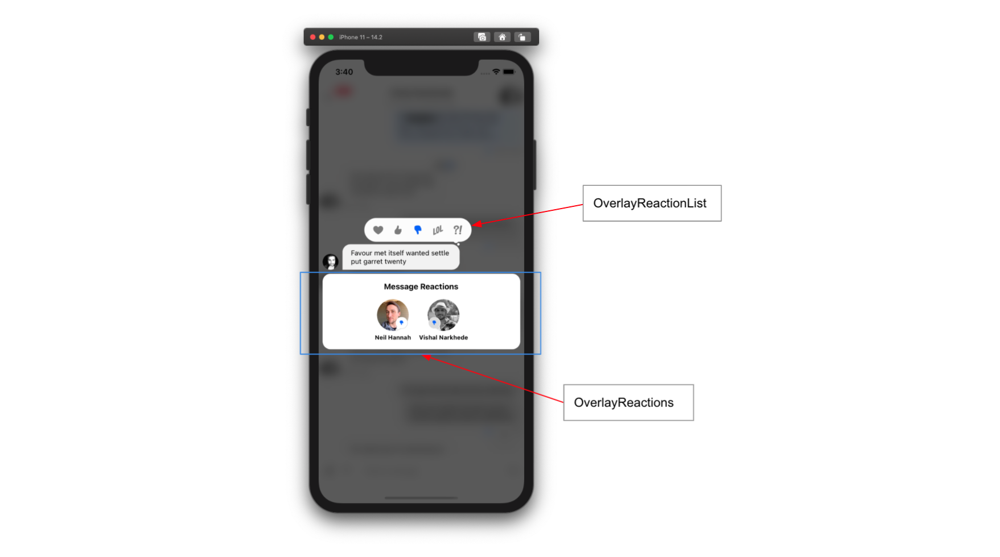
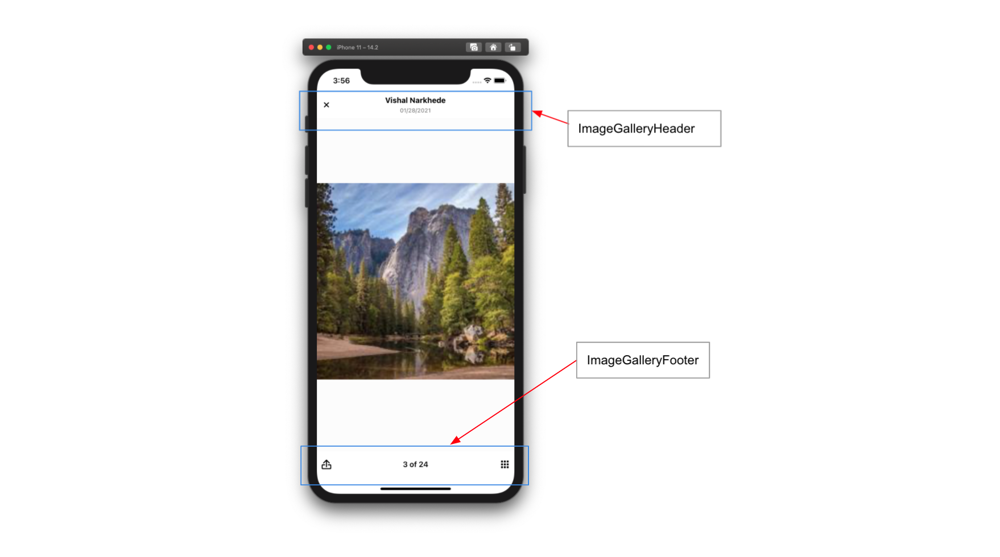

import Tabs from '@theme/Tabs';
import TabItem from '@theme/TabItem';

import AttachmentPickerBottomSheetHandleHeight from '../common-content/core-components/overlay-provider/props/attachment_picker_bottom_sheet_handle_height.mdx';
import AttachmentPickerBottomSheetHeight from '../common-content/core-components/overlay-provider/props/attachment_picker_bottom_sheet_height.mdx';
import AttachmentPickerErrorButtonText from '../common-content/core-components/overlay-provider/props/attachment_picker_error_button_text.mdx';
import AttachmentPickerErrorText from '../common-content/core-components/overlay-provider/props/attachment_picker_error_text.mdx';
import AttachmentSelectionBarHeight from '../common-content/core-components/overlay-provider/props/attachment_selection_bar_height.mdx';
import I18nInstance from '../common-content/core-components/overlay-provider/props/i18n_instance.mdx';
import ImageGalleryCustomComponents from '../common-content/core-components/overlay-provider/props/image_gallery_custom_components.mdx';
import ImageGalleryGridHandleHeight from '../common-content/core-components/overlay-provider/props/image_gallery_grid_handle_height.mdx';
import ImageGalleryGridSnapPoints from '../common-content/core-components/overlay-provider/props/image_gallery_grid_snap_points.mdx';
import MessageTextNumberOfLines from '../common-content/core-components/overlay-provider/props/message_text_number_of_lines.mdx';
import NumberOfAttachmentImagesToLoadPerCall from '../common-content/core-components/overlay-provider/props/number_of_attachment_images_to_load_per_call.mdx';
import NumberOfAttachmentPickerImageColumns from '../common-content/core-components/overlay-provider/props/number_of_attachment_picker_image_columns.mdx';
import NumberOfImageGalleryGridColumns from '../common-content/core-components/overlay-provider/props/number_of_image_gallery_grid_columns.mdx';
import Value from '../common-content/core-components/overlay-provider/props/value.mdx';
import AttachmentPickerBottomSheetHandle from '../common-content/core-components/overlay-provider/props/attachment_picker_bottom_sheet_handle.mdx';
import AttachmentPickerError from '../common-content/core-components/overlay-provider/props/attachment_picker_error.mdx';
import AttachmentPickerErrorImage from '../common-content/core-components/overlay-provider/props/attachment_picker_error_image.mdx';
import CameraSelectorIcon from '../common-content/core-components/overlay-provider/props/camera_selector_icon.mdx';
import FileSelectorIcon from '../common-content/core-components/overlay-provider/props/file_selector_icon.mdx';
import ImageOverlaySelectedComponent from '../common-content/core-components/overlay-provider/props/image_overlay_selected_component.mdx';
import ImageSelectorIcon from '../common-content/core-components/overlay-provider/props/image_selector_icon.mdx';
import MessageActionList from '../common-content/core-components/overlay-provider/props/message_action_list.mdx';
import MessageActionListItem from '../common-content/core-components/overlay-provider/props/message_action_list_item.mdx';
import OverlayReactionList from '../common-content/core-components/overlay-provider/props/overlay_reaction_list.mdx';
import OverlayReactions from '../common-content/core-components/overlay-provider/props/overlay_reactions.mdx';

The `OverlayProvider` is the top level Stream Chat for React Native component and wraps all other components provided by the SDK.
The `OverlayProvider` allows users to interact with messages on long press above the underlying views, use the full screen image viewer, and use the `AttachmentPicker` as a keyboard-esk view.

## Basic Usage

The `OverlayProvider` should wrap all other Stream Chat for React Native components and in most cases the majority of your application.

:::note

For detailed implementation instructions of the `OverlayProvider` with navigation please refer to the [Stream Chat with Navigation](../basics/stream_chat_with_navigation.mdx).

:::

```tsx {7,11}
import { StreamChat } from 'stream-chat';
import { ChannelList, Chat, OverlayProvider } from 'stream-chat-react-native';

const client = StreamChat.getInstance('api_key');

export const App = () => (
  <OverlayProvider>
    <Chat client={client}>
      <ChannelList />
    </Chat>
  </OverlayProvider>
);
```

## Context Providers

`OverlayProvider` contains providers for the `AttachmentPickerContext`, `ImageGalleryContext`, `MessageOverlayContext`, `OverlayContext`, `ThemeContext`, and `TranslationContext`.
These can be accessed using the corresponding hooks.

| Context                   | Hook                         |
| ------------------------- | ---------------------------- |
| `AttachmentPickerContext` | `useAttachmentPickerContext` |
| `ImageGalleryContext`     | `useImageGalleryContext`     |
| `MessageOverlayContext`   | `useMessageOverlayContext`   |
| `OverlayContext`          | `useOverlayContext`          |
| `ThemeContext`            | `useTheme`                   |
| `TranslationContext`      | `useTranslationContext`      |

## UI Customizations

You can override any of the components rendered in overlay using props on `OverlayProvider` or `Channel`.
Custom components provided to `Channel` are hoisted to the overlay for use in displaying messages within the `OverlayProvider`.
Customizing these components requires no interaction with the `OverlayProvider`.

Components only rendered within the overlay can be overridden and modified via props on the `OverlayProvider`.
Removing the `OverlayReactionList` can be done easily by replacing it with a function that returns null.

```tsx
<OverlayProvider OverlayReactionList={() => null}>
```

<Tabs
  defaultValue='message-overlay'
  values={[
    { label: 'Message Overlay', value: 'message-overlay' },
    { label: 'Image Picker', value: 'image-picker' },
    { label: 'Image Gallery', value: 'image-gallery' },
  ]}
>
<TabItem value='message-overlay'>



</TabItem>
<TabItem value='image-picker'>


</TabItem>
<TabItem value='image-gallery'>



</TabItem>
</Tabs>

## Props

The `OverlayProvider` can be used with no props provided but there are a plethora of props for customizing the components in the overlay.

### attachmentPickerBottomSheetHandleHeight

<AttachmentPickerBottomSheetHandleHeight />

### attachmentPickerBottomSheetHeight

<AttachmentPickerBottomSheetHeight />

### attachmentPickerErrorButtonText

<AttachmentPickerErrorButtonText />

### attachmentPickerErrorText

<AttachmentPickerErrorText />

### attachmentSelectionBarHeight

<AttachmentSelectionBarHeight />

### bottomInset

Height of items located below the `MessageInput` when present.
This inset determines the underlying shift to the `MessageList` when it is opened.

:::tip

This can also be set via the `setBottomInset` function provided by the `useAttachmentPickerContext` hook.

:::

| Type   | Default |
| ------ | ------- |
| number | 0       |

### i18nInstance

<I18nInstance />

### imageGalleryCustomComponents

<ImageGalleryCustomComponents />

### imageGalleryGridHandleHeight

<ImageGalleryGridHandleHeight />

### imageGalleryGridSnapPoints

<ImageGalleryGridSnapPoints />

### messageTextNumberOfLines

<MessageTextNumberOfLines />

### numberOfAttachmentImagesToLoadPerCall

<NumberOfAttachmentImagesToLoadPerCall />

### numberOfAttachmentPickerImageColumns

<NumberOfAttachmentPickerImageColumns />

### numberOfImageGalleryGridColumns

<NumberOfImageGalleryGridColumns />

### topInset

Distance from the top of the screen the attachment picker should open to when expanded.
This is often set to the header height.

:::tip

This can also be set via the `setTopInset` function provided by the `useAttachmentPickerContext` hook.

:::

| Type   | Default |
| ------ | ------- |
| number | 0       |

### value

<Value />

### AttachmentPickerBottomSheetHandle

<AttachmentPickerBottomSheetHandle />

### AttachmentPickerError

<AttachmentPickerError />

### AttachmentPickerErrorImage

<AttachmentPickerErrorImage />

### CameraSelectorIcon

<CameraSelectorIcon />

### FileSelectorIcon

<FileSelectorIcon />

### ImageOverlaySelectedComponent

<ImageOverlaySelectedComponent />

### ImageSelectorIcon

<ImageSelectorIcon />

### MessageActionList

<MessageActionList />

### MessageActionListItem

<MessageActionListItem />

### OverlayReactionList

<OverlayReactionList />

### OverlayReactions

<OverlayReactions />
