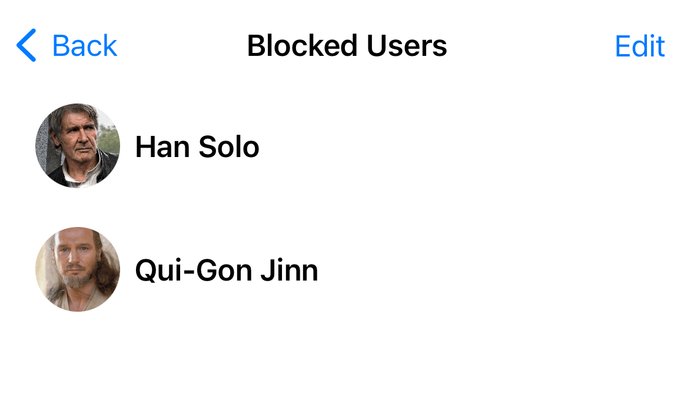

## Introduction

Blocking users is an essential feature in a chat app because it enhances user safety and experience. It allows individuals to protect themselves from harassment, spam, and unwanted interactions. By giving users control over their interactions, it helps maintain privacy, reduces the risk of cyber-bullying, and promotes a respectful community atmosphere.

As a result, some app stores require this functionality as part of their review process.

## Stream Chat

The Stream Chat SDK provides a way for blocking and unblocking users, as well as listing all of the blocked users.

When you block a user, you won’t receive any direct messages from that user anymore. However, if you share a group with other participants, you will still receive messages from the blocked user.

In this cookbook, we will see how to implement this feature in your chat apps, using the Stream Chat SDK.

## Low Level Client support

The low-level client provides the following methods related to user blocking.

### Blocking a user

In order to block a user, you need to use the `blockUser` method of the client instance. This method takes the user id of the user you wish to block.

```tsx
import { StreamChat } from 'stream-chat';
const chatClient = StreamChat.getInstance('your api key');

// Note this has to be done after the client connection(`client.connectUser`) is established.
const blockUser = async (userId: string) => {
  try {
    await chatClient.blockUser(userId);
  } catch (err) {
    console.log('Error blocking user:', err);
  }
};
```

### Unblocking a user

Similarly, to unblock a blocked user, you need to use the `unBlockUser` method of the client instance. This method takes the user id of the user you wish to unblock.

```tsx
import { StreamChat } from 'stream-chat';
const chatClient = StreamChat.getInstance('your api key');

// Note this has to be done after the client connection(`client.connectUser`) is established.
const unBlockUser = async (userId: string) => {
  try {
    await chatClient.unBlockUser(userId);
  } catch (err) {
    console.log('Error UnBlocking user:', err);
  }
};
```

### Listing Blocked Users

To list all the blocked users, you can use the `getBlockedUsers` method of the client instance.

```tsx
const chatClient = StreamChat.getInstance('your api key');

// Note this has to be done after the client connection(`client.connectUser`) is established.
const getBlockedUsers = async () => {
  try {
    const users = await chatClient.getBlockedUsers();
    setBlockedUsers(users.blocks);
  } catch (error) {
    console.log('Error getting blocked users:', error);
  }
};
```

## Message Actions

You can use the logic above to create your own custom message actions that will involve user blocking.

This can be done by using the `messageActions` prop of the `Channel` component. You can follow the guide [here](../guides/custom-message-actions.mdx).

```tsx
import { Channel, messageActions } from 'stream-chat-react-native';

const App = () => {
  return (
    <Channel
      channel={channel}
      messageActions={params => {
        const { dismissOverlay, message } = params;
        const actions = messageActions({ ...params });
        if (actions) {
          actions.push({
            action: async () => {
              try {
                await chatClient.blockUser(message.user?.id || '');
                dismissOverlay();
              } catch (error) {
                console.log('Error blocking user:', error);
              }
            },
            actionType: 'block-user',
            title: 'Block User',
          });
          return actions;
        } else {
          return [];
        }
      }}
    >
      {/* Other components here  */}
    </Channel>
  );
};
```

## Displaying Blocked users

Next, let’s see how we can build a custom UI that will show the list of blocked users. This will allow easier overview for the users about who they blocked, as well as provide an easy way to unblock them if needed.



```tsx
import { useEffect, useState } from 'react';
import { Image, StyleSheet, Text, View } from 'react-native';
import { BlockedUserDetails, StreamChat } from 'stream-chat';

const chatClient = StreamChat.getInstance('your api key');

const BlockedUsers = () => {
  const [blockedUsers, setBlockedUsers] = useState<BlockedUserDetails[]>([]);

  useEffect(() => {
    const getBlockedUsers = async () => {
      try {
        const users = await chatClient.getBlockedUsers();
        setBlockedUsers(users.blocks);
      } catch (error) {
        console.log('Error getting blocked users:', error);
      }
    };

    getBlockedUsers();
  }, []);

  const unBlockUser = async (userId: string) => {
    try {
      await chatClient.unBlockUser(userId);
      const filteredUsers = blockedUsers.filter(user => user.blocked_user_id !== userId);
      setBlockedUsers(filteredUsers);
    } catch (err) {
      console.log('Error UnBlocking user:', err);
    }
  };

  return (
    <View>
      {blockedUsers.map((blockedUser: BlockedUserDetails) => (
        <Pressable
          key={blockedUser.blocked_user_id}
          onPress={() => {
            unBlockUser(blockedUser.blocked_user_id);
          }}
          style={styles.container}
        >
          <Image source={{ uri: blockedUser.blocked_user.image as string }} style={styles.image} />
          <Text style={styles.name}>{blockedUser.blocked_user.name}</Text>
        </Pressable>
      ))}
    </View>
  );
};

const styles = StyleSheet.create({
  container: {
    flexDirection: 'row',
    padding: 16,
    alignItems: 'center',
  },
  image: {
    height: 80,
    width: 80,
    borderRadius: 40,
  },
  name: {
    fontSize: 16,
    fontWeight: 'bold',
    marginLeft: 16,
  },
});
```

There’s nothing special in this view, it just shows the blocked users in a list, and exposes a delete action, which will remove the blocked user from the list.

## Summary

In this cookbook we have seen the capabilities of the Stream Chat SDK for blocking users. We have also seen how to add message actions to block and unblock users, as well as a custom UI for displaying the blocked users.

It is recommended to use these actions, in order to avoid issues during app store reviews, especially on the Apple platforms.
