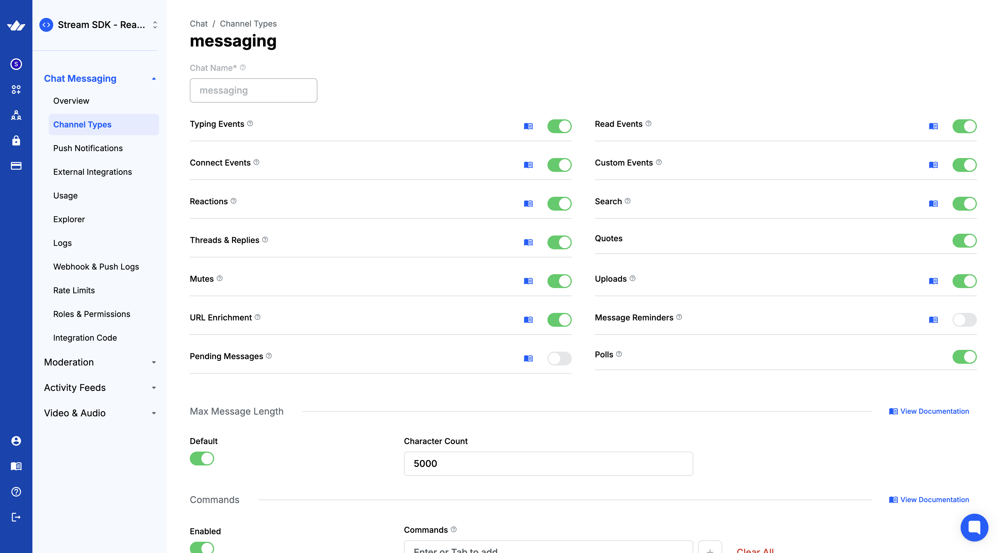
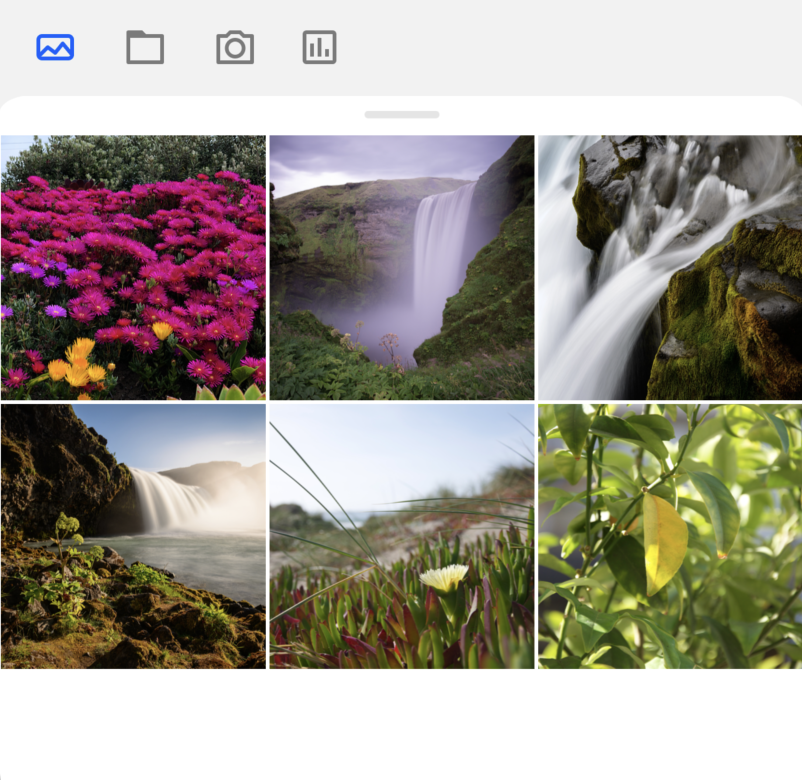
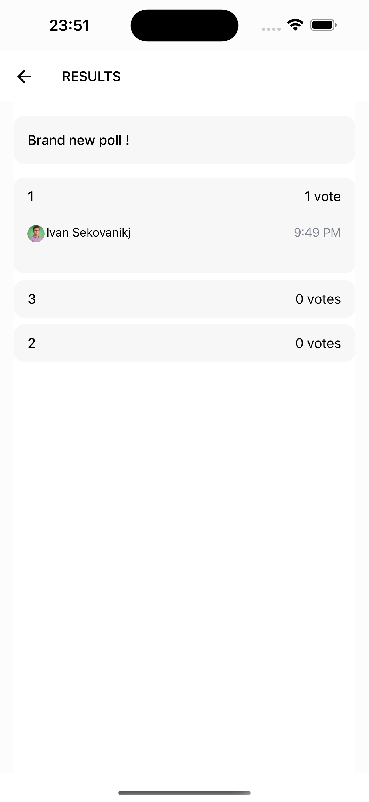
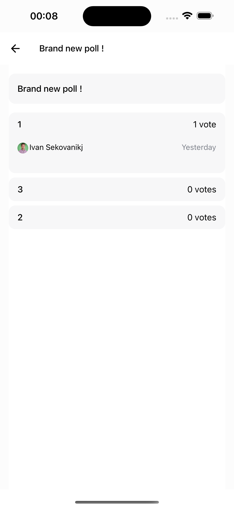
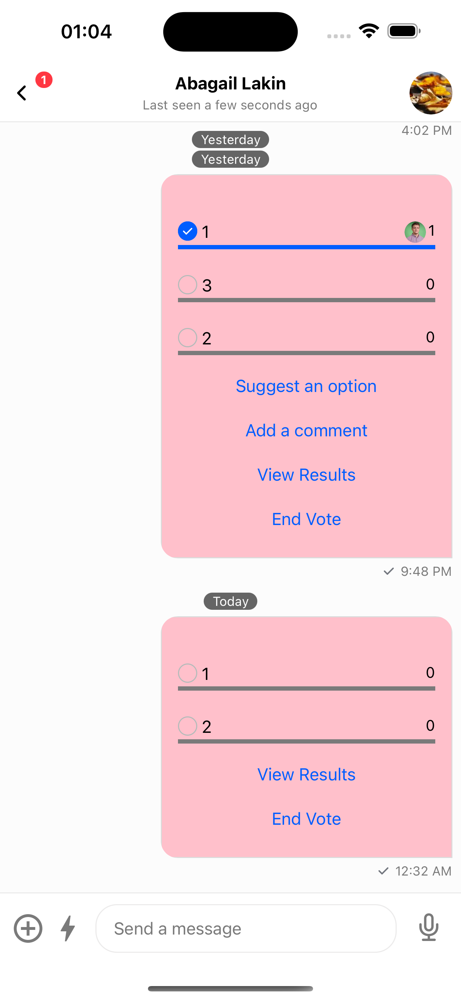
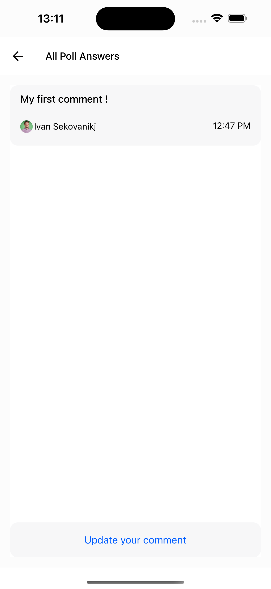
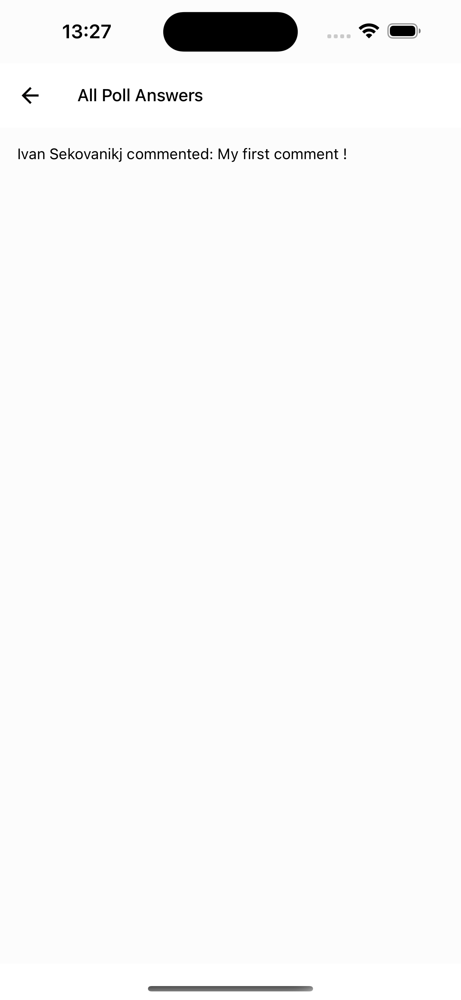

import DefaultUI1 from '../assets/guides/custom-poll-flow/default-ui-1.png';
import DefaultUI2 from '../assets/guides/custom-poll-flow/default-ui-2.png';
import DefaultUI3 from '../assets/guides/custom-poll-flow/default-ui-3.png';

import CustomStep11 from '../assets/guides/custom-poll-flow/custom-step-1-1.png';
import CustomStep12 from '../assets/guides/custom-poll-flow/custom-step-1-2.png';

import CustomCreation1 from '../assets/guides/custom-poll-flow/custom-creation-1.png';
import CustomCreation2 from '../assets/guides/custom-poll-flow/custom-creation-2.png';

import CustomCommentsCreation1 from '../assets/guides/custom-poll-flow/custom-comments-creation-1.png';
import CustomCommentsCreation2 from '../assets/guides/custom-poll-flow/custom-comments-creation-2.png';

In this cookbook we'll go over how we can create and customize a `Channel` screen containing the [`Poll` component](../ui-components/poll.mdx), along with adding navigation to all of its underlying screens rather than relying on modals.

### Prerequisites

This cookbook assumes that you've already set up a screen that is able to display a `Channel` with a `MessageList` inside. As `poll`s are tightly coupled with messages, we need to have this working before we add the `poll` message type.

Polls are disabled by default and can be enabled through the Stream Dashboard by toggling the `Poll` button.



Doing that will include the `Poll` button in your attachment picker:



It also assumes that you have a functioning `chatClient` that is used elsewhere.

For illustration purposes, we are going to be using the `React Navigation` library for navigation (however, any navigation library can be used).

### The initial UI

Without doing any form of customization yet, we should have something similar to the following:

```tsx
import { OverlayProvider, Chat, Channel, MessageList, MessageInput } from 'stream-chat-react-native';

const ChannelScreen = () => {
  return (
    <OverlayProvider>
      <Chat client={client}>
        <Channel channel={channel}>
          <ChannelHeader />
          <MessageList />
          <MessageInput />
        </Channel>
      </Chat>
    </OverlayProvider>
  );
};
```

and the `poll` creation flow should come out of the box with its default UI:

<div style={{ display: 'flex', gap: '1rem', justifyContent: 'space-between' }}>
  
  
  
</div>

At this point, let's try to customize the `Poll` component within the message. To do this, we can set the `PollContent` prop on our `Channel` component.

For now, we want to remove the `Poll` header and modify the behaviour of the buttons at the bottom. To do this, we can reuse the default `PollContent` component exported by the SDK that allows us to do modifications.

Additionally, we can reuse all of the buttons that we need and modify the ones that we want to do something else.

```tsx
import {
  OverlayProvider,
  Chat,
  Channel,
  MessageList,
  MessageInput,
  // highlight-next-line
  PollContent,
} from 'stream-chat-react-native';

// highlight-start
const MyPollButtons = () => {
  return (
    <>
      <ShowAllOptionsButton />
      <ViewResultsButton
        onPress={({ message, poll }) => Alert.alert(`Message ID: ${message.id} and Poll ID: ${poll.id}`)}
      />
      <EndVoteButton />
    </>
  );
};

const MyPollContent = () => <PollContent PollHeader={() => null} PollButtons={MyPollButtons} />;
// highlight-end

const ChannelScreen = () => {
  return (
    <OverlayProvider>
      <Chat client={client}>
        // highlight-next-line
        <Channel channel={channel} PollContent={MyPollContent}>
          <ChannelHeader />
          <MessageList />
          <MessageInput />
        </Channel>
      </Chat>
    </OverlayProvider>
  );
};
```

<div style={{ display: 'flex', gap: '1rem', justifyContent: 'space-between' }}>
  
  
</div>

As we can see, now we only display 2 buttons at the bottom, which are the `View Results` and `End Vote` ones. Clicking on the `View Results` button displays an `Alert` with some information about the `Poll` instead of opening the modal.

At this point we might realize that we no longer have access to the `PollResults` screen anymore. So, let's bring it back. However, we do not want to use the default navigation which is based on [React Native Modals](https://reactnative.dev/docs/modal), but rather introduce our own navigation.

To do this, let's rely on `React Navigation`. Since we need all of the `Poll` screens to also be children of the `Channel` component, we can introduce an additional `Stack` navigator that would take care of this.

```tsx
import { OverlayProvider, Chat, Channel, MessageList, MessageInput, PollContent } from 'stream-chat-react-native';
// highlight-next-line
import { createStackNavigator } from '@react-navigation/stack';

const MyPollButtons = () => {
  return (
    <>
      <ShowAllOptionsButton />
      <ViewResultsButton
        onPress={({ message, poll }) => Alert.alert(`Message ID: ${message.id} and Poll ID: ${poll.id}`)}
      />
      <EndVoteButton />
    </>
  );
};

const MyPollContent = () => <PollContent PollHeader={() => null} PollButtons={MyPollButtons} />;

// highlight-start
const ChannelMessageList = () => {
  return (
    <>
      <ChannelHeader />
      <MessageList />
      <MessageInput />
    </>
  );
};
// highlight-end

// highlight-next-line
const ChannelStack = createStackNavigator<StackNavigatorParamList>();

const ChannelScreen = () => {
  return (
    <OverlayProvider>
      <Chat client={client}>
        <Channel channel={channel} PollContent={MyPollContent}>
          // highlight-start
          <ChannelStack.Navigator initialRouteName={'ChannelMessageList'}>
            <ChannelStack.Screen
              name={'ChannelMessageList'}
              options={{ headerShown: false }}
              component={ChannelMessageList}
            />
            <ChannelStack.Screen name={'PollResultsScreen'} options={{ headerShown: false }} component={() => null} />
          </ChannelStack.Navigator>
          // highlight-end
        </Channel>
      </Chat>
    </OverlayProvider>
  );
};
```

For now, we'll leave the `PollResultsScreen` empty. With the code above, we're allowed to create a new navigation stack within the `Channel` component that we can then use for all of the `Poll` screens.

It would allow us to not have to move the `channel` prop around (as well as all other `Channel` customizations we might have) and still handle everything with our own navigation.

As a next step, let's reconstruct the `PollResults` screen. For this, we may use the `PollModalHeader` and `PollResults` components and get the default UI out of the box.

```tsx
import {
  OverlayProvider,
  Chat,
  Channel,
  MessageList,
  MessageInput,
  PollContent,
  // highlight-start
  PollResults,
  PollModalHeader,
  // highlight-end
} from 'stream-chat-react-native';
import { createStackNavigator } from '@react-navigation/stack';

const MyPollButtons = () => {
  return (
    <>
      <ShowAllOptionsButton />
      <ViewResultsButton
        onPress={({ message, poll }) =>
          navigation.navigate('PollResultsScreen', {
            message,
            poll,
          });
        }
      />
      <EndVoteButton />
    </>
  )
}

// ... rest of the components

// highlight-start
const PollResultsScreen = ({
  route: {
    params: { message, poll },
  },
}) => {
  const navigation = useNavigation();
  return (
    <SafeAreaView style={{ flex: 1 }}>
      <PollModalHeader title={'RESULTS'} onPress={() => navigation.goBack()} />
      <PollResults message={message} poll={poll} />
    </SafeAreaView>
  );
};
// highlight-end

const ChannelScreen = () => {
  return (
    <OverlayProvider>
      <Chat client={client}>
        <Channel channel={channel} PollContent={MyPollContent}>
          <ChannelStack.Navigator initialRouteName={'ChannelMessageList'}>
            <ChannelStack.Screen
              name={'ChannelMessageList'}
              options={{ headerShown: false }}
              component={ChannelMessageList}
            />
            <ChannelStack.Screen
              name={'PollResultsScreen'}
              options={{ headerShown: false }}
              // highlight-next-line
              component={PollResultsScreen}
            />
          </ChannelStack.Navigator>
        </Channel>
      </Chat>
    </OverlayProvider>
  );
};
```

Clicking on the `View Results` button now will successfully navigate us to the `PollResults` screen. It is no longer a modal but rather part of the navigation stack that we introduced.



It looks exactly the same as the default UI, however the title is changed to `RESULTS` rather than the `Poll Results`.

As a next step, let's say that we want to include the `Poll` name pinned at the top so it's present all the time in case we get many options.

For this purpose, we can use the `usePollState` hook and the `PollResultsContent` component.

```tsx
import {
  // ...rest of the imports
  // highlight-start
  usePollState,
  PollResultsContent,
  // highlight-end
} from 'stream-chat-react-native';
import { createStackNavigator } from '@react-navigation/stack';

// ... rest of the components

// highlight-start
const MyPollResultsContent = () => {
  const { name } = usePollState();
  const navigation = useNavigation();
  return (
    <>
      <PollModalHeader title={name} onPress={() => navigation.goBack()} />
      <PollResultsContent />
    </>
  );
};

const PollResultsScreen = ({
  route: {
    params: { message, poll },
  },
}) => {
  return (
    <SafeAreaView style={{ flex: 1 }}>
      <PollResults message={message} poll={poll} PollResultsContent={MyPollResultsContent} />
    </SafeAreaView>
  );
};
// highlight-end

const ChannelScreen = () => {
  return (
    <OverlayProvider>
      <Chat client={client}>
        <Channel channel={channel} PollContent={MyPollContent}>
          <ChannelStack.Navigator initialRouteName={'ChannelMessageList'}>
            <ChannelStack.Screen
              name={'ChannelMessageList'}
              options={{ headerShown: false }}
              component={ChannelMessageList}
            />
            <ChannelStack.Screen
              name={'PollResultsScreen'}
              options={{ headerShown: false }}
              component={PollResultsScreen}
            />
          </ChannelStack.Navigator>
        </Channel>
      </Chat>
    </OverlayProvider>
  );
};
```

Providing us with the following UI:



We are indeed allowed to do this because `PollResults` comes pre-wrapped within a `PollContext` and the button `onPress` callback provides us with all of the data we need to render initialize the `PollContextProvider`.

Since we did this to the results screen, let's do the same for the poll creation one for consistency.

```tsx
import {
  // ...rest of the imports
  // highlight-next-line
  CreatePoll,
} from 'stream-chat-react-native';
import { createStackNavigator } from '@react-navigation/stack';

// ... rest of the components

// highlight-start
const MyCreatePollContent = ({
  route: {
    params: { sendMessage },
  },
}) => {
  const navigation = useNavigation();
  return (
    <SafeAreaView style={{ flex: 1 }}>
      <CreatePoll sendMessage={sendMessage} closePollCreationDialog={() => navigation.goBack()} />
    </SafeAreaView>
  );
};
// highlight-end

const ChannelScreen = () => {
  // highlight-next-line
  const navigation = useNavigation();
  return (
    <OverlayProvider>
      <Chat client={client}>
        <Channel
          channel={channel}
          PollContent={MyPollContent}
          // highlight-start
          openPollCreationDialog={({ sendMessage }) => navigation.navigate('CreatePollScreen', { sendMessage })}
          // highlight-end
        >
          <ChannelStack.Navigator initialRouteName={'ChannelMessageList'}>
            <ChannelStack.Screen
              name={'ChannelMessageList'}
              options={{ headerShown: false }}
              component={ChannelMessageList}
            />
            <ChannelStack.Screen
              name={'PollResultsScreen'}
              options={{ headerShown: false }}
              component={PollResultsScreen}
            />
            // highlight-start
            <ChannelStack.Group screenOptions={{ presentation: 'modal' }}>
              <ChannelStack.Screen
                name={'CreatePollScreen'}
                options={{ headerShown: false }}
                component={MyCreatePollContent}
              />
            </ChannelStack.Group>
            // highlight-end
          </ChannelStack.Navigator>
        </Channel>
      </Chat>
    </OverlayProvider>
  );
};
```

giving us the final UI:

<div style={{ display: 'flex', gap: '1rem', justifyContent: 'space-between' }}>
  
  
</div>

Going forward with customizations, let's change the background color of our `Poll`s. Since all `Poll` components are `theme` compatible, we can do this by overriding the default theme:

```tsx
import {
  // ...rest of the imports
  // highlight-next-line
  ThemeProvider,
} from 'stream-chat-react-native';
import { createStackNavigator } from '@react-navigation/stack';

// ... rest of the components

// highlight-start
const myTheme: DeepPartial<Theme> = {
  poll: {
    message: {
      container: {
        backgroundColor: 'pink',
      },
    },
  },
};
// highlight-end

const ChannelScreen = () => {
  const navigation = useNavigation();
  return (
    // highlight-next-line
    <ThemeProvider style={myTheme}>
      <OverlayProvider>
        <Chat client={client}>
          <Channel
            channel={channel}
            PollContent={MyPollContent}
            openPollCreationDialog={({ sendMessage }) => navigation.navigate('CreatePollScreen', { sendMessage })}
          >
            <ChannelStack.Navigator initialRouteName={'ChannelMessageList'}>
              <ChannelStack.Screen
                name={'ChannelMessageList'}
                options={{ headerShown: false }}
                component={ChannelMessageList}
              />
              <ChannelStack.Screen
                name={'PollResultsScreen'}
                options={{ headerShown: false }}
                component={PollResultsScreen}
              />
              <ChannelStack.Group screenOptions={{ presentation: 'modal' }}>
                <ChannelStack.Screen
                  name={'CreatePollScreen'}
                  options={{ headerShown: false }}
                  component={MyCreatePollContent}
                />
              </ChannelStack.Group>
            </ChannelStack.Navigator>
          </Channel>
        </Chat>
      </OverlayProvider>
      // highlight-next-line
    </ThemeProvider>
  );
};
```

which gives us a changed `Poll` background:



:::note
Make sure that the `theme` is set above your `OverlayProvider` to make sure that the `Poll` customizations are also reflected on the message preview whenever it's long pressed.
:::

As one final step, let's assume we want to add an `PollAnswersList`; however the default UI doesn't fit our requirements and we want something more custom.

To do this, we first need to add the `ShowAllCommentsButton` and `AddCommentButton` components to our custom `Buttons` UI:

```tsx
import {
  // ...rest of the imports
  // highlight-start
  ShowAllCommentsButton,
  AddCommentButton
 // highlight-end
} from 'stream-chat-react-native';
import { createStackNavigator } from '@react-navigation/stack';

// ... rest of the components

const MyPollButtons = () => {
  return (
    <>
      <ShowAllOptionsButton />
      // highlight-start
      <ShowAllCommentsButton />
      <AddCommentButton />
      // highlight-end
      <ViewResultsButton
        onPress={({ message, poll }) =>
          navigation.navigate('PollResultsScreen', {
            message,
            poll,
          });
        }
      />
      <EndVoteButton />
    </>
  )
}

// ... the ChannelScreen component
```

Next, to actually create comments we need a poll that accepts answers (comments) as well as adding a comment. We can do this by enabling the option when creating a poll and then clicking on the `Add Comment` button:

<div style={{ display: 'flex', gap: '1rem', justifyContent: 'space-between' }}>
  
  
</div>

Now, similar to how we handled the other screens we would want to create a separate `Screen` in the navigation stack for our `AnswersList`. For now, we'll use the default UI:

```tsx
import {
  // ...rest of the imports
  // highlight-next-line
  PollAnswersList,
} from 'stream-chat-react-native';
import { createStackNavigator } from '@react-navigation/stack';

// ... rest of the components

const MyPollButtons = () => {
  return (
    <>
      <ShowAllOptionsButton />
      // highlight-start
      <ShowAllCommentsButton
          onPress={({ message, poll }) => {
            navigation.navigate('PollAnswersScreen', {
              message,
              poll,
            });
          }}
        />
      // highlight-end
      <AddCommentButton />
      <ViewResultsButton
        onPress={({ message, poll }) =>
          navigation.navigate('PollResultsScreen', {
            message,
            poll,
          });
        }
      />
      <EndVoteButton />
    </>
  )
}

// highlight-start
const PollAnswersScreen = ({
  route: {
    params: { message, poll },
  },
}) => {
  const navigation = useNavigation();
  return (
    <SafeAreaView style={{ flex: 1 }}>
      <PollModalHeader title={'All Poll Answers'} onPress={() => navigation.goBack()} />
      <PollAnswersList message={message} poll={poll} />
    </SafeAreaView>
  );
};
// highlight-end

const ChannelScreen = () => {
  const navigation = useNavigation();
  return (
    <ThemeProvider style={myTheme}>
      <OverlayProvider>
        <Chat client={client}>
          <Channel
            channel={channel}
            PollContent={MyPollContent}
            openPollCreationDialog={({ sendMessage }) => navigation.navigate('CreatePollScreen', { sendMessage })}
          >
            <ChannelStack.Navigator initialRouteName={'ChannelMessageList'}>
              <ChannelStack.Screen
                name={'ChannelMessageList'}
                options={{ headerShown: false }}
                component={ChannelMessageList}
              />
              <ChannelStack.Screen
                name={'PollResultsScreen'}
                options={{ headerShown: false }}
                component={PollResultsScreen}
              />
              // highlight-start
              <ChannelStack.Screen
                name={'PollAnswersScreen'}
                options={{ headerShown: false }}
                component={PollAnswersScreen}
              />
              // highlight-end
              <ChannelStack.Group screenOptions={{ presentation: 'modal' }}>
                <ChannelStack.Screen
                  name={'CreatePollScreen'}
                  options={{ headerShown: false }}
                  component={MyCreatePollContent}
                />
              </ChannelStack.Group>
            </ChannelStack.Navigator>
          </Channel>
        </Chat>
      </OverlayProvider>
    </ThemeProvider>
  );
};
```

which will give allow us to navigate to the default `PollAnswersList` UI:



Now, let's finally customize the UI. To achieve this we can override the `PollAnswersListContent` of our `PollAnswersList`.

Since the list of answers can be very large and we want to be able to still display all answers, we will use the `usePollAnswersPagination` hook to get them:

```tsx
import {
  // ...rest of the imports
  // highlight-next-line
  usePollAnswersPagination,
} from 'stream-chat-react-native';
import { createStackNavigator } from '@react-navigation/stack';

// ... rest of the components

// highlight-start
const LoadingIndicator = () => {
  /* some LoadingIndicator logic here */
};

const MyItem = ({ item }) => {
  const { answer_text, user } = item;
  return (
    <Text>
      {user.name} commented: {answer_text}
    </Text>
  );
};

const MyPollAnswersContent = () => {
  const { pollAnswers, loading, loadMore } = usePollAnswersPagination();
  return (
    <FlatList
      contentContainerStyle={{ flex: 1, padding: 16 }}
      data={pollAnswers}
      renderItem={MyItem}
      onEndReached={loadMore}
      ListFooterComponent={loading ? <LoadingIndicator /> : null}
    />
  );
};
// highlight-end

const PollAnswersScreen = ({
  route: {
    params: { message, poll },
  },
}) => {
  const navigation = useNavigation();
  return (
    <SafeAreaView style={{ flex: 1 }}>
      <PollModalHeader title={'All Poll Answers'} onPress={() => navigation.goBack()} />
      // highlight-start
      <PollAnswersList message={message} poll={poll} PollAnswersListContent={MyPollAnswersContent} />
      // highlight-end
    </SafeAreaView>
  );
};

// ... the Channel screen
```

And we get the final content:



The list will be fully compatible with loading the pagination when scrolling to the bottom and displaying a loading indicator whenever that happens as well.

With that, we have finished the customizations we wanted to do for our polls.

As a last note; any components that you'd like to reuse from the default UI are free to be imported from within the SDK.

An extensive list of these includes:

- All buttons mentioned [here](../ui-components/poll-buttons.mdx)
- `CreatePollContent`
- `PollContent`
- `PollButtons`
- `PollHeader`
- `PollModalHeader`
- `PollInputDialog`
- `CreatePollIcon`
- `PollOption`
- `PollResultsContent`
- `PollResultsItem`
- `PollVote`
- `PollAllOptionsContent`
