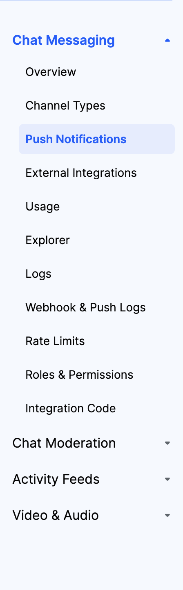
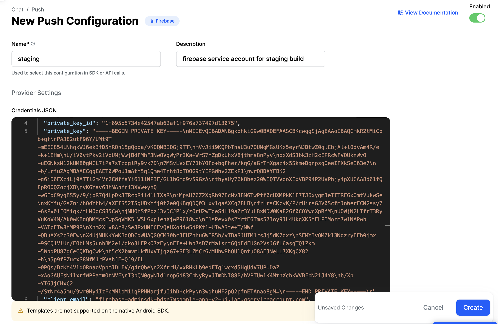

import Tabs from '@theme/Tabs';
import TabItem from '@theme/TabItem';

Easiest way to integrate push notifications in your Chat applications is using Firebase. [React Native Firebase](https://rnfirebase.io/) is the officially recommended package to add Firebase to your apps. We also recommend the [Notifee](https://notifee.app/) library for customising push notifications and listening to user interaction events.

## Requirements

<!-- TODO: Change to new docs for links -->

- Push notifications are sent only for new messages.
- Only channel members receive push messages.
- Members receive push notifications regardless of their online status.
- Replies inside a [thread](https://getstream.io/chat/docs/javascript/threads/?language=javascript) are only sent to users that are part of that thread:
  - They posted at least one message
  - They were mentioned
- Messages from muted users are not sent.
- Messages are sent to all registered devices for a user (up to 25).
- `skip_push` is marked as false, as described [here](https://getstream.io/chat/docs/javascript/send_message/?language=javascript#complex-example).
- `push_notifications` is enabled (default) on the channel type for the sent message.

:::note
Push notifications require membership. Watching a channel isn't enough.
:::

## Firebase Project Setup

Follow the steps mentioned below to setup a Firebase project for your apps:

1. [Create a Firebase project for your app](https://console.firebase.google.com/).
2. Register your [Android](https://firebase.google.com/docs/android/setup#register-app) app and [iOS](https://firebase.google.com/docs/ios/setup#register-app) app with the Firebase project.
3. Upload your [APNs authentication key](https://firebase.google.com/docs/cloud-messaging/ios/client#upload_your_apns_authentication_key) to your Firebase project.

## Get Google Service Account Credentials

Firebase projects support Google service accounts. Credentials obtained via this service account are used by Stream to call Firebase server APIs.

These credentials are the [private key file](https://firebase.google.com/docs/admin/setup#:~:text=To%20generate%20a%20private%20key%20file%20for%20your%20service%20account%3A) for your service account in the Firebase console. To generate a private key file for your service account:

- In the Firebase console, open `Settings > Service Accounts`.
- Click `Generate New Private Key`, then confirm by clicking `Generate Key`.
- Securely store the JSON file containing the key.

This JSON file contains the credentials which needs to be uploaded to Stream server as explained in the next step.

## Upload Credentials in Stream Dashboard

Visit your app's [Stream dashboard](https://dashboard.getstream.io/) page. From there, select the `Push Notifications` menu option as you can see in the image below:



From there you can create a new configuration by clicking the `New Configuration` button.

After selecting the `Firebase` Provider, you will be asked to provide the following information:

| Field Name | Usage description |
|---|---|
| `Name` | The name to identify this configuration. It is used in the `addDevice` methods while sending the device token. You can use different names per each build type of your app (for example `Production`, `Staging`) or similar |
| `Description` | Allows you to set a description on the configuration to help identify its usage in your app's context. |
| `Credentials JSON` | The firebase credentials that will be used to send the push notification. |

For our example, we are using `staging` as `name` and we are filling in the remaining information as you can see in the image below:



:::tip IMPORTANT
Make sure that the `enabled` switch button is set to `on` 
:::

Now, tap on the `Create` button at the bottom, to add this push configuration.

## App setup

### Generate Firebase credentials for the app from Firebase console

<Tabs groupId="current-os" queryString>
  <TabItem value="android" label="Android" default>

  
  On the Firebase console, add a new Android application and enter your projects details. The "Android package name" must match your local projects package name which can be found inside of the `namespace` field in `/android/app/build.gradle`, or in the `manifest` tag within the `/android/app/src/main/AndroidManifest.xml` file within your project for projects using android gradle plugin v7 and below.

  Download the `google-services.json` file.


  </TabItem>
  <TabItem value="ios" label="iOS">

  On the Firebase console, add a new iOS application and enter your projects details. The "iOS bundle ID" must match your local project bundle ID. The bundle ID can be found within the "General" tab when opening the project with Xcode.

  Download the `GoogleService-Info.plist` file.

  </TabItem>
</Tabs>

### Configure Firebase with credentials

<Tabs groupId="current-platform" queryString>
  <TabItem value="expo" label="Expo" default>

Integration with Expo is possible when using a [development build](https://docs.expo.dev/development/getting-started/). You can configure the project via config plugins or manually configure the native projects yourself (the "bare workflow").

NOTE: React Native Firebase cannot be used in the pre-compiled Expo Go app because React Native Firebase uses native code that is not compiled into Expo Go.

For "bare workflow" please switch the tab to React Native and follow its installation steps. The steps below are for Expo development builds.

#### Install React Native Firebase modules

  ```bash title="Terminal"
  # Install & setup the app module
  npx expo install @react-native-firebase/app

  # Install the messaging module
  npx expo install @react-native-firebase/messaging
  ```

#### Configure React Native Firebase modules

The recommended approach to configure React Native Firebase is to use Expo Config Plugins. You will add React Native Firebase modules to the `plugins` array of your `app.json` or `app.config.js`.

To enable Firebase on the native Android and iOS platforms, move the downloaded `google-services.json` and `GoogleService-Info.plist files` and provide their paths in the following `app.json` fields: `expo.android.googleServicesFile` and `expo.ios.googleServicesFile`. See the example configuration below.

For iOS only, since `firebase-ios-sdk` requires use_frameworks then you want to configure `expo-build-properties` `app.json` by adding `"useFrameworks": "static"`. See the example configuration below.
ß
The following is an example `app.json` to enable the React Native Firebase modules App, that specifies the Service Account files for both mobile platforms, and that sets the application ID to the example value of `com.mycorp.myapp` (change to match your own):

// TODO from here
  
  </TabItem>
  <TabItem value="rn" label="React Native">

1. Install React Native Firebase and its messaging module

  ```bash title="Terminal"
  # Install & setup the app module
  yarn add @react-native-firebase/app

  # Install the messaging module
  yarn add @react-native-firebase/messaging
  ```

2. [Setup your Android app with credentials and configure Firebase](https://rnfirebase.io/#2-react-native-cli---android-setup).
3. [Setup your iOS app with credentials and configure Firebase](https://rnfirebase.io/#3-react-native-cli---ios-setup).
4. Add the ["Push Notifications" capability](https://rnfirebase.io/messaging/usage/ios-setup#enable-push-notifications) for your iOS app.
5. Add the ["Background Modes" capability](https://rnfirebase.io/messaging/usage/ios-setup#enable-background-modes) for your iOS app along with both the "Background fetch" and "Remote notifications" sub-modes.


  </TabItem>
</Tabs>

### Request for notification permissions

At an appropriate place in your app, request notification permissions from the user. Below is a small example of how to request permissions using [`react-native-permissions`](https://github.com/zoontek/react-native-permissions) library:
<!-- vale off -->

```js
import { requestNotifications } from 'react-native-permissions';

await requestNotifications(['alert', 'sound']);
```

:::tip IMPORTANT
Ensure that the setup steps for iOS and Android in React Native/Expo from [`react-native-permissions`](https://github.com/zoontek/react-native-permissions) library documentation relevant for notification permission.
:::

## Registering a device with Stream

Once you configure the Firebase server key and set it up on the Stream dashboard, a device that is supposed to receive push notifications needs to be registered at the Stream backend. This is usually done by listening for the Firebase device token.

```ts
import { StreamChat } from 'stream-chat';
import messaging from '@react-native-firebase/messaging';

const client = StreamChat.getInstance('api_key');
// the name of the firebase configuration set in stream dashboard
const push_provider_name = 'staging';

const App = () => {
  const [isReady, setIsReady] = useState(false);

  useEffect(() => {
    const unsubscribe = messaging().onTokenRefresh(async newToken => {
      await client.addDevice(newToken, 'firebase', USER_ID, push_provider_name);
    });

    const init = async () => {
      const token = await messaging().getToken();
      client.setLocalDevice({
        id: token,
        'firebase',
        push_provider_name,
      });
      await client.connectUser({ id: USER_ID }, USER_TOKEN);

      setIsReady(true);
    };

    init();

    return async () => {
      await client?.disconnectUser();
      unsubscribe();
    };
  }, []);

  if (!isReady) {
    return null;
  }

  return (
    <Chat client={client}>
      {/* Child components of Chat go here */}
    </Chat>
  );
};

const styles = StyleSheet.create({
  container: {
    flex: 1,
    alignItems: 'center',
    justifyContent: 'center',
  },
});
```

:::caution

Please note that, `client.addDevice` call requires a user token to be set on the client.
So `client.addDevice` call should be made after `client.connectUser` in code.

:::

## The Push Notification Message Payload

When a message is received by the Chat API, if the [requirements](#requirements) are met, it kicks a job to send a notification message to Firebase.
According to the [battery and the online status](https://firebase.google.com/docs/cloud-messaging/concept-options#lifetime) of the device, Firebase will deliver this payload to the actual devices.

The delivered push notification message payload depends upon the [push payload template](https://getstream.io/chat/docs/react/push_template/?language=javascript) that has been set for your app at Stream. The current template set is visible in the Dashboard and can be customized. The default payload template has different fields based on iOS or Android. The `notification` field is handled by the Firebase SDK to display the message and `data` property should be handled by the app if needed. The [device state and payload contents](https://rnfirebase.io/messaging/usage#notifications) determine whether a Notification will be displayed. On iOS, both `notification` and `data` are present. On Android, only `data` is present. An example payload for iOS is below:

```json
{
  "data": {
    "sender": "stream.chat",
    "type": "message.new",
    "version": "v2",
    "id": "d152f6c1-8c8c-476d-bfd6-59c15c20548a",
    "channel_type": "messaging",
    "channel_id": "company-chat",
    "cid": "messaging:company-chat"
  },
  // the notification field is present only on iOS by default and not on Android
  "notification": {
    "title": "Message from user",
    "body": "Hello"
  }
  // other fields..
}
```

:::note

If you had migrated from push v1 to v2, the v1 template is copied to the notification field of the v2 template. In this case, the Firebase SDK will automatically display the message on Android too.

:::

## Receiving Notifications When On Background Or Quit State

### iOS

Since the `notification` field is present on iOS, it is automatically picked up by the Firebase SDK and displayed to the user when the app is not in the foreground.

### Android

To listen to notifications in the background, you can use the [`setBackgroundMessageHandler`](https://rnfirebase.io/messaging/usage#background--quit-state-messages) method.

:::caution

This handler works only on Android. For this handler to work on iOS, the payload must be customized [`data` only](#make-ios-payload-data-only).

:::

When the handler is triggered, you can display the notification on Android after retrieving the message. To setup, call the `setBackgroundMessageHandler` outside of your application logic as early as possible:

```jsx
// index.js
import { AppRegistry } from 'react-native';
import messaging from '@react-native-firebase/messaging';
import { StreamChat } from 'stream-chat';

messaging().setBackgroundMessageHandler(async remoteMessage => {
  const client = StreamChat.getInstance('api_key');

  // You can also provide tokenProvider instead of static token
  // await client._setToken({ id: userId }, tokenProvider)
  client._setToken(
    {
      id: 'user_id',
    },
    'user_token',
  );
  // handle the message
  const message = await client.getMessage(remoteMessage.data.id);

  // create the android channel to send the notification to
  const channelId = await notifee.createChannel({
    id: 'chat-messages',
    name: 'Chat Messages',
  });

  // display the notification
  const { stream, ...rest } = remoteMessage.data ?? {};
  const data = {
    ...rest,
    ...((stream as unknown as Record<string, string> | undefined) ?? {}), // extract and merge stream object if present
  };
  await notifee.displayNotification({
    title: 'New message from ' + message.message.user.name,
    body: message.message.text,
    data,
    android: {
      channelId,
      // add a press action to open the app on press
      pressAction: {
        id: 'default',
      },
    },
  });
});

function App() {
  // Your application
}

AppRegistry.registerComponent('app', App);
```

### Listen To User Interactions For Background Notifications

When a user interacts with the notification by pressing on it, the default behavior is to open the application. In many cases, it is useful to detect whether the application was opened by pressing on a notification (so you could open a specific screen, for example). The handlers that are triggered are different from iOS and Android.

The [React Native Firebase API](https://rnfirebase.io/messaging/notifications#handling-interaction) provides two APIs for handling interaction, and it is triggered on iOS:

- `messaging().getInitialNotification`: When the application is opened from a quit state.
- `messaging().onNotificationOpenedApp`: When the application is running, but in the background.

The [Notifee library](https://notifee.app/react-native/docs/events) provides events for handling interaction and it is triggered on Android:

- `notifee.getInitialNotification`: When the application is opened from a quit state.
- `notifee.onBackgroundEvent`: When the application is running but in the background.

To handle all the scenarios, the code must be executed during the app setup. See the code below for an example. Here using [React Navigation](https://reactnavigation.org/) we set an initial route when the app is opened from a quit state and also push to a Channel screen when the app is in a background state:

```js
import React, { useEffect, useState } from 'react';
import messaging from '@react-native-firebase/messaging';
import { NavigationContainer, NavigationContainerRef } from '@react-navigation/native';
import { createStackNavigator } from '@react-navigation/stack';

const Stack = createStackNavigator();
const navigationContainerRef = React.createRef<NavigationContainerRef>();

notifee.onBackgroundEvent(async ({ detail, type }) => {
  if (type === EventType.PRESS) {
    // user press on notification detected while app was on background on Android
    const channelId = detail.notification?.data?.channel_id;
    if (channelId) {
       navigationContainerRef.current?.navigate('ChannelScreen', { channelId });
    }
    await Promise.resolve();
  }
});

function App() {
  const [initialChannelId, setInitialChannelId] = useState<string>()
  useEffect(() => {
    const unsubscribeOnNotificationOpen = messaging().onNotificationOpenedApp((remoteMessage) => {
      // Notification caused app to open from background state on iOS
      const channelId = remoteMessage.data?.channel_id;
      // The navigation logic, to navigate to relevant channel screen.
      if (channelId) {
        navigationContainerRef.current?.navigate('ChannelScreen', { channelId });
      }
    });

    notifee.getInitialNotification().then(initialNotification => {
      if (initialNotification) {
        // Notification caused app to open from quit state on Android
        const channelId = initialNotification.notification.data?.channel_id;
        // Start the app with the relevant channel screen.
        setInitialChannelId(channelId)
      }
    });

    messaging()
      .getInitialNotification()
      .then(remoteMessage => {
        if (remoteMessage) {
          // Notification caused app to open from quit state on iOS
          const channelId = remoteMessage.data?.channel_id;
          // Start the app with the relevant channel screen.
          setInitialChannelId(channelId)
        }
    });

    return () => {
      unsubscribeOnNotificationOpen();
    };
  }, []);

  return (
    <NavigationContainer ref={navigationContainerRef}>
      <Stack.Navigator initialRouteName={initialChannelId ? "ChannelScreen" : "Home"}>
        <Stack.Screen name='Home' component={HomeScreen} />
        <Stack.Screen name='ChannelListScreen' component={ChannelListScreen} />
        <Stack.Screen name='ChannelScreen'
          component={ChannelScreen}
          initialParams={initialChannelId ? { channelId: initialChannelId } : undefined}
        />
      </Stack.Navigator>
    </NavigationContainer>
  );
}
```

## Customizing The Delivered Payload

Please see the [JavaScript SDK documentation](https://getstream.io/chat/docs/javascript/push_template/?language=javascript) about the variables present to configure the push template and the templating language used. Some of the common use-cases for customizing the template are given below.

:::caution

The methods to customize the push template are **server-side** only.

:::

### Add Notification Field In Android Payload

To update the payload for Android to have notification payload also, you can add relevant keys to the `notification_template` using the JavaScript SDK like below:

```js
const client = StreamChat.getInstance(‘api_key’, ‘api_secret’);
const notification_template = `{
    "title": "New message from {{ sender.name }}",
    "body": "{{ truncate message.text 2000 }}",
    "click_action": "OPEN_ACTIVITY_1",
    "sound": "default"
}`;

client.updateAppSettings({
  firebase_config: {
    notification_template,
  }
});
```

The above configuration allows to align Android with iOS, by receiving the same notification payload, which makes it so that there is no need to display notifications using Notifee. The `click_action` key is essential to make your app open on press. Also, note that the action must be added to the launcher activity in your app's `AndroidManifest.xml`. See the example below where we add `OPEN_ACTIVITY_1` action to the launcher activity:

```xml
<activity
  android:name=".MainActivity"
  android:label="@string/app_name"
  android:configChanges="keyboard|keyboardHidden|orientation|screenLayout|screenSize|smallestScreenSize|uiMode"
  android:launchMode="singleTask"
  android:windowSoftInputMode="adjustResize"
  android:exported="true">
  <intent-filter>
      <action android:name="android.intent.action.MAIN" />
      <category android:name="android.intent.category.LAUNCHER" />
  </intent-filter>
  <intent-filter>
      <action android:name="OPEN_ACTIVITY_1" />
      <category android:name="android.intent.category.DEFAULT" />
  </intent-filter>
</activity>
```

Also you must use `ACTION_PRESS` event from Notifee to handle the user press on background in Android like below:

```js
notifee.onBackgroundEvent(async ({ detail, type }) => {
  if (type === EventType.ACTION_PRESS) {
    // user press on notification detected while app was on background on Android
    const channelId = detail.notification?.data?.channel_id;
    if (channelId) {
      navigationContainerRef.current?.navigate('ChannelScreen', { channelId });
    }
    await Promise.resolve();
  }
});
```

:::info

The `notification_template` is a JSON object that includes the keys relevant to push notifications for Android. See the [AndroidNotification](https://firebase.google.com/docs/reference/fcm/rest/v1/projects.messages#AndroidNotification) type in the firebase documentation for all the supported keys.

:::
:::caution

We do not recommend doing this. If `notification_template` is added, then notifications will be shown in the foreground for Android. iOS will, by default, not show any notifications in the foreground. Generally, chat applications do not show push notifications in the foreground. This is why we do not recommend it. However, if you want foreground notifications in both platforms, please follow the steps mentioned in the [display-notification-in-foreground](#display-notification-in-foreground) section.

:::

### Show badge number on the iOS app

We can show the number of unread messages in the app's badge by adding the `badge` key to the `apn_template` using the JavaScript SDK like below:

```js
const client = StreamChat.getInstance(‘api_key’, ‘api_secret’);

const apn_template = `{
  "aps" : {
    "alert": {
      "title": "{{ sender.name }} @ {{ channel.name }}",
      "body": "{{ truncate message.text 2000 }}"
    },
    "badge": {{ unread_count }},
    "mutable-content": 1,
    "category": "stream.chat"
  },
}`;

client.updateAppSettings({
  firebase_config: {
    apn_template,
  }
});
```

A good practice is to remove the badge count once the app is opened. We can do that using Notifee like below:

```js
function App() {
  useEffect(() => {
    const clearBadge = async () => {
      await notifee.setBadgeCount(0);
    };
    clearBadge();
  }, []);
  // Rest of your application
}
```

### Make iOS Payload Data Only

If the iOS payload is made to be data only, then `setBackgroundMessageHandler` can be used to display notifications using Notifee. The payload can be customized using the JavaScript SDK like below:

```js
const client = StreamChat.getInstance(‘api_key’, ‘api_secret’);

const apn_template = `{
  "aps": {
    "content-available": 1
  }
}`;

client.updateAppSettings({
  firebase_config: {
    apn_template,
  }
});
```

:::info

The `apn_template` is a JSON object that includes the keys relevant to push notifications for iOS. See [Payload Key Reference](https://developer.apple.com/documentation/usernotifications/setting_up_a_remote_notification_server/generating_a_remote_notification) in the iOS documentation to see the supported keys.

:::
:::caution
Ensure that the headless prop can be injected to your iOS app as mentioned [here](https://rnfirebase.io/messaging/usage#background-application-state=). Also, enable the Remote Notifications Capability for your app as mentioned [in the iOS documentation](https://developer.apple.com/documentation/usernotifications/setting_up_a_remote_notification_server/pushing_background_updates_to_your_app).

:::

The `content-available` key is essential to inform iOS that it is a [silent background update](https://developer.apple.com/documentation/usernotifications/setting_up_a_remote_notification_server/generating_a_remote_notification). Please note that iOS will consider background notifications as a [low priority](https://developer.apple.com/documentation/usernotifications/setting_up_a_remote_notification_server/pushing_background_updates_to_your_app). Thus, the delivery of these notifications may be throttled.

## Display Notification In Foreground

As mentioned before, the Firebase SDK automatically displays the message to the user on iOS using the `notification` property when the app is not in the foreground. And on Android, you can use [`setBackgroundMessageHandler`](https://rnfirebase.io/messaging/usage#background--quit-state-messages) method to display notifications in the background.

However, if you do want to display the notification in the foreground, you can listen to messages using the [`onMessage`](https://rnfirebase.io/messaging/usage#foreground-state-messages) callback inside of your application code and display a notification to end user. Code executed via this handler has access to React context and is able to interact with your application (for example updating the state or UI).

:::note

Generally, chat applications don't show push notifications when the app is in the foreground, so you may want to ignore this step depending on your product requirement.

:::

```jsx
import messaging from '@react-native-firebase/messaging';
import notifee from '@notifee/react-native';

useEffect(() => {
  // add listener to notifications received when on foreground
  const unsubscribeOnMessage = messaging().onMessage(async remoteMessage => {
    const message = await chatClient.getMessage(remoteMessage.data.id);

    // create the android channel to send the notification to
    const channelId = await notifee.createChannel({
      id: 'chat-messages',
      name: 'Chat Messages',
    });

    // display the notification
    const { stream, ...rest } = remoteMessage.data ?? {};
    const data = {
      ...rest,
      ...((stream as unknown as Record<string, string> | undefined) ?? {}), // extract and merge stream object if present
    };
    await notifee.displayNotification({
      title: 'New message from ' + message.message.user.name,
      body: message.message.text,
      data,
      android: {
        channelId,
        pressAction: {
          id: 'default',
        },
      },
    });
  });

  // add listener to user interactions on foreground notifications
  const unsubscribeForegroundEvent = notifee.onForegroundEvent(({ detail, type }) => {
    if (type === EventType.PRESS) {
      // user has pressed notification
      const channelId = detail.notification?.data?.channel_id;
      // The navigation logic, to navigate to relevant channel screen.
      if (channelId) {
        navigationContainerRef.current?.navigate('ChannelScreen', { channelId });
      }
    }
  });

  return () => {
    unsubscribeOnMessage();
    unsubscribeForegroundEvent();
  };
}, []);
```

## Troubleshooting

- You can check the "Webhook & Push Logs" section in the Dashboard to see if Notifications were sent by Stream. Please see the [Common Issues & FAQ](https://getstream.io/chat/docs/javascript/push_-_common_issues_and_faq/?language=javascript) to diagnose the various cases in which the Stream Chat API may not send the notifications.
- Android devices can restrict your app while it's in the background to preserve battery life. This can prevent trigger notifications from being displayed. The [Notifee documentation](https://notifee.app/react-native/docs/android/background-restrictions) explains it in detail.
- Additionally, suppose Stream Chat API has sent the notifications but was not displayed on the device. In that case, you can check the diagnostics steps for [Android](https://firebase.google.com/support/troubleshooter/fcm/delivery/diagnose/android) and [iOS](https://firebase.google.com/support/troubleshooter/fcm/delivery/diagnose/ios) in the Firebase cloud messaging documentation.
- If you are still having trouble with Push Notifications, please contact support@getstream.io.
