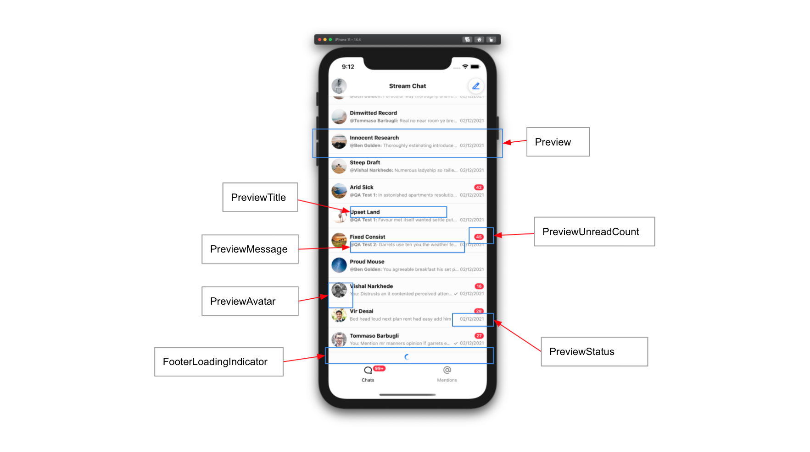

import LastMessagePreview from '../common-content/ui-components/channel-preview-messenger/props/last_message_preview.mdx'
import FormatLatestMessageDate from '../common-content/ui-components/channel-preview-messenger/props/format_latest_message_date.mdx';
import Channel from '../common-content/ui-components/channel-preview-messenger/props/channel.mdx';

The `ChannelPreviewStatus` is the UI component for displaying the last message status. Renders the last message date for each channel on a list.

 <!-- Replace with propert screenshot -->

## UI Customizations

You can have a custom channel preview status component by setting the `PreviewStatus` prop on any of its parent UI components.
<!-- Added the following phrase so users can search for "custom message date" and find this component once it defaults to rendering the last message date  -->
In the following sample we display a custom message preview date. 

<!-- Added the comment about useMemo because one of our sample projects had a perf problem related to this exact case  -->
```jsx
import { useMemo } from 'react';
import { ChannelPreviewMessenger } from 'stream-chat-react-native';
import { customDateFormatter } from '...'; // your custom date formatter

const CustomPreviewStatus = ({ latestMessagePreview }) => {
    // important usage of useMemo once date parsers can perform some computation when re-rendering.
    const formattedDate = useMemo(() => customDateFormatter(latestMessagePreview), [latestMessagePreview]);
    return (
        <Text>{formattedDate}</Text>
    );
}

<ChannelPreviewMessenger PreviewStatus={CustomPreviewStatus} />
```

## Props

### channel

<Channel/>

### lastMessagePreview

<LastMessagePreview/>

### formatLatestMessageDate

<FormatLatestMessageDate/>