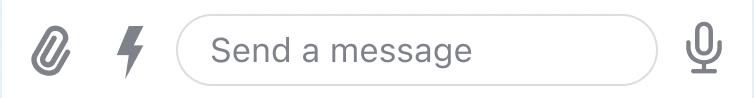
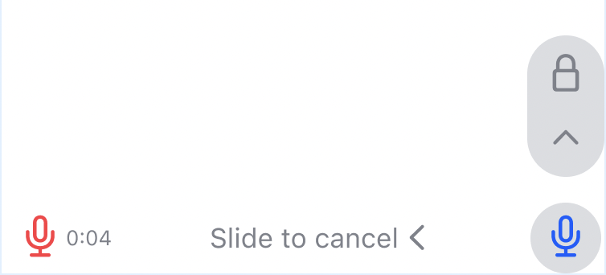
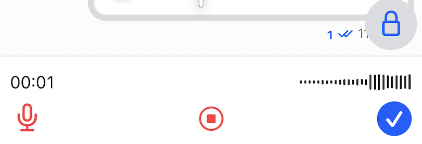
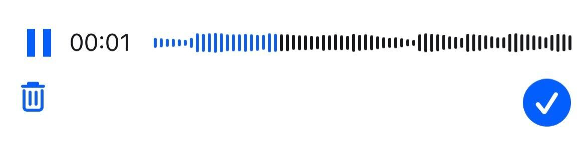

import ImageShowcase from '@site/src/components/ImageShowcase';
import AudioAttachmentUploadPreview from '../assets/guides/audio-support/audio-attachment-upload-preview.jpg';
import AudioAttachment from '../assets/guides/audio-support/audio-attachment.jpg';

import Tabs from '@theme/Tabs';
import TabItem from '@theme/TabItem';

The Stream Chat React Native SDK has the support for recording and playing the audio. This can be sent as a message.

## Installation

To support audio playing and recording, install the following package:

<Tabs
defaultValue='rncli'
groupId='rn-platform'
values={[
  { label: 'RN CLI', value: 'rncli' },
  { label: 'Expo', value: 'expo' },
]}
>
<TabItem value='rncli'>

- [`react-native-video`](https://github.com/react-native-video/react-native-video) for Audio playback support.
- [`react-native-audio-recorder-player`](https://github.com/hyochan/react-native-audio-recorder-player) for Audio recording and preview.

</TabItem>

<TabItem value="expo">

- [`expo-av`](https://docs.expo.dev/versions/latest/sdk/av/) for Audio playback, recording and async audio messages support.

</TabItem>
</Tabs>

:::note
Please follow along the linked documentation of each optional dependencies so as to support them correctly in your application.

Also, make sure that the `minSdkVersion` is >=24, for [`react-native-audio-recorder-player`](https://github.com/hyochan/react-native-audio-recorder-player) to work and the `kotlinVersion` should be `1.6.10`.
:::

## Enable Async Audio

Recording voice messages is possible by enabling audio recording on the [`Channel`](../core-components/channel.mdx#audiorecordingenabled) or the [`MessageInput`](../ui-components/message-input.mdx#audiorecordingenabled) component.

```tsx
<Channel audioRecordingEnabled />
```

Once enabled and once the necessary packages are installed, the `MessageInput` UI will render a `StartRecordingAudioButton`.



On long pressing the `StartRecordingAudioButton`, the recording UI renders and the recording starts, showing the `AudioRecorder` UI and a `AudioRecordingLockIndicator` on top.



You can slide the `StartRecordingAudioButton` to the top or to the left.

- On sliding the button to the left, the recording is stopped and deleted and the `MessageInput` state is reset.
- On sliding the button to the top, the mic is locked and you don't have to press the button anymore.

When the mic is locked, the `AudioRecordingInProgress` component is rendered on top, and the `AudioRecorder` component now shows the stop recording and the send recording button.



When the recording is stopped, the `AudioRecordingPreview` component is rendered which allows you to preview the recording. It has play and pause button to control the preview. Moreover, the `AudioRecorder` component now renders delete recording and the confirm button to send the recording.



The audio attachment has different preview in the `MessageInput` and the `MessageList` component. The `MessageInput` renders `AudioAttachmentUploadPreview` and the `MessageList` renders the `AudioAttachment` component.

<ImageShowcase
  items={[
    {
      image: AudioAttachmentUploadPreview,
      caption: 'AudioAttachmentUploadPreview',
      alt: 'AudioAttachmentUploadPreview',
    },
    {
      image: AudioAttachment,
      caption: 'AudioAttachment',
      alt: 'AudioAttachment',
    },
  ]}
/>

## Message Send Behaviour

The resulting recording is always uploaded on the recording completion. The recording is completed when user stops the recording and confirms the completion with a send button.

The behavior, when a message with the given recording attachment is sent, however, can be controlled through the asyncMessagesMultiSendEnabled configuration prop on `Channel` or `MessageInput`.

```tsx
<Channel asyncMessagesMultiSendEnabled audioRecordingEnabled />
```

And so the message is sent depending on asyncMessagesMultiSendEnabled value as follows:

| `asyncMessagesMultiSendEnabled` value | Impact                                                                                                                                                    |
| ------------------------------------- | --------------------------------------------------------------------------------------------------------------------------------------------------------- |
| `false` (default behavior)            | immediately after a successful upload at one step on completion. In that case as a single attachment (voice recording only), no-text message is submitted |
| `true`                                | upon clicking the `SendMessage` button if `asyncMessagesMultiSendEnabled` is enabled                                                                      |

:::note
Enabling `asyncMessagesMultiSendEnabled` would allow users to record multiple voice messages or accompany the voice recording with text or other types of attachments.
:::

## Customization

We allow different types of customization with the behaviour of async audio messages.

### UI Customization

The components of the async audio can be customized by passing your custom component to the props in the table in the [`Channel`](../core-components/channel.mdx) component.

| Component                                                                                     | Description                                                                                                                        |
| --------------------------------------------------------------------------------------------- | ---------------------------------------------------------------------------------------------------------------------------------- |
| [`AudioAttachmentUploadPreview`](../core-components/channel.mdx#audioattachmentuploadpreview) | Component prop used to customize the audio attachment upload preview in the `MessageInput`.                                        |
| [`AudioRecorder`](../core-components/channel.mdx#audiorecorder)                               | Component prop used to customize the audio recording controls and UI that replaces the `MessageInput`.                             |
| [`AudioRecordingInProgress`](../core-components/channel.mdx#audiorecordinginprogress)         | Component prop used to customize the audio recording UI when its in recording state.                                               |
| [`AudioRecordingPreview`](../core-components/channel.mdx#audiorecordingpreview)               | Component prop used to customize the audio recording preview UI.                                                                   |
| [`AudioRecordingLockIndicator`](../core-components/channel.mdx#audiorecordinglockindicator)   | Component prop used to customize the mic lock indicator on top of the `MessageInput`.                                              |
| [`AudioRecordingWaveform`](../core-components/channel.mdx#audiorecorindwaveform)              | Component prop used to customize the audio recording waveform component that is shown in the `AudioRecordingInProgress` component. |
| [`StartRecordingAudioButton`](../core-components/channel.mdx#startaudiorecordingbutton)       | Component prop used to customize the start audio recording button in the `MessageInput`.                                           |
| [`AudioAttachment`](../core-components/channel.mdx#audioattachment)                           | Component prop used to customize the audio attachment in the `MessageList`.                                                        |

### Function customization

| Component                                                                                          | Description                                                                                                                                                                                  |
| -------------------------------------------------------------------------------------------------- | -------------------------------------------------------------------------------------------------------------------------------------------------------------------------------------------- |
| [`audioRecordingEnabled`](../core-components/channel.mdx#audioattachmentuploadpreview)             | Controls whether the async audio feature(sending voice recording) is enabled.                                                                                                                |
| [`asyncMessagesMultiSendEnabled`](../core-components/channel.mdx#audiorecorder)                    | When it’s enabled, recorded messages won’t be sent immediately. Instead they will “stack up” in the composer allowing the user to send multiple voice recording as part of the same message. |
| [`asyncMessagesLockDistance`](../core-components/channel.mdx#audiorecordinginprogress)             | Controls how many pixels to the top side the user has to scroll in order to lock the recording view and allow the user to lift their finger from the screen without stopping the recording.  |
| [`asyncMessagesMinimumPressDuration`](../core-components/channel.mdx#audiorecordingpreview)        | Controls the minimum duration that the user has to press on the record button in the composer, in order to start recording a new voice message.                                              |
| [`asyncMessagesSlideToCancelDistance`](../core-components/channel.mdx#audiorecordinglockindicator) | Controls how many pixels to the leading side the user has to scroll in order to cancel the recording of a voice message.                                                                     |
