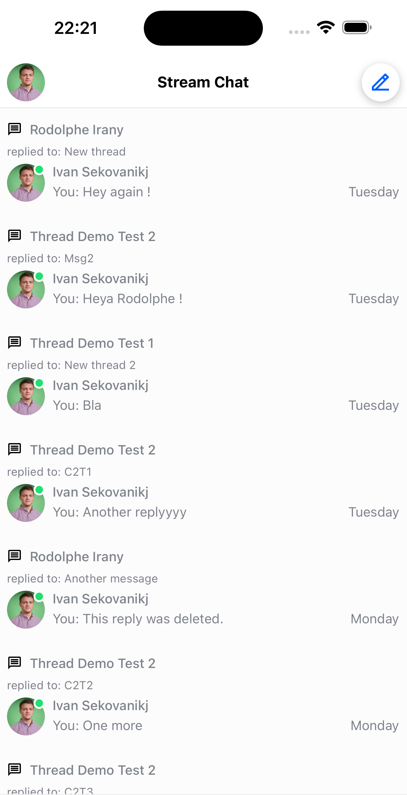
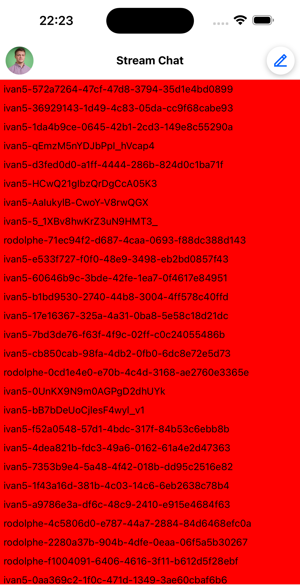
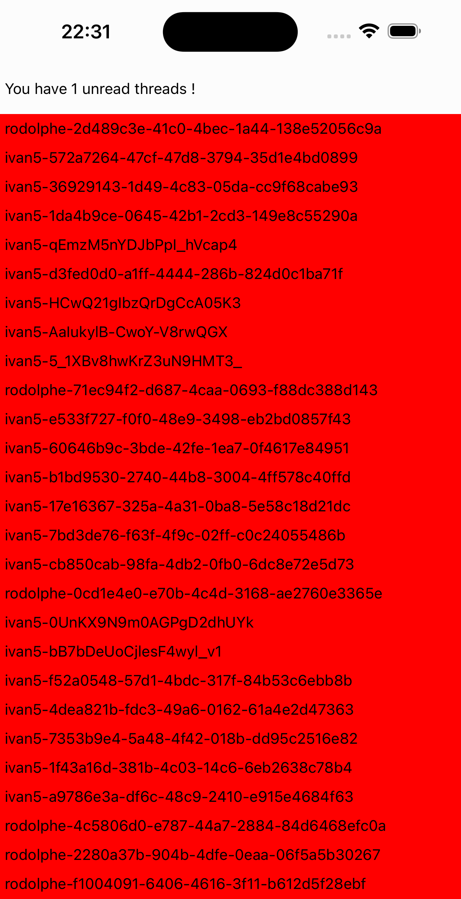

In this cookbook we'll go over how we can create and customize a screen containing the [`ThreadList` component](../ui-components/thread-list.mdx). The goal will be to display a list of threads as well as have a banner that displays the number of unread threads within the list.

### Prerequisites

This cookbook assumes that you've already set up a separate screen that is able to display a single [`Thread`](../ui-components/thread.mdx) along with all of its replies. If this is indeed the case, there are no changes that you will need to do in order to have it working for the `ThreadList` screen.

It also assumes that you have a functioning `chatClient` that is used elsewhere.

For illustration purposes, we are going to be using the `React Navigation` library for navigation (however, any navigation library can be used).

### Creating the screen

Here is how you add the [`ThreadList` component](../ui-components/thread-list.mdx) in a new screen example:

```tsx
import { OverlayProvider, Chat, ThreadList } from 'stream-chat-react-native';

const ThreadListScreen = () => {
  return (
    <OverlayProvider>
      <Chat client={client}>
        <ThreadList />
      </Chat>
    </OverlayProvider>
  );
};
```

This alone should be enough to already display all of the threads the user is involved in using the standard UI.



As a next step, let's make sure that the `ThreadList` updates internally only when the screen is in focus. For this purpose, we can use the `isFocused` property like so:

```tsx
import { OverlayProvider, Chat, ThreadList } from 'stream-chat-react-native';
// highlight-start
// any navigation library hook/method can be used for this
import { useIsFocused } from '@react-navigation/native';
// highlight-end

const ThreadListScreen = () => {
  // highlight-next-line
  const isFocused = useIsFocused();
  return (
    <OverlayProvider>
      <Chat client={client}>
        // highlight-next-line
        <ThreadList isFocused={isFocused} />
      </Chat>
    </OverlayProvider>
  );
};
```

This can be particularly useful if we decide to put the list of threads as a separate tab at the bottom of our app (and the screens don't get unmounted when switching tabs).

The `ThreadList` should display as intended now and refresh only when we're looking at it. However, we may notice that clicking on an item within the `ThreadList` does not do anything. Since we would like to see the item that we clicked on in more detail, let's navigate to the thread that it describes:

```tsx
import { OverlayProvider, Chat, ThreadList } from 'stream-chat-react-native';
// any navigation library hook/method can be used for this
// highlight-next-line
import { useNavigation, useIsFocused } from '@react-navigation/native';

const ThreadListScreen = () => {
  const isFocused = useIsFocused();
  // highlight-next-line
  const navigation = useNavigation();
  return (
    <OverlayProvider>
      <Chat client={client}>
        <ThreadList
          isFocused={isFocused}
          // highlight-start
          // here we can reuse the same method as we would in the ChannelList component
          onThreadSelect={(thread, channel) => {
            navigation.navigate('ThreadScreen', {
              thread,
              channel,
            });
          }}
          // highlight-end
        />
      </Chat>
    </OverlayProvider>
  );
};
```

Now we should be able to navigate to any thread displayed in the list. For the next step, let's assume that we do not need all of the information displayed in each item within the `ThreadList` - but instead are really only interested in displaying the ID of each thread. We also want these to be separated by exactly 10 pixels apart.

For this, we can override how the `ThreadListItem` is rendered within the list.

```tsx
import { TouchableOpacity, Text } from 'react-native';
// highlight-start
import {
  OverlayProvider,
  Chat,
  ThreadList,
  useThreadsContext,
  useThreadListItemContext,
  MessageType,
} from 'stream-chat-react-native';
// highlight-end

// any navigation library hook/method can be used for this
import { useNavigation, useIsFocused } from '@react-navigation/native';

// highlight-start
const ThreadListItem = () => {
  // we grab the definition of the navigation function from the ThreadsContext
  const { onThreadSelect } = useThreadsContext();
  // we grab the actual thread, channel and its parent message from the ThreadListItemContext
  const { channel, thread, parentMessage } = useThreadListItemContext();
  return (
    <TouchableOpacity
      style={{ backgroundColor: 'red', padding: 5 }}
      onPress={() => {
        if (onThreadSelect) {
          // since we are overriding the behaviour of the item it is mandatory to pass the parameters in the
          // below to onThreadSelect()
          onThreadSelect({ thread: parentMessage as MessageType, threadInstance: thread }, channel);
        }
      }}
     >
      <Text>{thread?.id}</Text>
    </TouchableOpacity>
  )
}
// highlight-end

const ThreadListScreen = () => {
  const isFocused = useIsFocused();
  const navigation = useNavigation();
  return (
    <OverlayProvider>
      <Chat client={client}>
        <ThreadList
          isFocused={isFocused}
          {/* here we can reuse the same method as we would in the ChannelList component */}
          onThreadSelect={(thread, channel) => {
            navigation.navigate('ThreadScreen', {
              thread,
              channel,
            });
          }}
          // highlight-next-line
          ThreadListItem={ThreadListItem}
        />
      </Chat>
    </OverlayProvider>
  );
};
```

Now we should have successfully rendered the thread list items.



As a second to last step, we would like to display a banner right on top of the list telling us how many unread threads we have in total just so that we can keep track.

For that, we can rely on using the [state store](../state-and-offline-support/state-overview.mdx#thread-and-threadmanager) our SDK exposes and the [`useStateStore` hook](../state-and-offline-support/state-overview.mdx#usestatestore-hook):

```tsx
import { TouchableOpacity, Text, View } from 'react-native';
import {
  OverlayProvider,
  Chat,
  ThreadList,
  useThreadsContext,
  useThreadListItemContext,
  MessageType,
  // highlight-next-line
  useStateStore,
} from 'stream-chat-react-native';
// highlight-next-line
import { ThreadManagerState } from 'stream-chat';
// any navigation library hook/method can be used for this
import { useNavigation, useIsFocused } from '@react-navigation/native';

// ...

// highlight-start
// create a selector for unreadThreadCount
const selector = (nextValue: ThreadManagerState) => [nextValue.unreadThreadCount];

const CustomBanner = () => {
  // use our utility hook to access the store
  const [unreadCount] = useStateStore(client?.threads?.state, selector);

  // display the banner
  return (
     <View style={{ paddingVertical: 15, paddingHorizontal: 5 }}>
       <Text>You have {unreadCount} unread threads !</Text>
     </View>
  );
};
// highlight-end

const ThreadListScreen = () => {
  const isFocused = useIsFocused();
  const navigation = useNavigation();
  return (
    <OverlayProvider>
      <Chat client={client}>
        // highlight-start
        {/* it's important that the banner is also a child of <Chat /> */}
        <CustomBanner />
        // highlight-end
        <ThreadList
          isFocused={isFocused}
          {/* here we can reuse the same method as we would in the ChannelList component */}
          onThreadSelect={(thread, channel) => {
            navigation.navigate('ThreadScreen', {
              thread,
              channel,
            });
          }}
          ThreadListItem={ThreadListItem}
        />
      </Chat>
    </OverlayProvider>
  );
};
```



And as a final step, we would like each item in the `ThreadList` to be separated by 10 pixels. For this, we can use the [`FlatList` properties](https://reactnative.dev/docs/flatlist#props) that can be accessed through the `additionalFlatListProps` prop.

Finally, our screen would look like this:

```tsx
// ...

// highlight-next-line
const ItemSeparatorComponent = () => <View style={{ paddingVertical: 5 }} />

const ThreadListScreen = () => {
  const isFocused = useIsFocused();
  const navigation = useNavigation();
  return (
    <OverlayProvider>
      <Chat client={client}>
        {/* it's important that the banner is also a child of <Chat /> */}
        <CustomBanner />
        <ThreadList
          isFocused={isFocused}
          {/* here we can reuse the same method as we would in the ChannelList component */}
          onThreadSelect={(thread, channel) => {
            navigation.navigate('ThreadScreen', {
              thread,
              channel,
            });
          }}
          ThreadListItem={ThreadListItem}
          // highlight-start
          additionalFlatListProps={{
            ItemSeparatorComponent,
          }}
          // highlight-end
        />
      </Chat>
    </OverlayProvider>
  );
};
```


We now have an entirely custom `ThreadList` that we can further modify to our liking.
