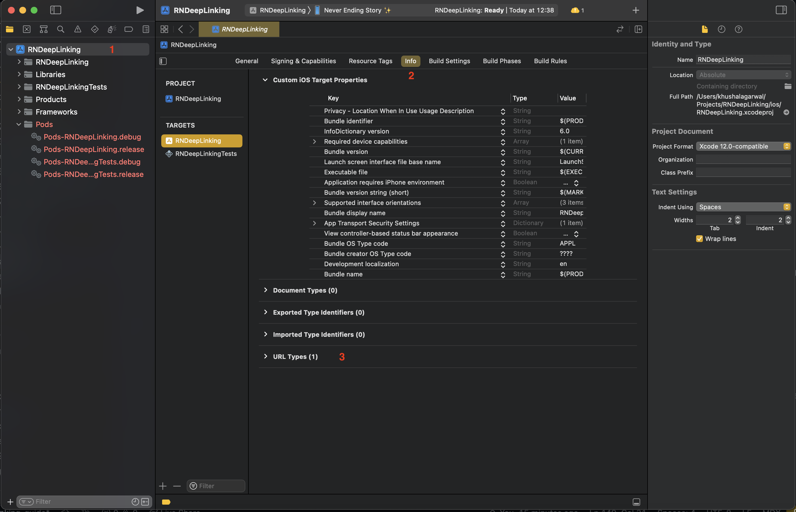
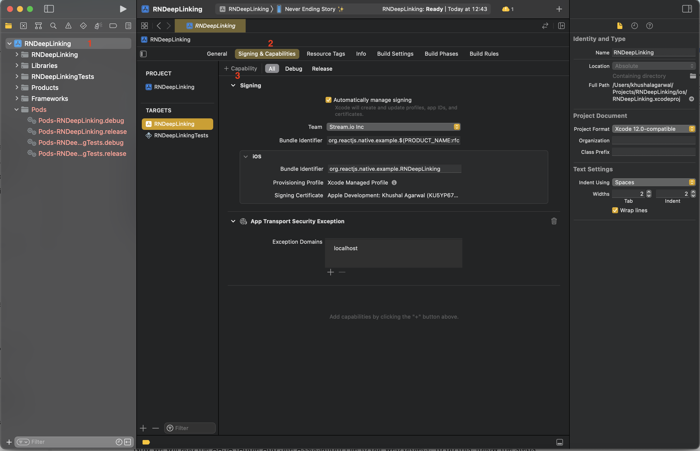

import Tabs from '@theme/Tabs';
import TabItem from '@theme/TabItem';

This guide talks about deep linking into a simple chat application or a generic application directly. It also focuses on getting the channel id or similar entity through a Deep link URL and thereby use it to initiate the chat.

### Step 1 - Native Setup

:::note
Prerequisites before following this guide is having an application with our Stream Video SDK integrated. You can follow our tutorials for the same to get started with an application.
:::

<Tabs
  defaultValue='android'
  values={[
    { label: 'Android', value: 'android' },
    { label: 'iOS', value: 'ios' },
  ]}
>

<TabItem value='android'>

For instructions on how to add support for deep linking on Android we will primarily follow [this guide](https://developer.android.com/training/app-links/deep-linking#adding-filters).

#### Creating Intent Filters

To create a link to your app content, add an intent filter that contains these elements and attribute values in your `AndroidManifest.xml` file at `/android/app/src/main/AndroidManifest.xml`.

- `action` - Specify the ACTION_VIEW intent action so that the intent filter can be reached from Google Search.

```xml
<action android:name="android.intent.action.VIEW" />
```

- `data` - Add one or more `<data>` tags, each of which represents a URI format that resolves to the activity. At minimum, the `<data>` tag must include the `android:scheme` attribute.

```xml
<data android:scheme="http" />
<data android:scheme="https" />
<!-- The URL here must exclude the scheme -->
<data android:host="`YOUR URL HERE`" />
```

- `category` - Include the `DEFAULT` and the `BROWSABLE` category. It is required in order for the intent filter to be accessible from a web browser. Without it, clicking a link in a browser cannot resolve to your app.

```xml
<category android:name="android.intent.category.DEFAULT" />
<category android:name="android.intent.category.BROWSABLE" />
```

Combined together your intent filter should look like:

```xml
<intent-filter android:autoVerify="true">
    <action android:name="android.intent.action.VIEW" />
    <category android:name="android.intent.category.DEFAULT" />
    <category android:name="android.intent.category.BROWSABLE" />
    <data android:scheme="http" />
    <data android:scheme="https" />
    <!-- Example: "stream-calls-dogfood.vercel.app” -->
    <data android:host="`YOUR URL HERE`" />
</intent-filter>
```

#### Adding Asset Links

An Android App Link is a special type of deep link that allows your website URLs to immediately open the corresponding content in your Android app, without requiring the user to select the app.
Android App Links use the [Digital Asset Links API](https://developers.google.com/digital-asset-links) to establish trust that your app has been approved by the website to automatically open links for that domain. If the system successfully verifies that you own the URLs, the system automatically routes those URL intents to your app.

To verify that you own both your app and the website URLs, complete the following steps:

- Add intent filters that contain the `autoVerify` attribute(as we have done in our example above). This attribute signals to the system that it should verify whether your app belongs to the URL domains used in your intent filters.

- [Declare the association](https://developer.android.com/training/app-links/verify-android-applinks#web-assoc) between your website and your intent filters by hosting a Digital Asset Links JSON file at the following location:

```
https://domain.name/.well-known/assetlinks.json
```

You can use [this tool](https://developers.google.com/digital-asset-links/tools/generator) to generate the `assetlink.json` for your web project. Enter the Hosting site name, App package name and App package fingerprint(SHA256) to generate it.

- Hosting site name is the URL of the website which we will use for deep linking in our app.
- App package name can be easily found in the first line of your `MainActivity.java` file as a value to `package`.
- To get your App package fingerprint(SHA256) follow [this](https://developers.google.com/android/guides/client-auth) guide.

</TabItem>

<TabItem value='ios'>

#### Adding deep linking support in AppDelegate

For adding the support of deep linking in iOS we will have to follow the below steps:

1. We need to link `RCTLinking` to the project by following steps. This will be responsible to listen to incoming app links. For this, go to `AppDelegate.m` or `AppDelegate.mm` and add the following snippet:

```mm
#import <React/RCTLinkingManager.h>

- (BOOL)application:(UIApplication *)application
   openURL:(NSURL *)url
   options:(NSDictionary<UIApplicationOpenURLOptionsKey,id> *)options
{
  return [RCTLinkingManager application:application openURL:url options:options];
}

- (BOOL)application:(UIApplication *)application continueUserActivity:(nonnull NSUserActivity *)userActivity
 restorationHandler:(nonnull void (^)(NSArray<id<UIUserActivityRestoring>> * _Nullable))restorationHandler
{
 return [RCTLinkingManager application:application
                  continueUserActivity:userActivity
                    restorationHandler:restorationHandler];
}
```

#### Setting up a URL scheme

To add URI scheme to the iOS project configuration, open `YOUR_APP_NAME/ios/app-name.xcworkspace` in Xcode. Then select the project name in the left sidebar and navigate to the **Info** tab.
Next go to the `URL types`, click the +(plus) button, and under the Identifier and URL schemes, add:

1. Your app's bundle id.
2. And, Your name for the scheme that act as the URL prefix, respectively.
3. Leave the role as `Editor`.



#### Setting up Universal schemes

:::note
If your app is using [Universal Links](https://developer.apple.com/ios/universal-links/), you will need to add the following code as well.
:::

```mm
- (BOOL)application:(UIApplication *)application continueUserActivity:(nonnull NSUserActivity *)userActivity
 restorationHandler:(nonnull void (^)(NSArray<id<UIUserActivityRestoring>> * _Nullable))restorationHandler
{
 return [RCTLinkingManager application:application
                  continueUserActivity:userActivity
                    restorationHandler:restorationHandler];
}
```

##### Adding Associated Domains Entitlement

Within your Signing & Capabilities section of Xcode, add the Associated Domains entitlement, thus giving your app the capability to support external domains for not only Universal Links, but web credentials too.



To add Associated Domains support click on +(plus) button just below the `Signing & Capabilities` section near to `Capability`. Search for `Associated Domains` and drag and drop it to the background. This will add the Associated Domains tab.

Within the top empty field that presents itself after adding this entitlement, click on +(plus) icon and insert `applinks:` followed by your domain name.

_The `applinks:` prefix is a nod to Xcode that this domain is being used for Universal Linking, and is one of a few prefixes that Xcode will recognise depending on the technology you are implementing._

One you are done with this step, a `.entitlements` file will be created, inside `ios/YOUR_APP_NAME` folder.

Now we will add the AASA (Apple App Site Association) File to our web project. To do this, follow the steps below:

- Create a `apple-app-site-association` file inside `.well-known` directory on the top level of your domain, so that the file is hosted at `https://domain.name/.well-known/apple-app-site-association`.

- Now, Paste the following snippet:

```
{
    "applinks": {
        "apps": [],
        "details": [{
            "appID": ["<TeamID>.com.example.myapp"],
            "paths": ["*"]
        }]
    }
}
```

There are only a couple of things to take note of here:

- The appID field expects your Team ID (found [here](https://developer.apple.com/account/#/membership) on your Membership page) to prefix your App Bundle ID.
- Each URL is configured in the details array, with each item in that array being an object with the appID, and a paths array of each URI you are supporting. The wildcard (\*) character can be used for supporting unique identifiers within the URI.
- The apps field must be left as an empty array.

This is all that you need to do for getting started with iOS deep linking.

</TabItem>

</Tabs>

### Step 2 - Using the `Linking` API

After the configuration on Android and iOS, we will finally use the [Linking](https://reactnative.dev/docs/linking) API from the React Native to set up handling the link and using it to navigate in the app.

If the app is _not already_ open, it is opened and the URL is passed in as the initialURL.

You can handle these events with getInitialURL() - it returns a Promise that resolves to the URL if there is one.

We then will parse the URL and set our actions accordingly.

If the app is _already open_, the app is foregrounded, and a Linking `url` event is fired. You can handle these events with `addEventListener('url', callback)`- it calls `callback({url})` with the linked URL.

An example of both is shared below:

```tsx title="App.tsx"
const App = () => {
  useEffect(() => {
    const parseAndSetChannelID = (url: string | null) => {
      const matchResponse = url?.match(`YOUR REGEX HERE`); // To match the paths and handle them accordingly
      if (matchResponse?.length) {
        // Your custom setup here.
      }
    };
    const { remove } = Linking.addEventListener('url', ({ url }) => {
      parseAndSetChannelID(url);
    });
    const configure = async () => {
      const url = await Linking.getInitialURL();
      parseAndSetChannelID(url);
    };
    configure();
    return remove;
  }, []);
};
```

You can extract the channel ID if its in the URL, start the conversation using the channel ID and navigate to appropriate screen once you have the URL as shown in the example above or choose to perform any other action.
