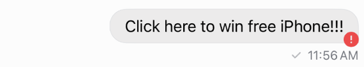
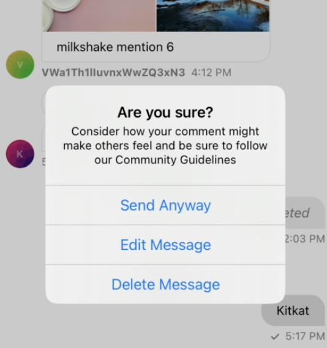

Stream Chat has support for several moderation actions, such as flagging, muting, banning and shadow banning. You can find more details about the available low-level client moderation tools on this [page](https://getstream.io/chat/docs/ios-swift/moderation/?language=swift).

You can moderate flagged messages and users through Stream's [moderation dashboard](https://getstream.io/chat/docs/javascript/moderation/?language=javascript).

### Moderation Categories

For each channel type, you can enable AI moderation, consisting of 4 moderation categories:

- Semantic Filters
- Commercial Spam
- Platform Circumvention
- Blocklists

For each moderation category, you can configure an action that will be performed after a message falls into that category.

The available actions are:

- Flag
- Block
- Bounce
- Bounce then flag
- Bounce then block

### React Native SDK Handling

In the React Native SDK, you can check if a message was moderated, by checking the `moderation_details` value in the chat message, which is not defined or `undefined` for regular messages.

If a message is blocked by moderation, the message `type` is `error` and the message text contains `Message was blocked by moderation policies`.

If a message is bounced by moderation, the message `type` is `error` and the message `moderation_details` value is defined.

### UI Components handling

The React Native SDK handles the bounced messages by default. When a message is bounced, there is a visual indicator on the message view to reflect that.

When you press/long press on a message, you can perform several default actions on it, such as editing and deleting it, as well as trying to resent it.

:::note
When you try to resend a message when bounced, if the bounced then flag settings is applied, the message will be marked as flag after being sent the second time.

When you try to resend a message when bounced, if the bounced then blocked settings is applied, the message will be blocked after being sent the second time.
:::

You can customize the default actions on the bounced message action handler component, that is, [MessageBounce](../ui-components/message-bounce.mdx) component by passing it to the [`Channel`](../core-components/channel.mdx#messagebounce) component.
