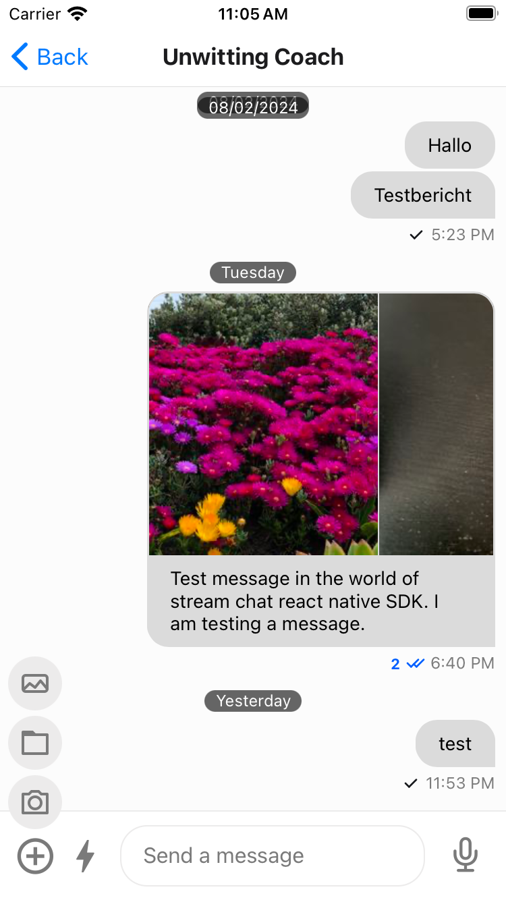

import Tabs from '@theme/Tabs';
import TabItem from '@theme/TabItem';

:::note
This guide can help you to comply with the new Google Play's [android policy for photo and video permissions](https://support.google.com/googleplay/android-developer/answer/14115180?hl=en).
:::

To enable the native image picker, you need to do the following steps and that would provide a native image picker for both iOS and Android.

### Step 1: Uninstall the media library

Uninstall the media library by running the following command(if you have already installed it) else choose not to install it at all as it is a optional dependency.

<Tabs
  defaultValue='rncli'
  groupId='rn-platform'
  values={[
    { label: 'RN CLI', value: 'rncli' },
    { label: 'Expo', value: 'expo' },
  ]}
>
<TabItem value='rncli'>

```bash title="Terminal"
yarn remove @react-native-camera-roll/camera-roll
```

</TabItem>

<TabItem value='expo'>

```bash title="Terminal"
yarn remove expo-media-library
```

</TabItem>
</Tabs>

### Step 2: Install the native image picker

Install the native image picker by running the following command:

<Tabs
  defaultValue='rncli'
  groupId='rn-platform'
  values={[
    { label: 'RN CLI', value: 'rncli' },
    { label: 'Expo', value: 'expo' },
  ]}
>
<TabItem value='rncli'>

```bash title="Terminal"
yarn add react-native-image-picker
```

</TabItem>

<TabItem value='expo'>

```bash title="Terminal"
npx expo install expo-image-picker
```

</TabItem>
</Tabs>

This shall give you a UI to select images from the gallery using native image picker or take a picture from the camera or alternatively select a file.



:::note
Please follow the post installation steps as mentioned in the [react-native-image-picker](https://github.com/react-native-image-picker/react-native-image-picker?tab=readme-ov-file#post-install-steps).
:::

### Step 3: Add customization(if necessary)

You can customize what happens on clicking the [`AttachButton`](../ui-components/attach-button.mdx) by passing your own `onPress` function to the `handleAttachButtonPress` of the `Channel` component.

```jsx
import { useCallback } from 'react';
import { Channel } from 'stream-chat-react-native';

const App = () => {
  const handleAttachButtonPress = useCallback(async () => {
    // Your custom logic here
  }, []);

  return <Channel channel={channel} handleAttachButtonPress={handleAttachButtonPress} />;
};
```

The other alternative is customizing the `AttachButton` component itself.

```jsx
import { AttachButton } from 'stream-chat-react-native';

const CustomAttachButton = props => {
  const { onPress } = props;

  const handlePress = async () => {
    // Your custom logic here
  };

  return <AttachButton onPress={handlePress} />;
};

const App = () => {
  return <Channel channel={channel} AttachButton={CustomAttachButton} />;
};
```
